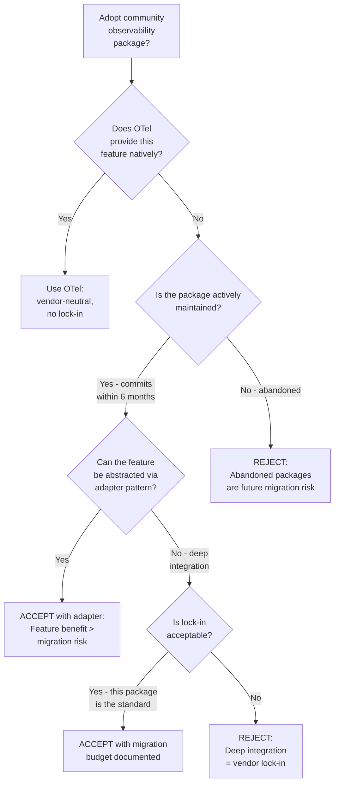
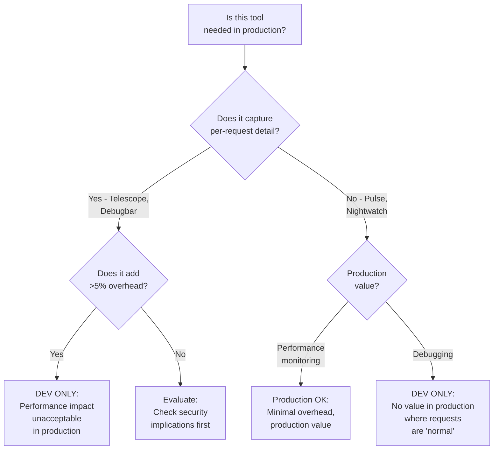

# Community Package Adoption Decision

```mermaid
flowchart TD
    A[Adopt community\nobservability\npackage?] --> B{Does OTel\nprovide this\nfeature natively?}
    B -->|Yes| C[Use OTel:\nvendor-neutral,\nno lock-in]
    B -->|No| D{Is the package actively\nmaintained?}
    D -->|Yes - commits\nwithin 6 months| E{Can the feature\nbe abstracted via\nadapter pattern?}
    D -->|No - abandoned| F[REJECT:\nAbandoned packages\nare future migration risk]
    E -->|Yes| G[ACCEPT with adapter:\nFeature benefit >\n migration risk]
    E -->|No - deep\nintegration| H{Is lock-in\nacceptable?}
    H -->|Yes - this package\nis the standard| I[ACCEPT with migration\nbudget documented]
    H -->|No| J[REJECT:\nDeep integration\n= vendor lock-in]
```

# Dev vs Production Tool Decision

```mermaid
flowchart TD
    A[Is this tool\nneeded in production?] --> B{Does it capture\nper-request detail?}
    B -->|Yes - Telescope,\nDebugbar| C{Does it add\n>5% overhead?}
    B -->|No - Pulse,\nNightwatch| D{Production\nvalue?}
    C -->|Yes| E[DEV ONLY:\nPerformance impact\nunacceptable\nin production]
    C -->|No| F[Evaluate:\nCheck security\nimplications first]
    D -->|Performance
    monitoring| G[Production OK:\nMinimal overhead,\nproduction value]
    D -->|Debugging| H[DEV ONLY:\nNo value in production\nwhere requests\nare 'normal']
```
