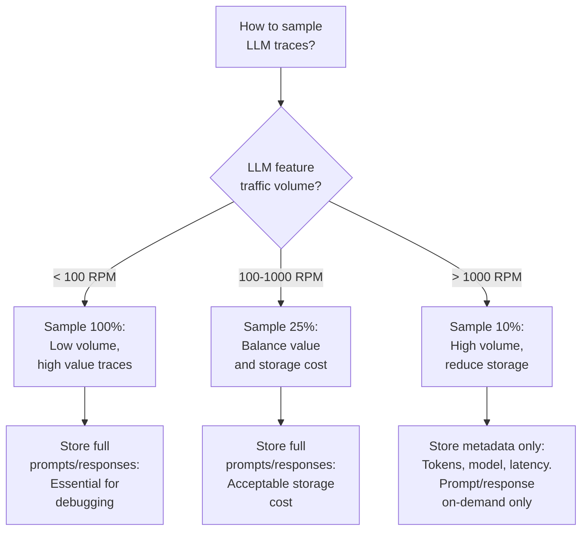

# LLM Tracing Span Structure Decision

```mermaid
flowchart TD
    A[LLM interaction\nhow to trace?] --> B{Single LLM call\nor agent loop?}
    B -->|Single call| C[Simple trace:\n1. prompt_preparation\n2. context_retrieval (RAG)\n3. llm_api_call\n4. guardrail_check\n5. response_processing]
    B -->|Agent loop\n(multi-step)| D[Complex trace:\nAgent root span\n├── step_1: tool_call\n│   └── llm_api_call\n├── step_2: tool_result\n├── step_3: tool_call\n│   └── llm_api_call\n└── step_n: final_response]
    C --> E{Retrieval\ncontext?}
    E -->|Yes| F[Link RAG span\nto LLM span\nvia SpanLinks]
    E -->|No| G[Simple spans\nwith attributes]
    D --> H{Agent decision\npoint?}
    H -->|Yes| I[Agent span:\nrecords chosen action,\nreasoning, alternatives\nconsidered]
    H -->|No| J[Tool call span:\nrecords tool name,\ninput, output,
    duration]
```

# LLM Trace Sampling Decision


