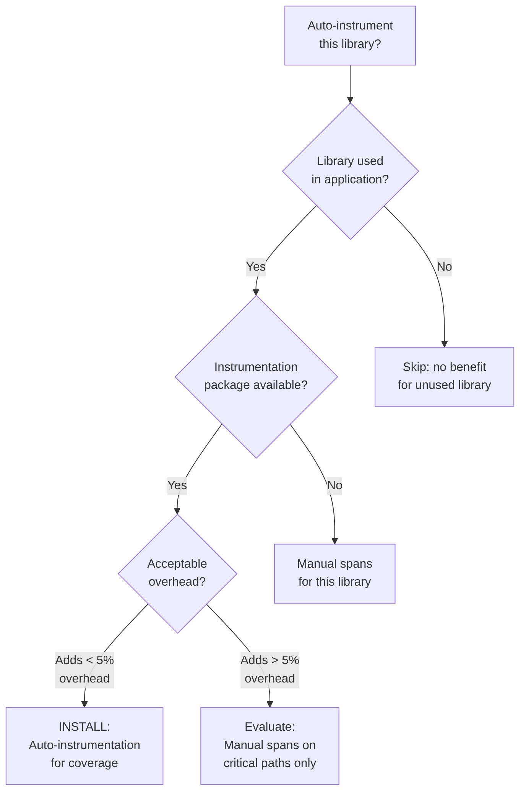
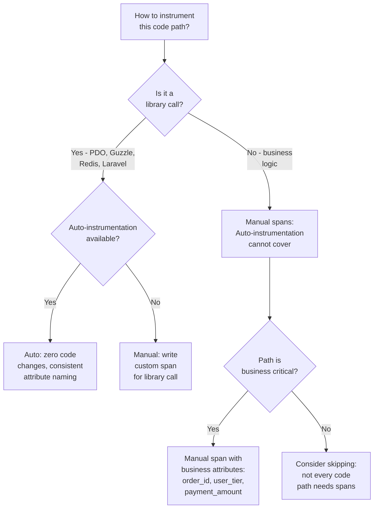

# Auto-Instrumentation Adoption Decision

```mermaid
flowchart TD
    A[Auto-instrument\nthis library?] --> B{Library used\nin application?}
    B -->|Yes| C{Instrumentation\npackage available?}
    B -->|No| D[Skip: no benefit\nfor unused library]
    C -->|Yes| E{Acceptable\noverhead?}
    C -->|No| F[Manual spans\nfor this library]
    E -->|Adds < 5%\noverhead| G[INSTALL:\nAuto-instrumentation\nfor coverage]
    E -->|Adds > 5%\noverhead| H[Evaluate:\nManual spans on\ncritical paths only]
```

# Auto vs Manual Instrumentation Decision

```mermaid
flowchart TD
    A[How to instrument\nthis code path?] --> B{Is it a\nlibrary call?}
    B -->|Yes - PDO, Guzzle,\nRedis, Laravel| C{Auto-instrumentation\navailable?}
    B -->|No - business\nlogic| D[Manual spans:\nAuto-instrumentation\ncannot cover]
    C -->|Yes| E[Auto: zero code\nchanges, consistent\nattribute naming]
    C -->|No| F[Manual: write\ncustom span\nfor library call]
    D --> G{Path is\nbusiness critical?}
    G -->|Yes| H[Manual span with\nbusiness attributes:\norder_id, user_tier,\npayment_amount]
    G -->|No| I[Consider skipping:\nnot every code\npath needs spans]
```
