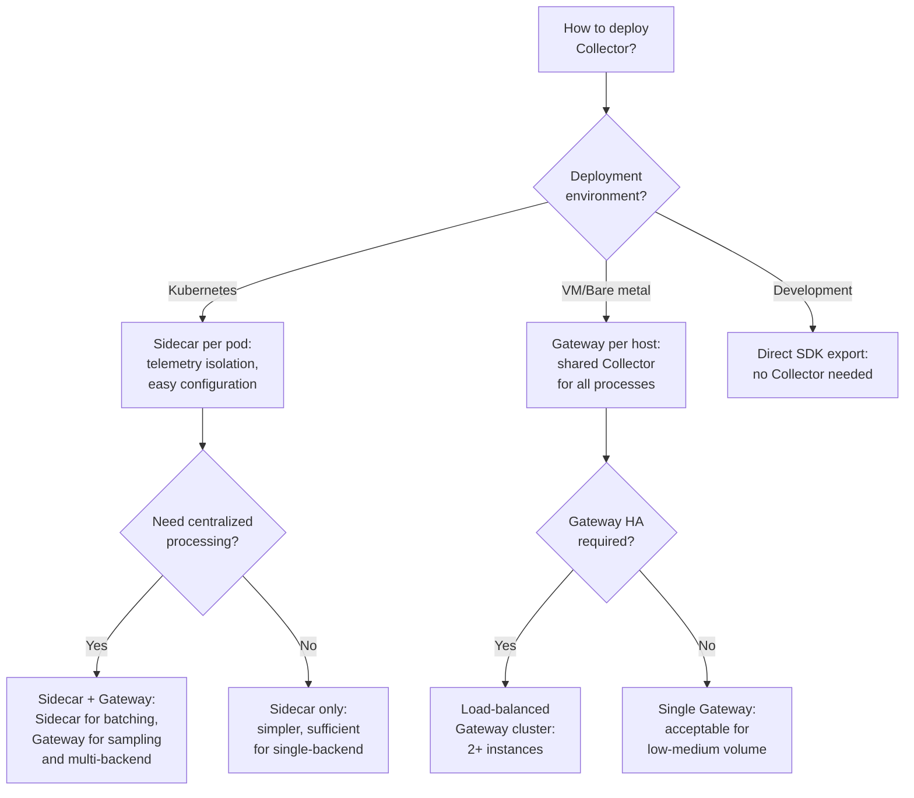
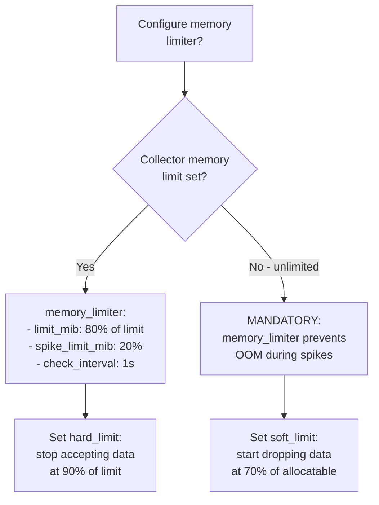

# Collector Deployment Decision



# Memory Limiter Decision



# Pipeline Batching Decision

```mermaid
flowchart TD
    A[Configure batching\nfor this signal?} --> B{Telemetry\nvolume?}
    B -->|< 100 spans/sec| C[batch config:\ntimeout: 1s\nsend_batch_size: 1024]
    B -->|100-1000\nspans/sec| D[batch config:\ntimeout: 200ms\nsend_batch_size: 4096]
    B -->|> 1000\nspans/sec| E[batch config:\ntimeout: 100ms\nsend_batch_size: 8192]
    C --> F{Batching benefit vs\nlatency trade-off?}
    D --> F
    E --> F
    F -->|Lower latency\ncritical| G[Reduce timeout:\n50ms minimum\nfor near-real-time]
    F -->|Efficiency\ntarget| H[Increase batch size:\nup to 16384\nfor maximum efficiency]
```
