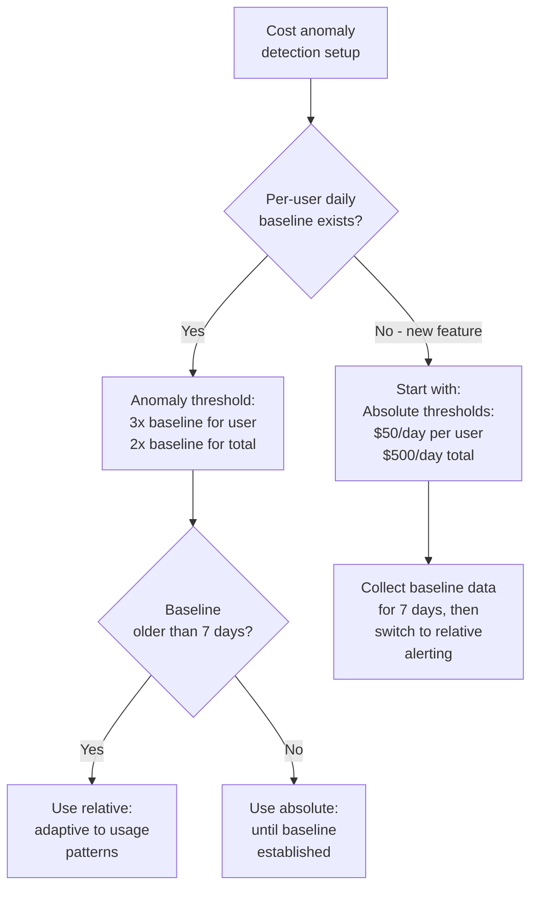
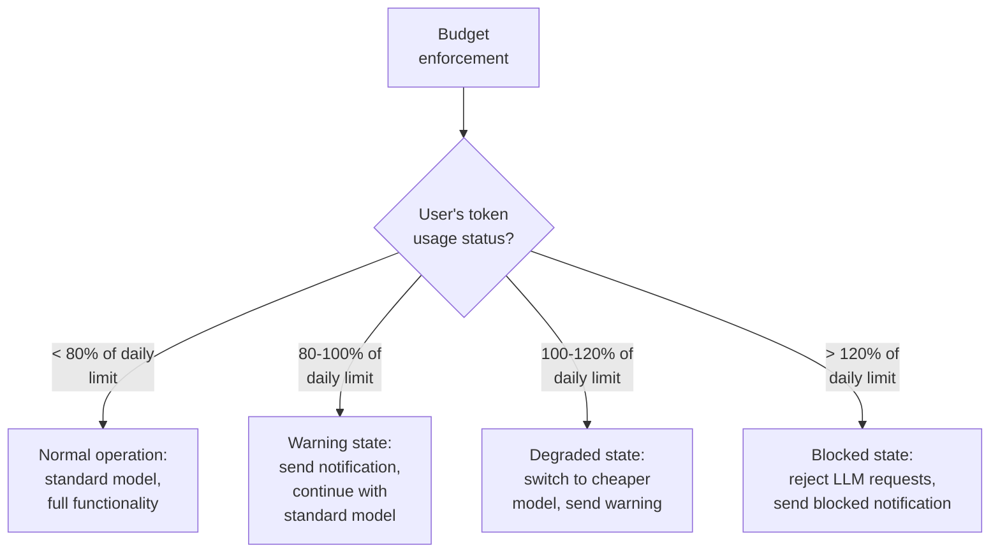

# Token Tracking Strategy Decision

```mermaid
flowchart TD
    A[How to track\ntoken usage?] --> B{Need per-user\ndetail?}
    B -->|Yes| C{User count?}
    B -->|No - aggregate\nonly| D[CHEAP:\nOTel Counter metrics\nby model + feature\nonly]
    C -->|< 10K users| E[MEDIUM:\nStructured logs\nper user + per request.\nOTel metrics aggregated.]
    C -->|> 10K users| F[EXPENSIVE:\nLog aggregation service\n(ELK, Loki).\nOTel metrics for\nreal-time monitoring.]
```

# Cost Anomaly Detection Strategy



# Budget Enforcement Decision


