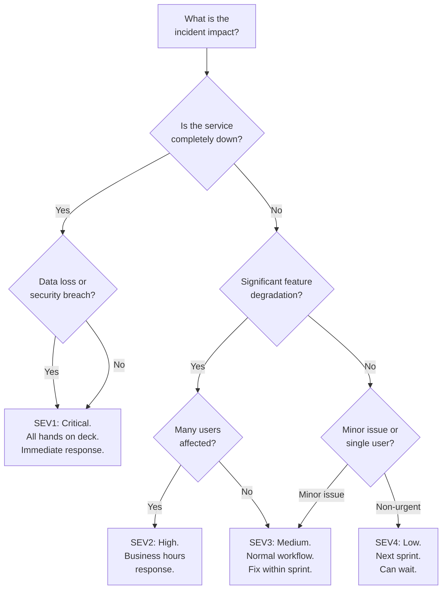
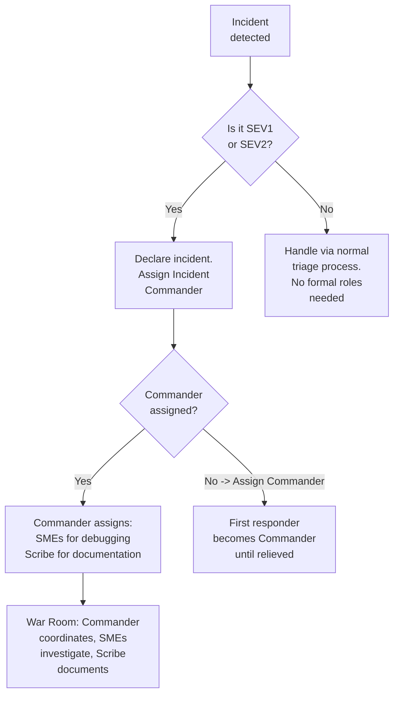
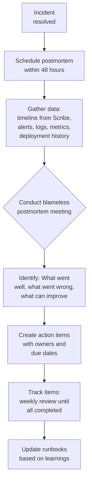

# Incident Severity Classification

```mermaid
flowchart TD
    A[What is the\nincident impact?] --> B{Is the service\ncompletely down?}
    B -->|Yes| C{Data loss or\nsecurity breach?}
    B -->|No| D{Significant feature\ndegradation?}
    C -->|Yes| E[SEV1: Critical.\nAll hands on deck.\nImmediate response.]
    C -->|No| E
    D -->|Yes| F{Many users\naffected?}
    D -->|No| G{Minor issue or\nsingle user?}
    F -->|Yes| H[SEV2: High.\nBusiness hours\nresponse.]
    F -->|No| I[SEV3: Medium.\nNormal workflow.\nFix within sprint.]
    G -->|Minor issue| I
    G -->|Non-urgent| J[SEV4: Low.\nNext sprint.\nCan wait.]
```

# Incident Response Role Assignment

```mermaid
flowchart TD
    A[Incident\ndetected] --> B{Is it SEV1\nor SEV2?}
    B -->|Yes| C[Declare incident.\nAssign Incident\nCommander]
    B -->|No| D[Handle via normal\ntriage process.\nNo formal roles\nneeded]
    C --> E{Commander\nassigned?}
    E -->|Yes| F[Commander assigns:\nSMEs for debugging\nScribe for documentation]
    E -->|No -> Assign Commander| G[First responder\nbecomes Commander\nuntil relieved]
    F --> H[War Room: Commander\ncoordinates, SMEs\ninvestigate, Scribe\ndocuments]
```

# Postmortem Process

```mermaid
flowchart TD
    A[Incident\nresolved] --> B[Schedule postmortem\nwithin 48 hours]
    B --> C[Gather data:\ntimeline from Scribe,\nalerts, logs, metrics,\ndeployment history]
    C --> D{Conduct blameless\npostmortem meeting}
    D --> E[Identify: What went\nwell, what went wrong,\nwhat can improve]
    E --> F[Create action items\nwith owners and\ndue dates]
    F --> G[Track items:\nweekly review until\nall completed]
    G --> H[Update runbooks\nbased on learnings]
```
