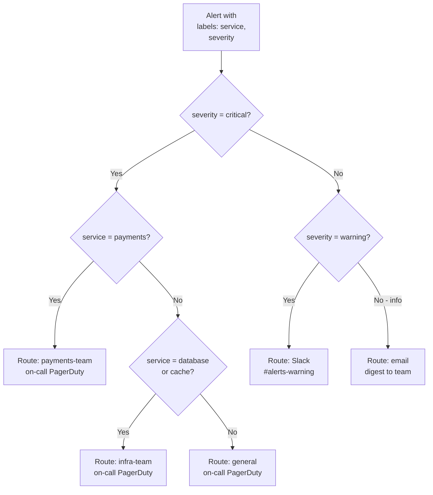
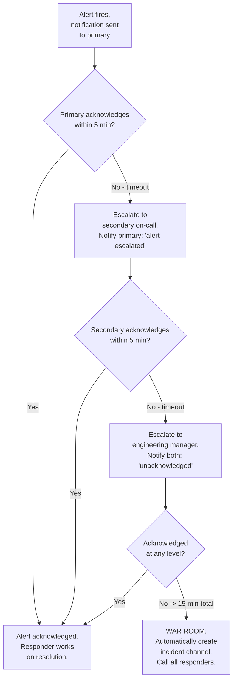
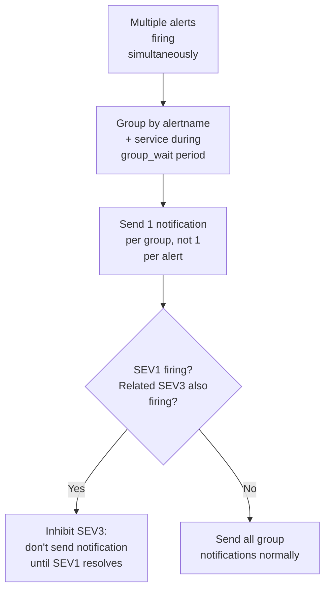

# Alert Routing Decision

```mermaid
flowchart TD
    A[Alert with\nlabels: service,\nseverity] --> B{severity = critical?}
    B -->|Yes| C{service = payments?}
    B -->|No| D{severity = warning?}
    C -->|Yes| E[Route: payments-team\non-call PagerDuty]
    C -->|No| F{service = database\nor cache?}
    F -->|Yes| G[Route: infra-team\non-call PagerDuty]
    F -->|No| H[Route: general\non-call PagerDuty]
    D -->|Yes| I[Route: Slack\n#alerts-warning]
    D -->|No - info| J[Route: email\ndigest to team]
```

# Escalation Path Decision

```mermaid
flowchart TD
    A[Alert fires,\nnotification sent\nto primary] --> B{Primary acknowledges\nwithin 5 min?}
    B -->|Yes| C[Alert acknowledged.\nResponder works\non resolution.]
    B -->|No - timeout| D[Escalate to\nsecondary on-call.\nNotify primary: 'alert escalated']
    D --> E{Secondary acknowledges\nwithin 5 min?}
    E -->|Yes| C
    E -->|No - timeout| F[Escalate to\nengineering manager.\nNotify both: 'unacknowledged']
    F --> G{Acknowledged\nat any level?}
    G -->|Yes| C
    G -->|No -> 15 min total| H[WAR ROOM:\nAutomatically create\nincident channel.\nCall all responders.]
```

# Alert Spam Reduction

```mermaid
flowchart TD
    A[Multiple alerts\nfiring\nsimultaneously] --> B[Group by alertname\n+ service during\ngroup_wait period]
    B --> C[Send 1 notification\nper group, not 1\nper alert]
    C --> D{SEV1 firing?\nRelated SEV3 also\nfiring?}
    D -->|Yes| E[Inhibit SEV3:\ndon't send notification\nuntil SEV1 resolves]
    D -->|No| F[Send all group\nnotifications normally]
```
