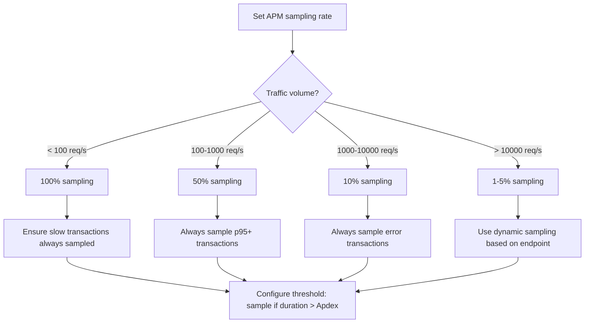

# Decision Trees: APM Tool Integration

## Decision D-01: APM Tool Selection

**Question:** Which APM tool is most appropriate?

```mermaid
flowchart TD
    A[Choose APM tool] --> B{Compliance requirements?}
    B -->|Vendor-neutral required| C[OpenTelemetry + backend]
    B -->|No vendor preference| D{Team size?}
    C --> E[OTel Collector > Tempo/Prometheus]
    D -->|Small (< 10)| F{Primary need?}
    D -->|Large/Enterprise| G[New Relic or Datadog]
    F -->|Laravel N+1 detection| H[Scout APM]
    F -->|Deep profiling| I[Blackfire]
    F -->|Full-featured APM| J[New Relic APM]
    G --> K[Enterprise features, compliance certifications]
    H --> L[Best Laravel-specific N+1 detection]
    I --> M[Best profiling, CI integration]
    J --> N[Most comprehensive APM features]
```

## Decision D-02: Sampling Strategy

**Question:** What sampling rate should be configured?



## Decision D-03: Transaction Naming

**Question:** How should transaction names be configured?

```mermaid
flowchart TD
    A[Configure transaction naming] --> B{URL pattern?}
    B -->|Static routes| C[Use route name as transaction name]
    B -->|Dynamic segments| D[Use route pattern, not actual value]
    B -->|No route name| E[Use HTTP method + URI pattern]
    C --> F[Route: dashboard.home → transaction: dashboard.home]
    D --> G[Route: users/{id} → transaction: GET /users/{id}]
    E --> H[Pattern: GET /api/orders/{id}/items → GET /api/orders/*/items]
    F --> I[Verify grouping in dashboard]
    G --> I
    H --> I
```
