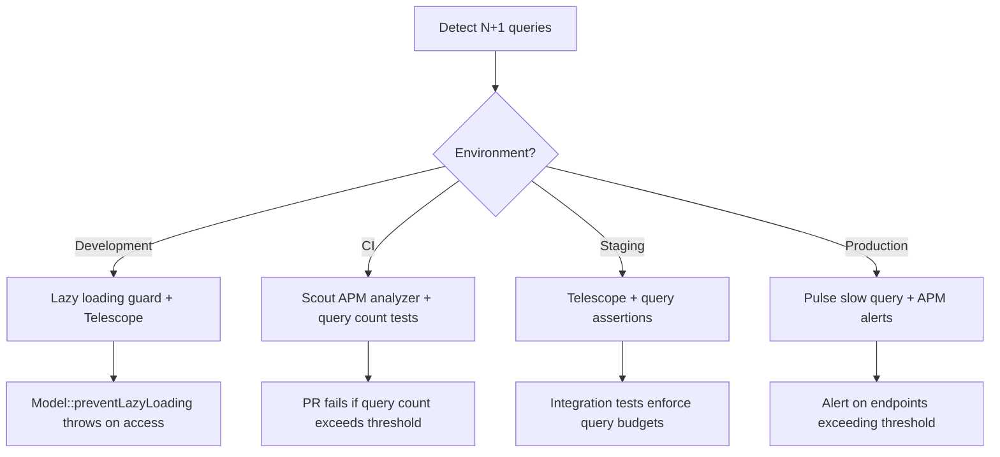

# Decision Trees: N+1 Query Detection

## Decision D-01: Detection Strategy by Environment

**Question:** How should N+1 be detected in each environment?



## Decision D-02: Loading Strategy by Dataset Size

**Question:** Should relationships be eager loaded or lazy-loaded with chunking?

```mermaid
flowchart TD
    A[Load relationships] --> B{Expected record count?}
    B -->|< 100| C[Eager load - all records with with()]
    B -->|100-1000| D[Eager load - with selective columns]
    B -->|> 1000| E{Processing pattern?}
    E -->|Read-only iteration| F[chunk() or lazy()]
    E -->|Modification needed| G[chunk() + individual load()]
    C --> H[Model::with(['relation:id,name'])]
    D --> I[Model::with(['relation:id,key,display'])]
    F --> J[Model::lazy()->each(fn($m) => $m->relation->name)]
    G --> K[Model::chunk(100, fn($records) => ...)]
```

## Decision D-03: Fix Identification

**Question:** What fix is appropriate for a detected N+1?

```mermaid
flowchart TD
    A[N+1 detected] --> B{Location?}
    B -->|Controller query| C[Add with() to initial query]
    B -->|Blade view loop| D[Eager load in controller, pass to view]
    B -->|API Resource| E[Use whenLoaded() or preload]
    B -->|Middleware| F[Load in middleware, add to request]
    C --> G[Order::with('user:id,name')->get()]
    D --> H[Controller: with('posts'); View: use $order->posts]
    E --> I[$this->whenLoaded('relation', fn() => ...)]
    F --> J[Midleware adds with() to active queries]
```
