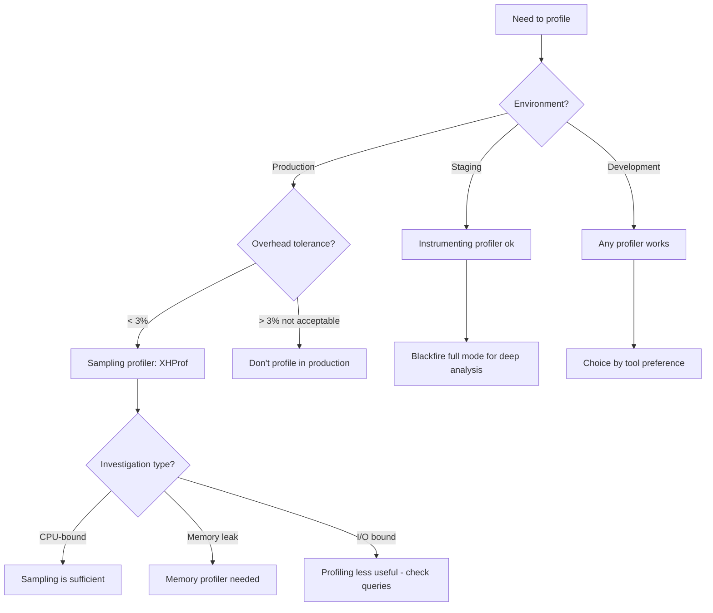
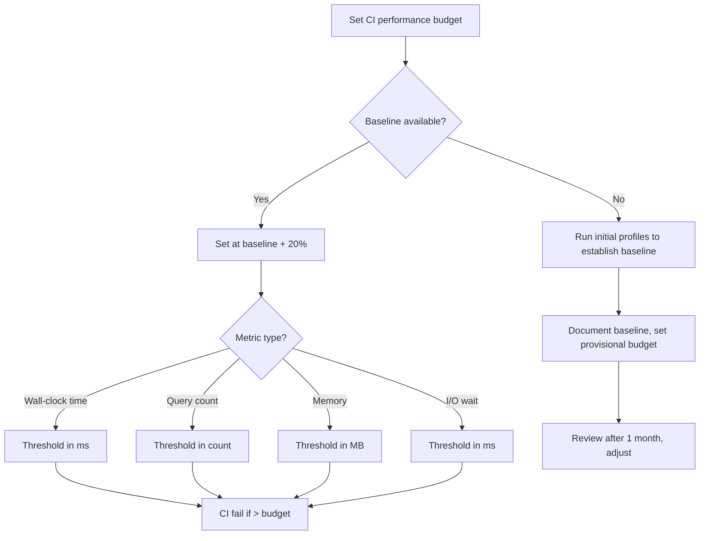

# Decision Trees: Performance Profiling

## Decision D-01: Profiling Approach

**Question:** Which profiling approach is appropriate for the current scenario?



## Decision D-02: Bottleneck Classification

**Question:** Is the performance issue CPU-bound or I/O-bound?

```mermaid
flowchart TD
    A[Analyze bottleneck] --> B{Wall time vs CPU time?}
    B -->|Wall >> CPU (>2x)| C[I/O-bound bottleneck]
    B -->|Wall ≈ CPU| D[CPU-bound bottleneck]
    C --> E[Database queries: check EXPLAIN]
    C --> F[HTTP calls: check external latency]
    C --> G[File I/O: check disk stats]
    D --> H[Flame graph hot functions]
    D --> I[Memory allocations]
    E --> J[Add index, reduce query count, add cache]
    F --> K[Add timeout, parallelize, cache response]
    G --> L[Migrate to SSD, add cache layer]
    H --> M[Optimize algorithm, add cache]
    I --> N[Reduce allocations, reuse objects]
```

## Decision D-03: CI Budget Enforcement

**Question:** How should performance budgets be set and enforced?


