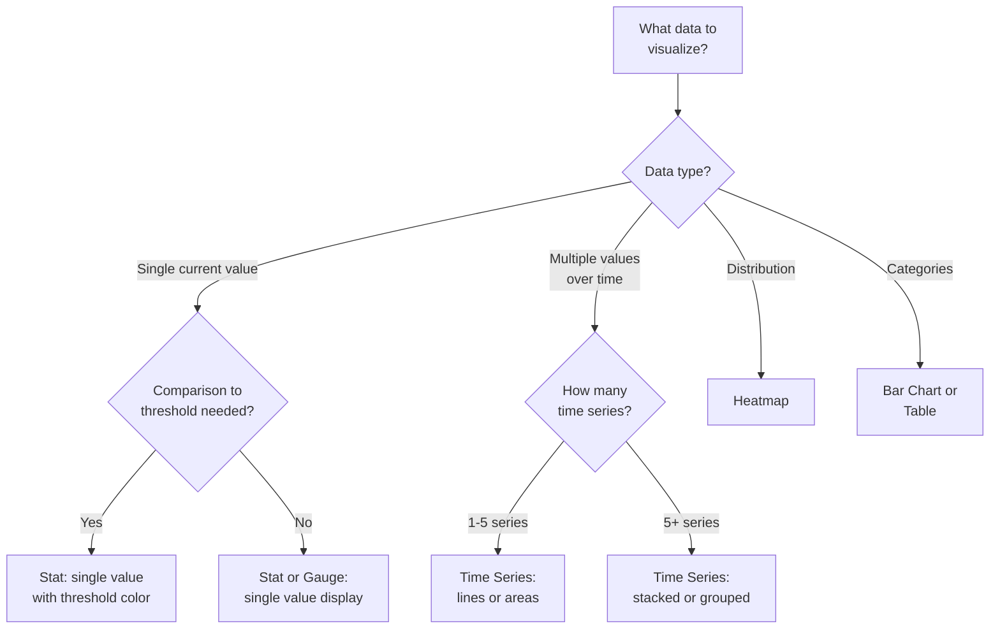

# Dashboard Layout Decision

```mermaid
flowchart TD
    A[What dashboard\ntype is needed?] --> B{Target audience?}
    B -->|Operations\n(on-call)| C[Operations Dashboard:\nError rate, latency,\nthroughput, saturation]
    B -->|Business\n(stakeholders)| D[Business Dashboard:\nOrders, revenue,\nactive users]
    B -->|Development\n(debugging)| E[Debug Dashboard:\nSlow queries, errors,\ncache misses]
    C --> F[Layout: Top row = 4 Stat\npanels, Middle = breakdowns,\nBottom = correlations]
    D --> G[Layout: Top = KPIs,\nMiddle = trends,\nBottom = comparisons]
    E --> H[Layout: Top = current\nslow requests, Middle =\nquery details, Bottom = logs]
```

# Panel Type Selection


