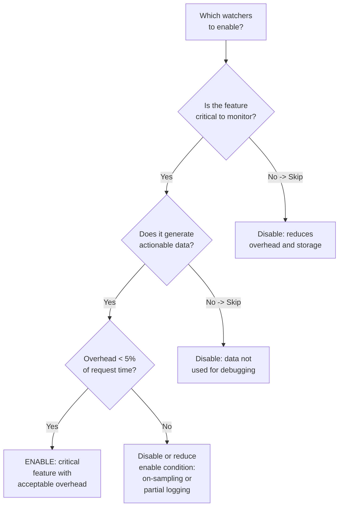
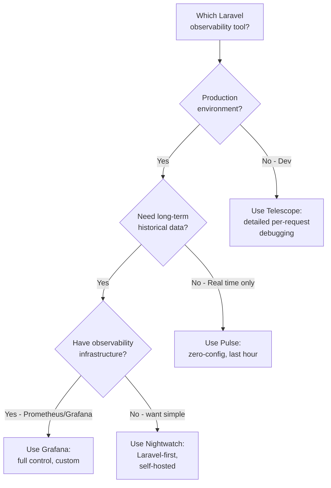

# Watcher Selection Decision

```mermaid
flowchart TD
    A[Which watchers\nto enable?] --> B{Is the feature\ncritical to monitor?}
    B -->|Yes| C{Does it generate\nactionable data?}
    B -->|No -> Skip| D[Disable: reduces\noverhead and storage]
    C -->|Yes| E{Overhead < 5%\nof request time?}
    C -->|No -> Skip| F[Disable: data not\nused for debugging]
    E -->|Yes| G[ENABLE: critical\nfeature with\nacceptable overhead]
    E -->|No| H[Disable or reduce\nenable condition:\non-sampling or\npartial logging]
```

# Observability Tool Selection

```mermaid
flowchart TD
    A[Which Laravel\nobservability tool?] --> B{Production\nenvironment?}
    B -->|Yes| C{Need long-term\nhistorical data?}
    B -->|No - Dev| D[Use Telescope:\ndetailed per-request\ndebugging]
    C -->|Yes| E{Have observability\ninfrastructure?}
    C -->|No - Real time only| F[Use Pulse:\nzero-config, last hour]
    E -->|Yes - Prometheus/Grafana| G[Use Grafana:\nfull control, custom]
    E -->|No - want simple| H[Use Nightwatch:\nLaravel-first,\nself-hosted]
```
