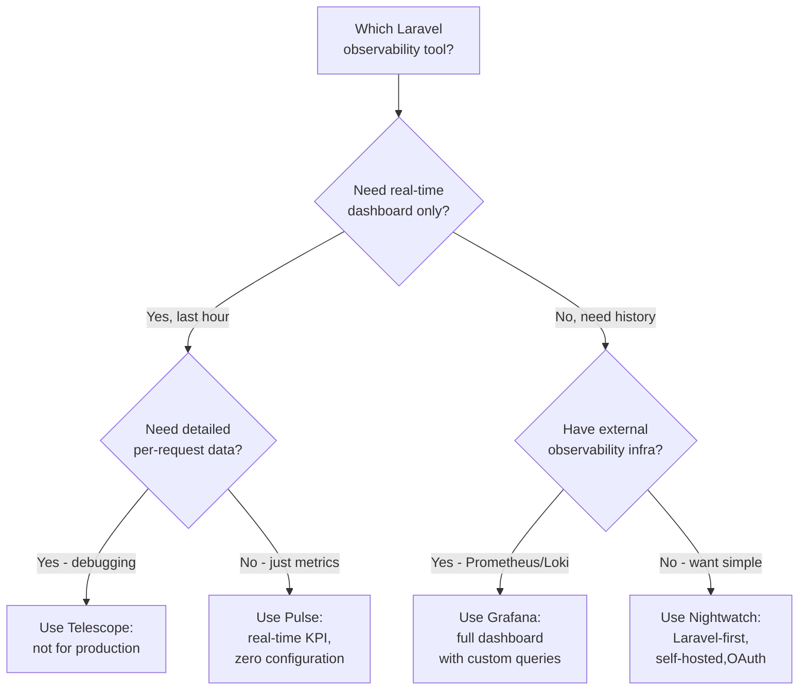
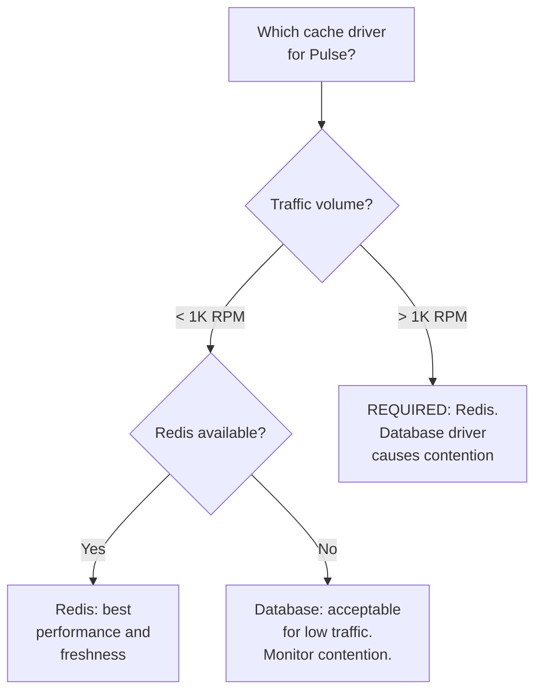

# Observability Tool Selection

```mermaid
flowchart TD
    A[Which Laravel\nobservability tool?] --> B{Need real-time\ndashboard only?}
    B -->|Yes, last hour| C{Need detailed\nper-request data?}
    B -->|No, need history| D{Have external\nobservability infra?}
    C -->|Yes - debugging| E[Use Telescope:\nnot for production]
    C -->|No - just metrics| F[Use Pulse:\nreal-time KPI,\nzero configuration]
    D -->|Yes - Prometheus/Loki| G[Use Grafana:\nfull dashboard\nwith custom queries]
    D -->|No - want simple| H[Use Nightwatch:\nLaravel-first,\nself-hosted,OAuth]
```

# Pulse Cache Driver Decision

```mermaid
flowchart TD
    A[Which cache driver\nfor Pulse?] --> B{Traffic volume?}
    B -->|< 1K RPM| C{Redis available?}
    B -->|> 1K RPM| D[REQUIRED: Redis.\nDatabase driver\ncauses contention]
    C -->|Yes| E[Redis: best\nperformance and\nfreshness]
    C -->|No| F[Database: acceptable\nfor low traffic.\nMonitor contention.]
```
