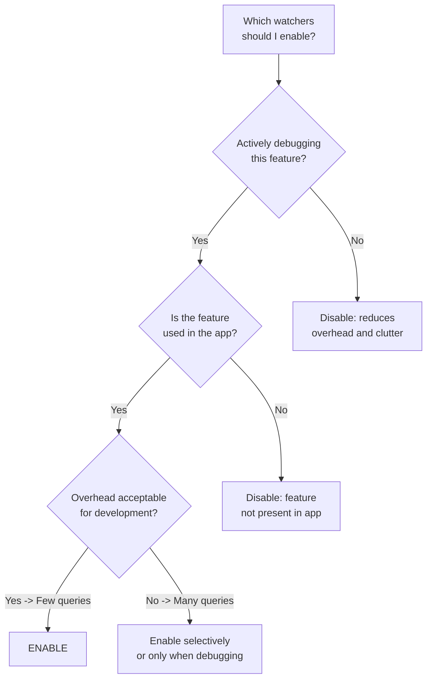
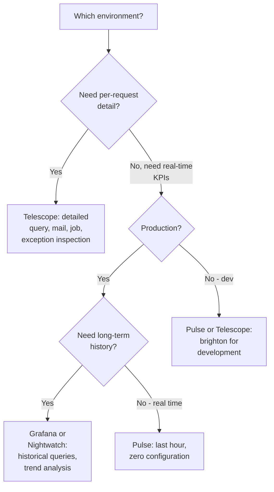
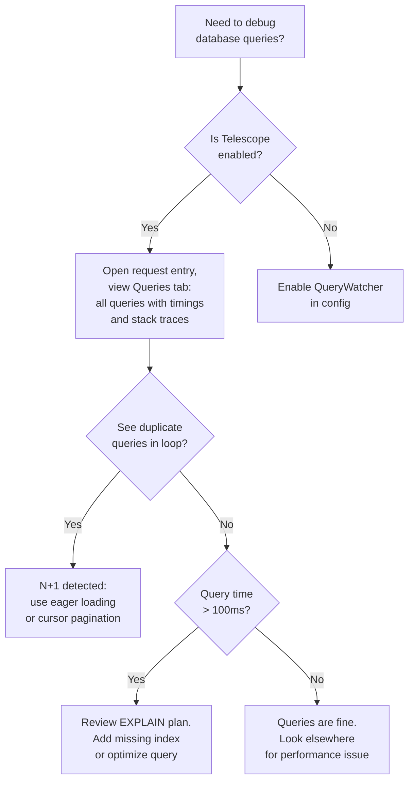

# Telescope Watcher Selection

```mermaid
flowchart TD
    A[Which watchers\nshould I enable?] --> B{Actively debugging\nthis feature?}
    B -->|Yes| C{Is the feature\nused in the app?}
    B -->|No| D[Disable: reduces\noverhead and clutter]
    C -->|Yes| E{Overhead acceptable\nfor development?}
    C -->|No| F[Disable: feature\nnot present in app]
    E -->|Yes -> Few queries| G[ENABLE]
    E -->|No -> Many queries| H[Enable selectively\nor only when debugging]
```

# Development vs Production Observability

```mermaid
flowchart TD
    A[Which environment?] --> B{Need per-request\ndetail?}
    B -->|Yes| C[Telescope: detailed\nquery, mail, job,\nexception inspection]
    B -->|No, need real-time\nKPIs| D{Production?}
    D -->|Yes| E{Need long-term\nhistory?}
    D -->|No - dev| F[Pulse or Telescope:\nbrighton for\ndevelopment]
    E -->|Yes| G[Grafana or\nNightwatch:\nhistorical queries,\ntrend analysis]
    E -->|No - real time| H[Pulse: last hour,\nzero configuration]
```

# Telescope Query Debugging

```mermaid
flowchart TD
    A[Need to debug\ndatabase queries?] --> B{Is Telescope\nenabled?}
    B -->|Yes| C[Open request entry,\nview Queries tab:\nall queries with timings\nand stack traces]
    B -->|No| D[Enable QueryWatcher\nin config]
    C --> E{See duplicate\nqueries in loop?}
    E -->|Yes| F[N+1 detected:\nuse eager loading\nor cursor pagination]
    E -->|No| G{Query time\n> 100ms?}
    G -->|Yes| H[Review EXPLAIN plan.\nAdd missing index\nor optimize query]
    G -->|No| I[Queries are fine.\nLook elsewhere\nfor performance issue]
```
