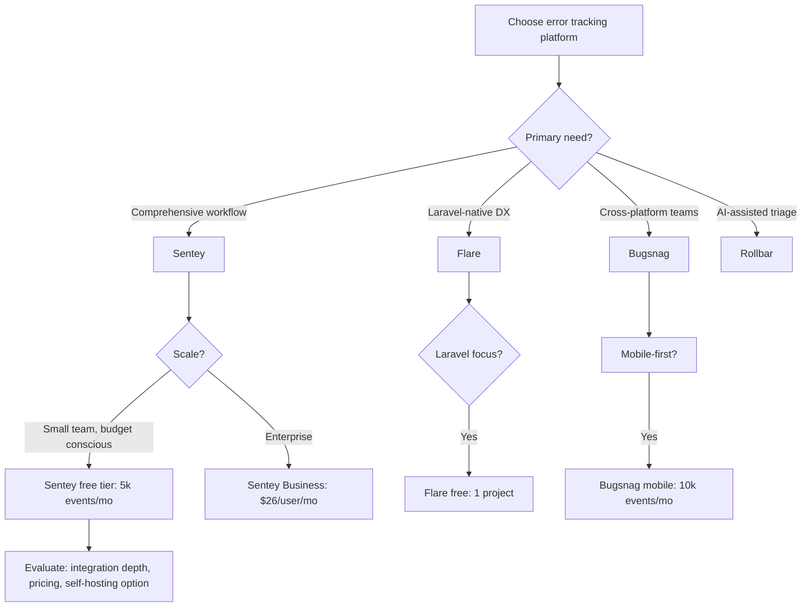
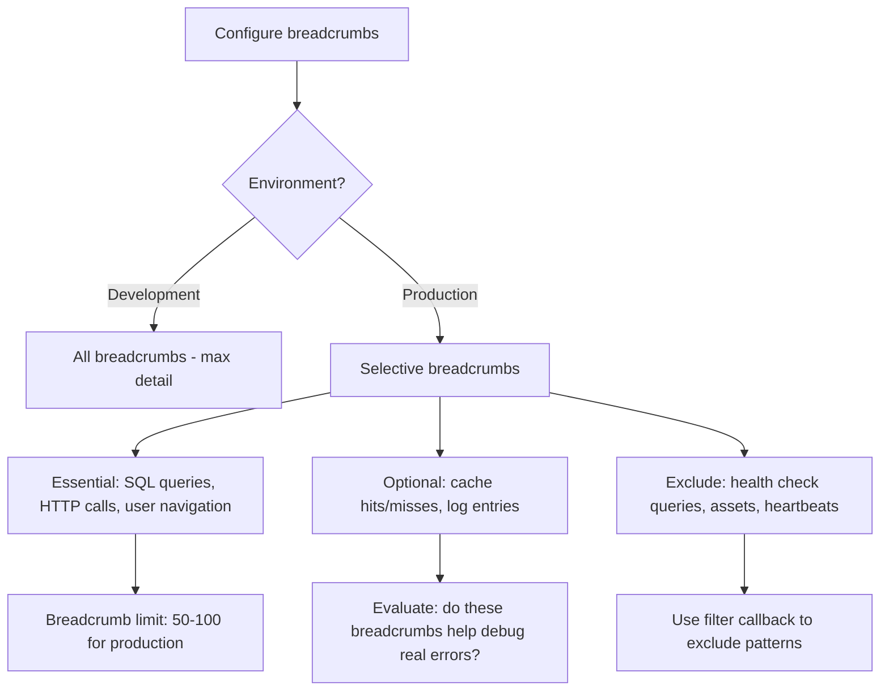

# Decision Trees: Error Tracking Workflow

## Decision D-01: Error Tracking Platform Selection

**Question:** Which error tracking platform should be used?



**Recommendation:** Sentry for most Laravel teams — best balance of features, pricing, and Laravel integration. Flare for small Laravel-only teams wanting deeper framework integration.

---

## Decision D-02: Release Version Format

**Question:** What format should the release version use?

```mermaid
flowchart TD
    A[Choose release format] --> B{Deployment method?}
    B -->|CI/CD pipeline| C[git SHA - precise, traceable]
    B -->|Manual deploy| D[Sementic version - readable]
    B -->|Automated rollbacks| E[CI build number - monotonic]
    C --> F[Set SENTRY_RELEASE={git_sha} in CI step]
    D --> G[Manually tag releases]
    E --> H[Extract CI_BUILD_NUMBER]
```

**Recommendation:** git SHA for CI/CD deployments. Semantic version for manually tagged releases. Git SHA provides unambiguous commit-to-error mapping.

---

## Decision D-03: Breadcrumb Configuration

**Question:** Which breadcrumbs should be collected in production?



**Recommendation:** Production breadcrumbs = SQL queries + HTTP client calls + user navigation + auth events. Limit to 100 max. Exclude health checks and static assets.
