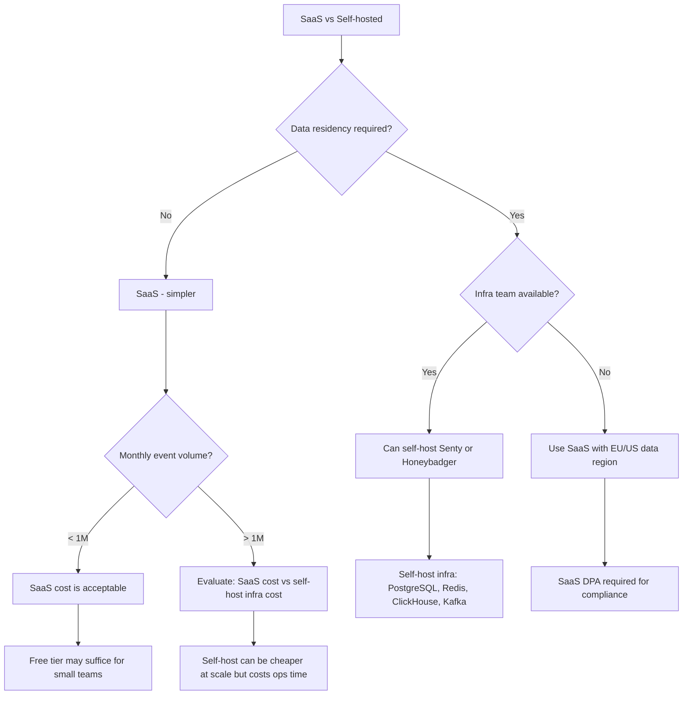

# Decision Trees: Flare & BugSnag Alternatives

## Decision D-01: Platform Selection

**Question:** Which error tracking platform is best for this team?

```mermaid
flowchart TD
    A[Choose error tracking platform] --> B{App type?}
    B -->|Laravel only| C{Laravel team size?}
    B -->|Laravel + mobile| D[Bugsnag - unified cross-platform]
    B -->|Multi-service| E[Sentey - comprehensive]
    C -->|Small (< 10)| F{Want solutions?}
    C -->|Large| G[Sentey - scale]
    D --> H[Evaluate mobile SDK quality]
    F -->|Yes - solution debugging| I[Flare]
    F -->|No - standard tracking| J[Sentey free tier]
    I --> K[Laravel-idiomatic, solution-based]
    G --> L[Team management, release workflow]
    J --> M[5k events/mo free, upgrade as needed]
```

---

## Decision D-02: SaaS vs Self-Hosted

**Question:** Should the error tracking platform be SaaS or self-hosted?



**Recommendation:** SaaS for most teams. Self-host only when data sovereignty regulations force it or at very high volume (>10M events/month) with dedicated ops team.
