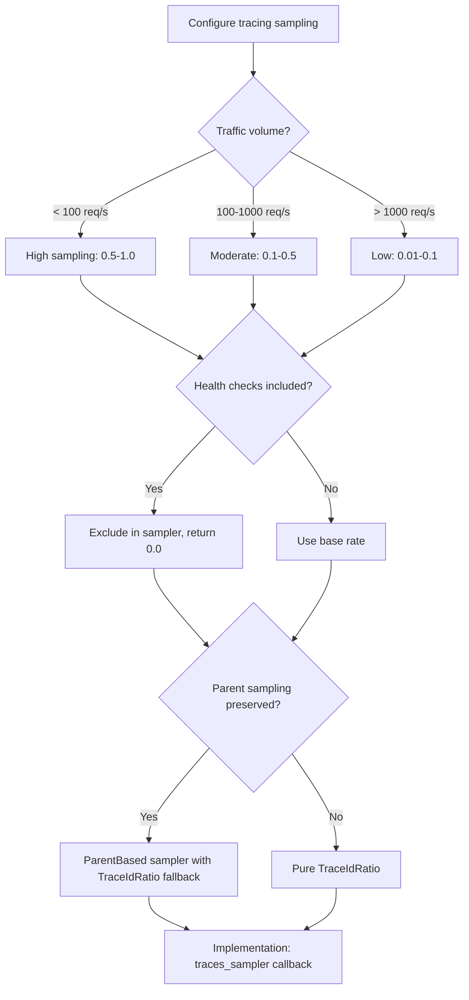
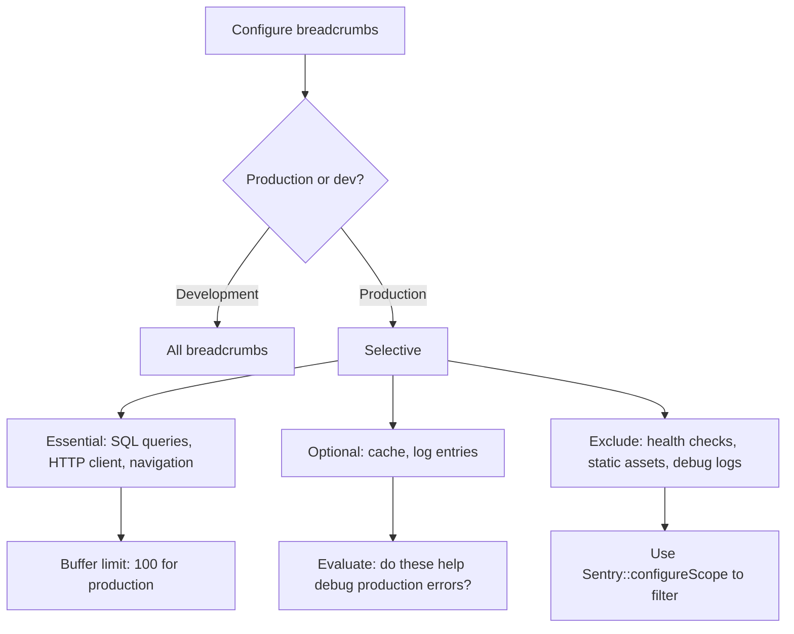
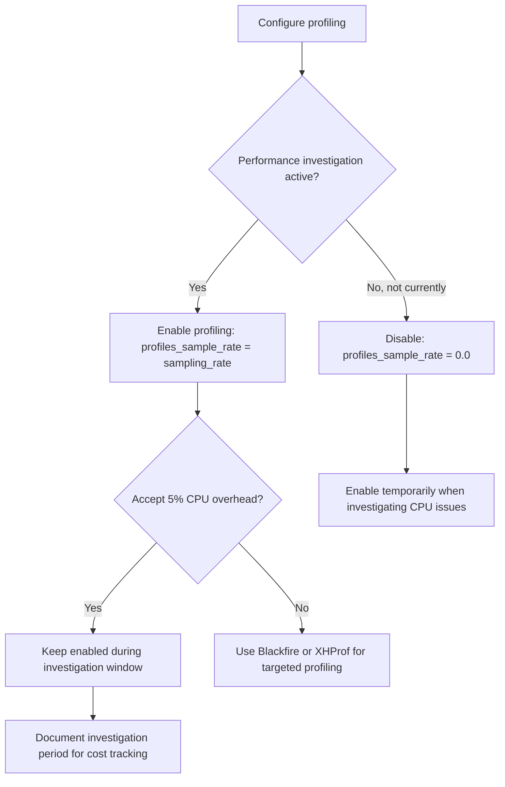

# Decision Trees: Sentry Laravel Integration

## Decision D-01: Sampling Strategy

**Question:** How should Sentry performance tracing be sampled?

## Decision D-02: Breadcrumb Selection

**Question:** Which breadcrumb types should be collected?

## Decision D-03: Profiling Configuration

**Question:** Should profiling be enabled in production?

