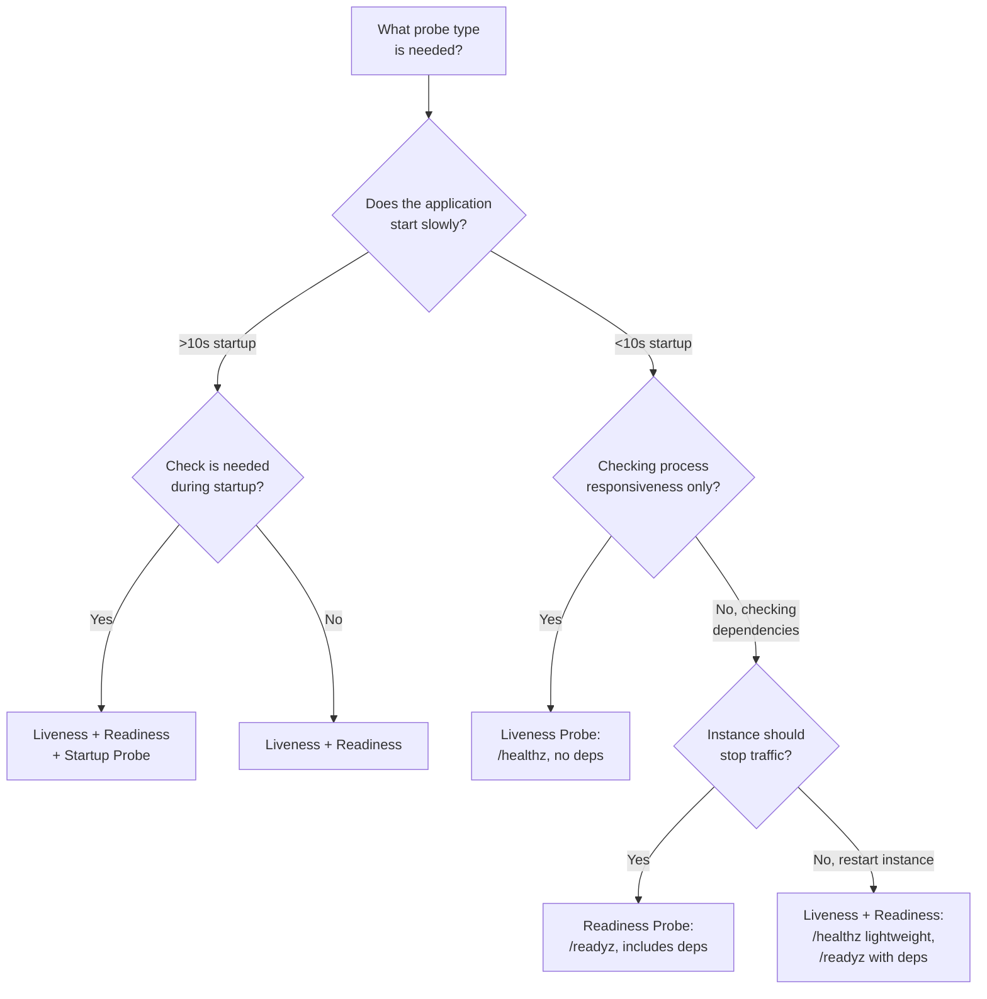
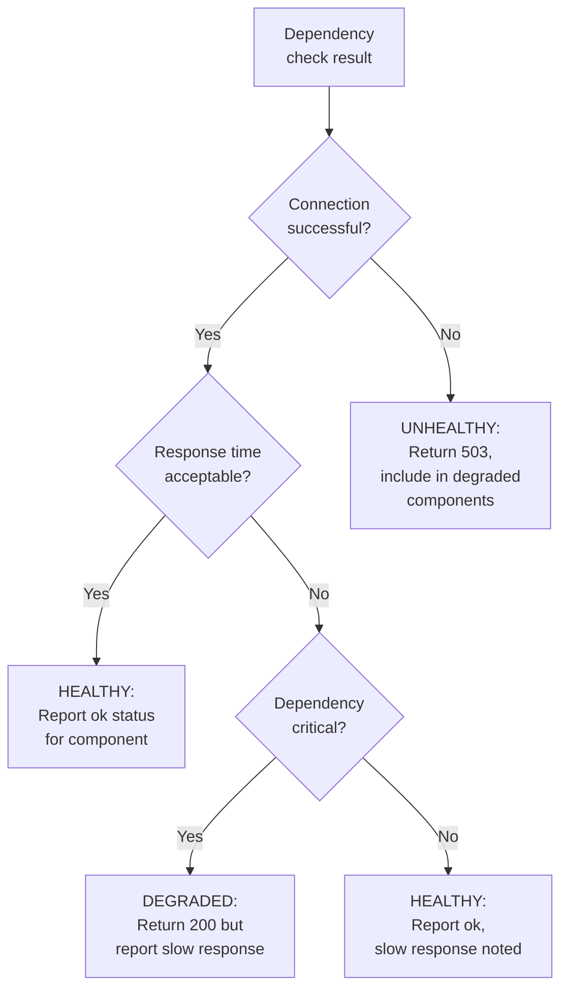

# Probe Type Selection

```mermaid
flowchart TD
    A[What probe type\nis needed?] --> B{Does the application\nstart slowly?}
    B -->|>10s startup| C{Check is needed\nduring startup?}
    B -->|<10s startup| D{Checking process\nresponsiveness only?}
    C -->|Yes| E[Liveness + Readiness\n+ Startup Probe]
    C -->|No| F[Liveness + Readiness]
    D -->|Yes| G[Liveness Probe:\n/healthz, no deps]
    D -->|No, checking\ndependencies| H{Instance should\nstop traffic?}
    H -->|Yes| I[Readiness Probe:\n/readyz, includes deps]
    H -->|No, restart instance| J[Liveness + Readiness:\n/healthz lightweight,\n/readyz with deps]
```

# Component Health Status

```mermaid
flowchart TD
    A[Dependency\ncheck result] --> B{Connection\nsuccessful?}
    B -->|Yes| C{Response time\nacceptable?}
    B -->|No| D[UNHEALTHY:\nReturn 503,\ninclude in degraded\ncomponents]
    C -->|Yes| E[HEALTHY:\nReport ok status\nfor component]
    C -->|No| F{Dependency\ncritical?}
    F -->|Yes| G[DEGRADED:\nReturn 200 but\nreport slow response]
    F -->|No| H[HEALTHY:\nReport ok,\nslow response noted]
```
