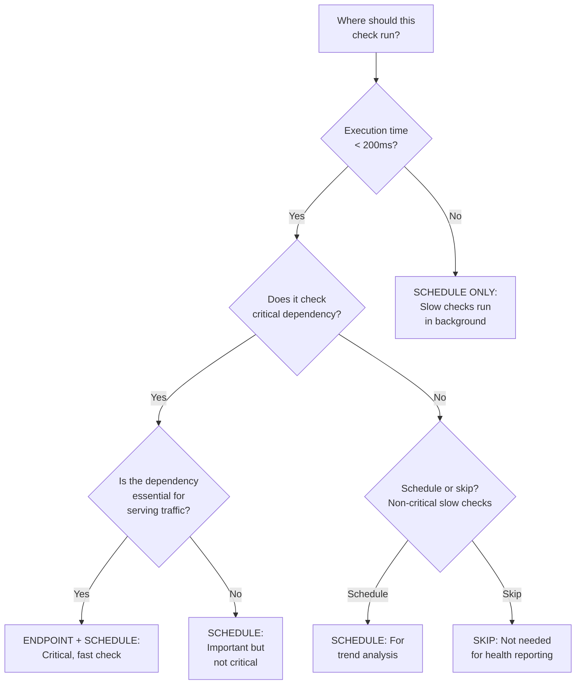
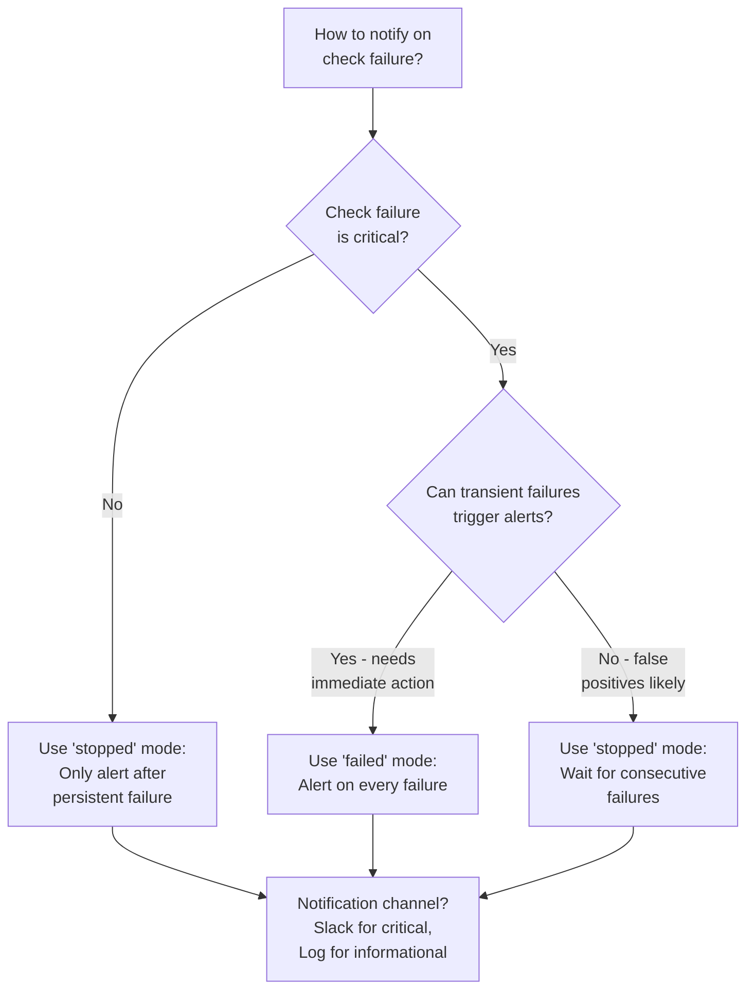

# Check Execution Mode Decision

```mermaid
flowchart TD
    A[Where should this\ncheck run?] --> B{Execution time\n< 200ms?}
    B -->|Yes| C{Does it check\ncritical dependency?}
    B -->|No| D[SCHEDULE ONLY:\nSlow checks run\nin background]
    C -->|Yes| E{Is the dependency\nessential for\nserving traffic?}
    C -->|No| F{Schedule or skip?\nNon-critical slow checks}
    F -->|Schedule| G[SCHEDULE: For\ntrend analysis]
    F -->|Skip| H[SKIP: Not needed\nfor health reporting]
    E -->|Yes| I[ENDPOINT + SCHEDULE:\nCritical, fast check]
    E -->|No| J[SCHEDULE:\nImportant but\nnot critical]
```

# Notification Configuration

```mermaid
flowchart TD
    A[How to notify on\ncheck failure?] --> B{Check failure\nis critical?}
    B -->|Yes| C{Can transient failures\ntrigger alerts?}
    B -->|No| D[Use 'stopped' mode:\nOnly alert after\npersistent failure]
    C -->|Yes - needs\nimmediate action| E[Use 'failed' mode:\nAlert on every failure]
    C -->|No - false\npositives likely| F[Use 'stopped' mode:\nWait for consecutive\nfailures]
    D --> G[Notification channel?\nSlack for critical,\nLog for informational]
    E --> G
    F --> G
```
