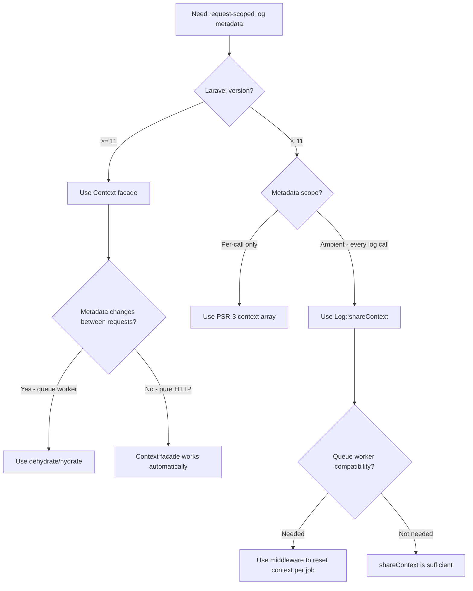
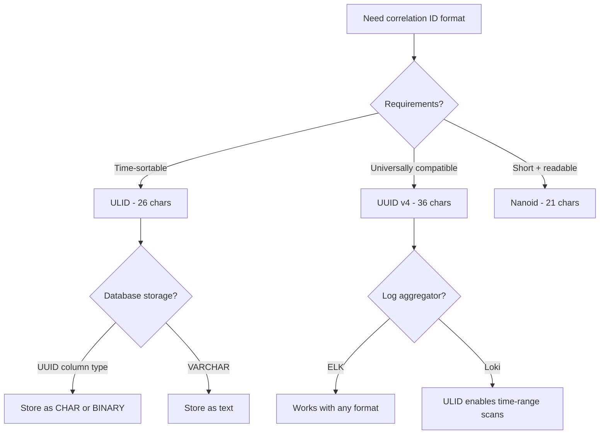
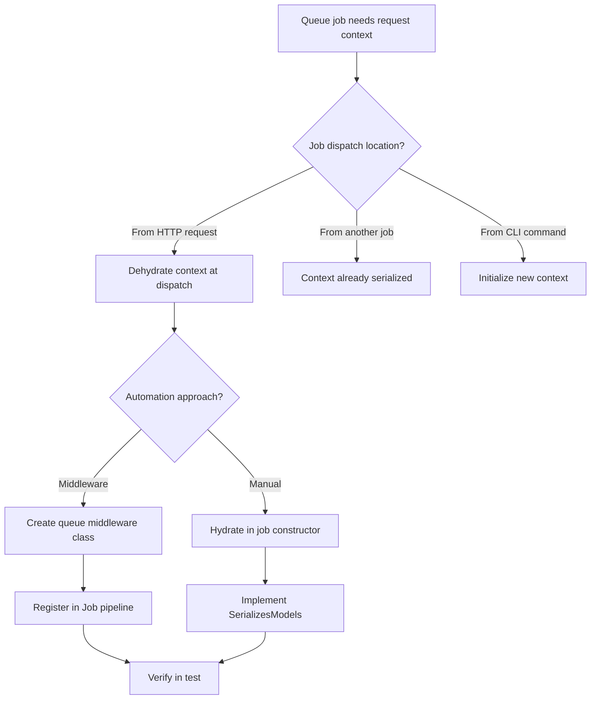
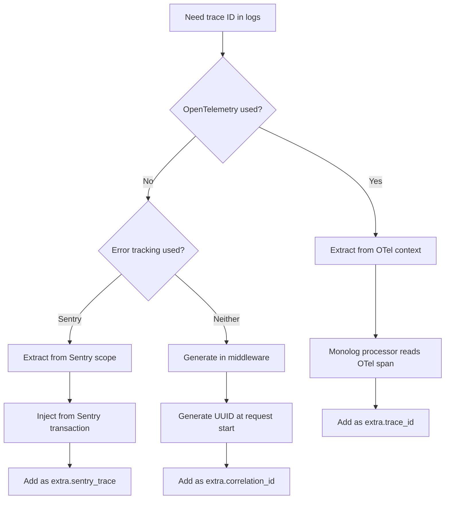

# Decision Trees: Log Context & Correlation

## Decision D-01: How to Store Request-Scoped Metadata

**Question:** What mechanism should I use to attach metadata to every log entry in a request?

**Path 1 — Context facade (recommended):** Laravel 11+ provides automatic serialization, scope isolation, and queue integration. This is the production standard.

**Path 2 — shareContext (Laravel 10 fallback):** Works but has known issues with queue workers where context can leak between jobs. Reset explicitly in queue middleware.

**Path 3 — PSR-3 only:** Acceptable for simple applications with few log calls. Every log call must manually include context — error-prone at scale.

---

## Decision D-02: Correlation ID Generation

**Question:** What format should the correlation ID use?

**Recommendation:** ULID for new projects — it is sortable, URL-safe, and shorter than UUID v4. Stick with UUID v4 if the organization standard uses it or if compatibility with external systems requires it.

---

## Decision D-03: Context Propagation Strategy for Queues

**Question:** How should context be propagated to queued jobs?

**Path 1 — Queue middleware (recommended):** Create `PropagateLogContext` middleware that calls `Context::dehydrate()` on `$job->context` before dispatch and `Context::hydrate()` on execution. Register globally on the Queue facade.

**Path 2 — Manual hydration:** Acceptable for one-off jobs but leads to inconsistencies when multiple developers add new jobs.

---

## Decision D-04: Trace ID Source

**Question:** Where should the trace ID come from for log correlation?

**Recommendation:** Prefer OpenTelemetry as the trace ID source — it ensures consistency between logs and distributed traces. Fall back to Sentry's trace ID if Sentry is used but OTel is not. Generate a simple UUID as the last resort.
