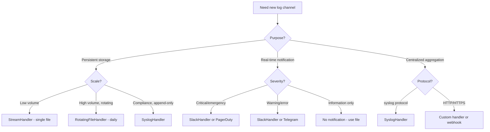
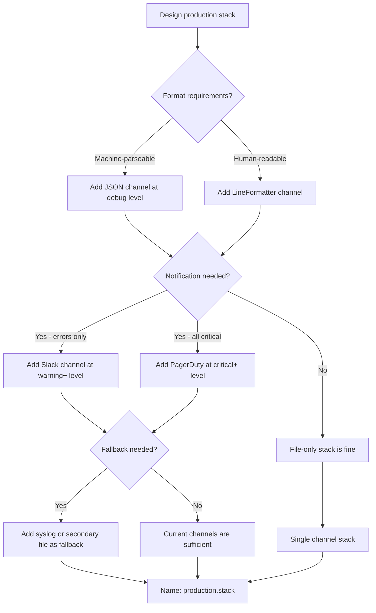
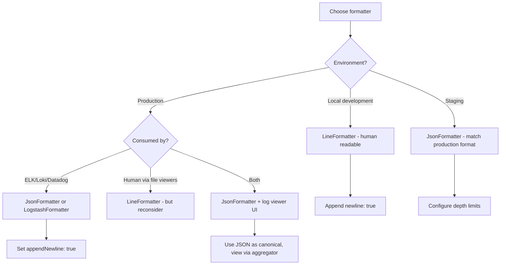

# Decision Trees: Monolog Architecture & Channel Configuration

## Decision D-01: Channel Destination Selection

**Question:** What type of handler should a new channel use?

---

## Decision D-02: Stack Composition Strategy

**Question:** How should the production stack be composed?

**Recommendation:** Standard production stack: JSON file (debug) + Slack (warning+) + syslog (emergency fallback).

---

## Decision D-03: Formatter Selection

**Question:** Which formatter should a channel use?

**Recommendation:** JSON for all production channels. Use `LineFormatter` only in local development. If humans must read production logs, use a log viewer UI (Kibana, Grafana Loki Explore) rather than changing the format.
