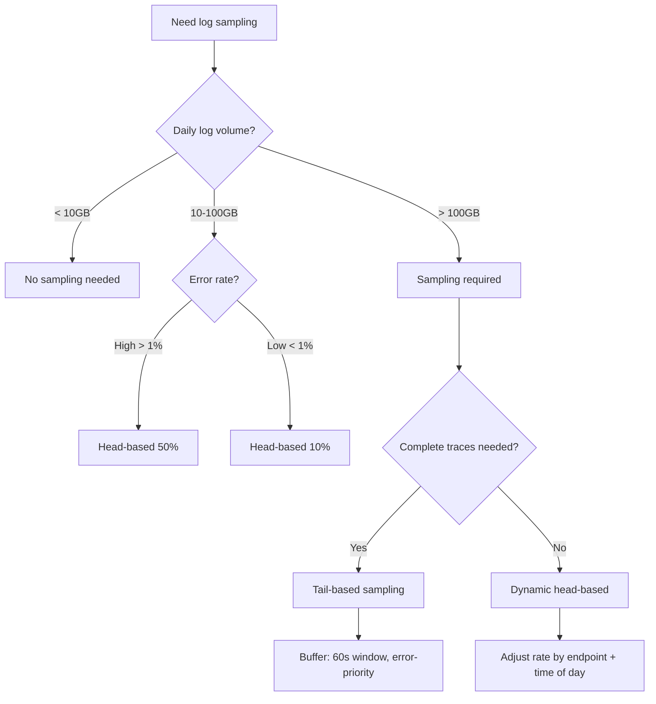
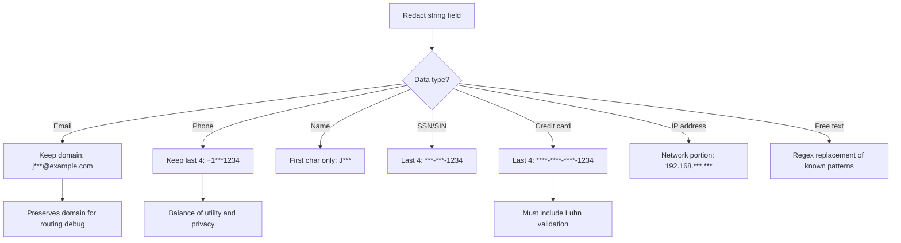

# Decision Trees: PII Redaction & Log Sampling

## Decision D-01: Redaction Strategy Selection

**Question:** Which redaction approach should be used for each piece of data?

```mermaid
flowchart TD
    A[PII field identified in logs] --> B{Field type?}
    B -->|Credential| C[Full redaction - '[REDACTED]']
    B -->|User identifier| D{Correlation needed?}
    B -->|Contact info| E[HMAC hash or partial mask]
    B -->|Regulated number| F[Full redaction]
    D -->|Yes - join across entries| G[Salted HMAC hash]
    D -->|No| H[Full redaction]
    C --> I[Add to blocklist]
    E --> J[email: j***@example.com; phone: +1***1234]
    F --> K[Luhn-checked credit card mask]
    G --> L[Use APP_KEY as salt]
```

**Recommendation:**
- Credentials: full redaction
- User IDs needed for debugging: salted HMAC hash
- Email/phone: partial mask (preserve domain/TLD for routing debug)
- Credit cards: full redaction with Luhn validation
- IP addresses: full redaction (or truncate to /24 for geo-debugging)

---

## Decision D-02: Sampling Strategy Selection

**Question:** Which sampling strategy is appropriate?



**Head-based recommendation:** Start at 10% for traffic >1000 req/s. Adjust to keep weekly volume within budget. Exclude errors always.

**Tail-based recommendation:** Use when trace completeness matters more than storage cost. Budget 50MB per 1000 concurrent traces.

---

## Decision D-03: Masking Strategy for String Fields

**Question:** How should a specific string field be masked?



**Important:** For HMAC hashing, always use a secret salt. Without salt, identical values produce identical hashes, enabling frequency analysis attacks on the hashed dataset.
