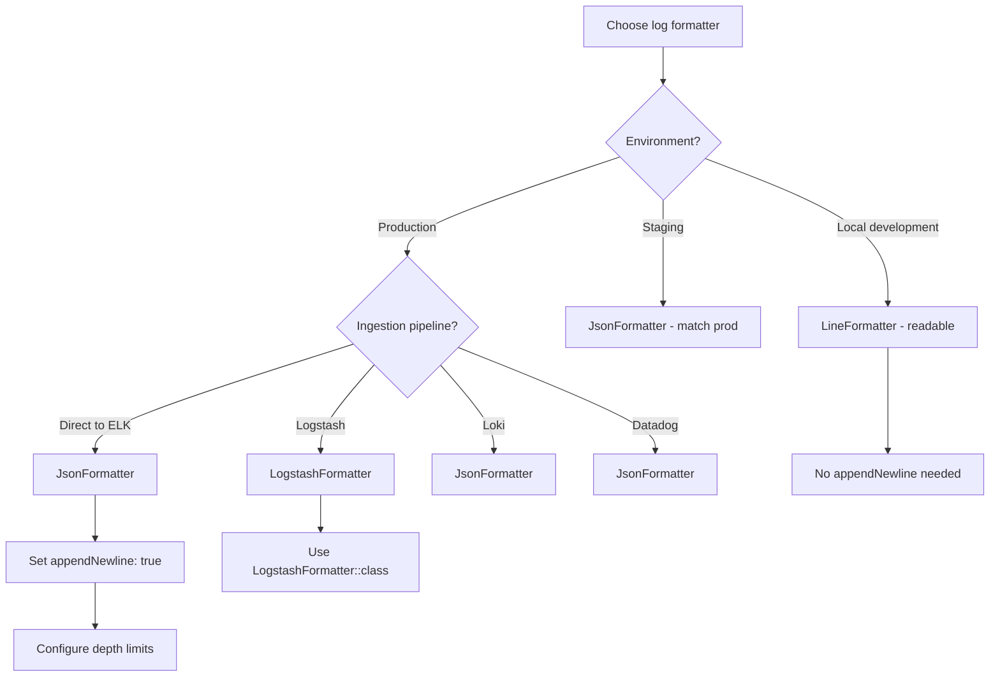
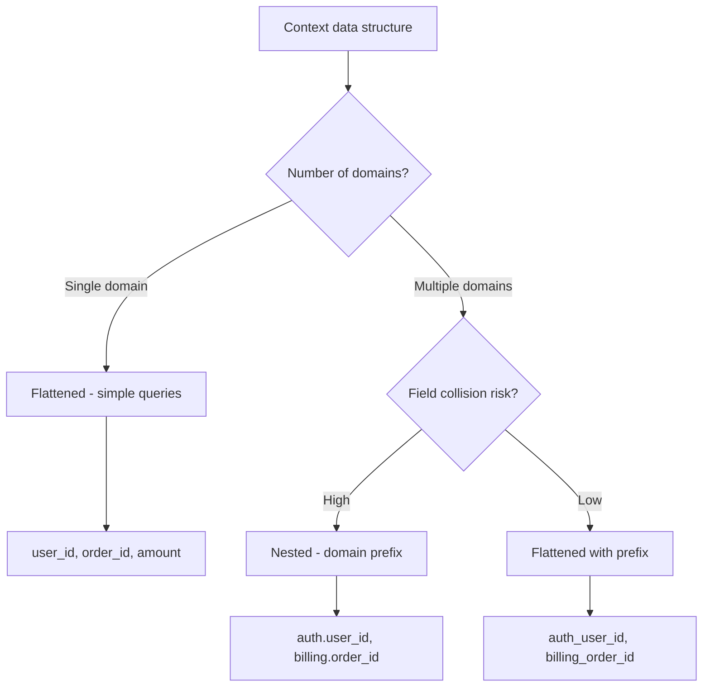
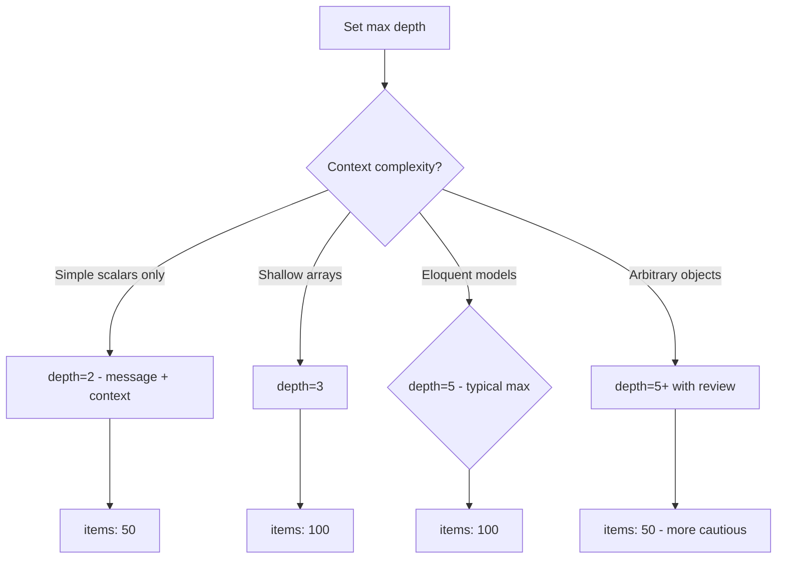

# Decision Trees: Structured JSON Logging

## Decision D-01: Formatter Selection

**Question:** Which formatter should a channel use?

**Recommendation:** Use `JsonFormatter` for all production channels. Only switch to `LogstashFormatter` if Logstash is in the ingestion path.

---

## Decision D-02: Context Data Structure

**Question:** Should context be flattened or nested in JSON output?

**Recommendation:** Flattened with prefix for most applications. Nested for complex multi-domain contexts with high collision risk.

---

## Decision D-03: Depth Limit Configuration

**Question:** What maxNormalizeDepth setting is appropriate?

**Recommendation:** Depth=5, Items=100 as default. Increase only after reviewing actual context data shape.
