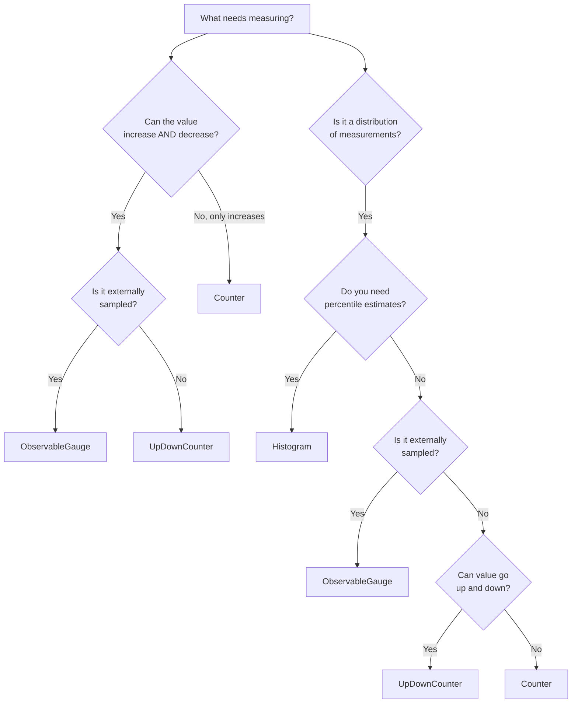
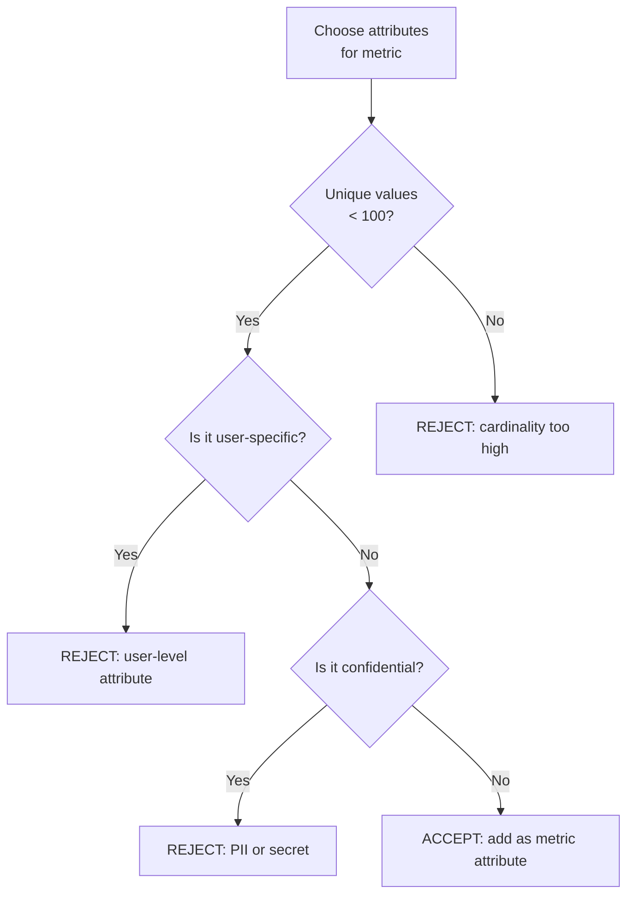

# Instrument Selection Decision

```mermaid
flowchart TD
    A[What needs measuring?] --> B{Can the value\nincrease AND decrease?}
    B -->|Yes| C{Is it externally\nsampled?}
    B -->|No, only increases| D[Counter]
    C -->|Yes| E[ObservableGauge]
    C -->|No| F[UpDownCounter]
    A --> G{Is it a distribution\nof measurements?}
    G -->|Yes| H{Do you need\npercentile estimates?}
    H -->|Yes| I[Histogram]
    H -->|No| J{Is it externally\nsampled?}
    J -->|Yes| K[ObservableGauge]
    J -->|No| L{Can value go\nup and down?}
    L -->|Yes| M[UpDownCounter]
    L -->|No| N[Counter]
```

# Metric Attribute Selection

```mermaid
flowchart TD
    A[Choose attributes\nfor metric] --> B{Unique values\n< 100?}
    B -->|Yes| C{Is it user-specific?}
    B -->|No| D[REJECT: cardinality too high]
    C -->|Yes| E[REJECT: user-level attribute]
    C -->|No| F{Is it confidential?}
    F -->|Yes| G[REJECT: PII or secret]
    F -->|No| H[ACCEPT: add as metric attribute]
```
