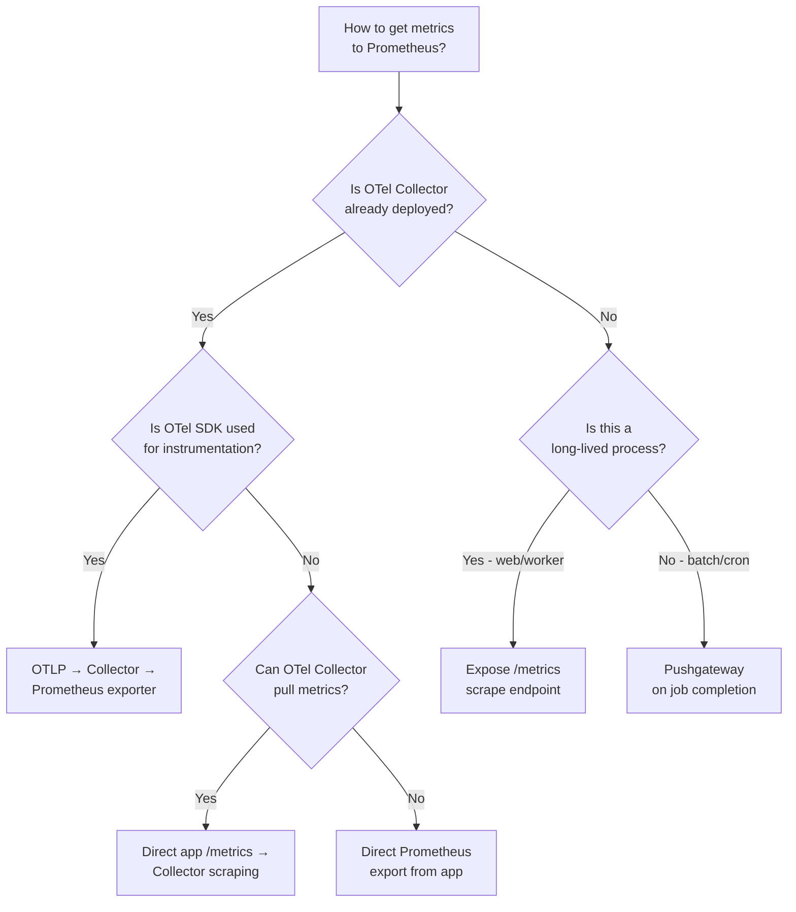
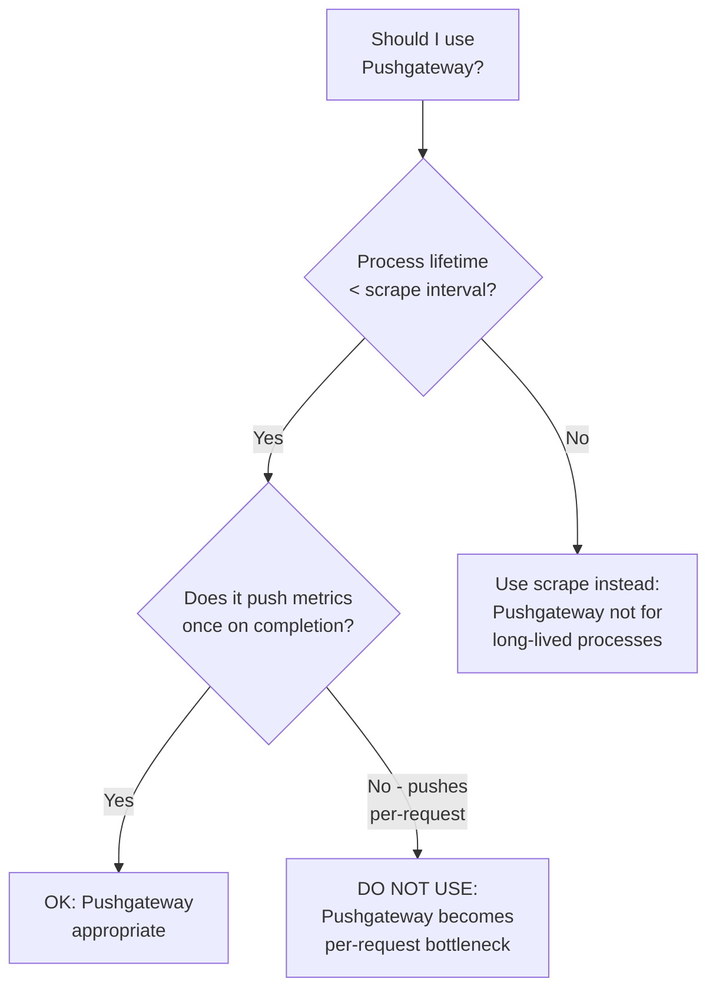

# Integration Pattern Decision

```mermaid
flowchart TD
    A[How to get metrics\nto Prometheus?] --> B{Is OTel Collector\nalready deployed?}
    B -->|Yes| C{Is OTel SDK used\nfor instrumentation?}
    B -->|No| D{Is this a\nlong-lived process?}
    C -->|Yes| E[OTLP → Collector →\nPrometheus exporter]
    C -->|No| F{Can OTel Collector\npull metrics?}
    F -->|Yes| G[Direct app /metrics →\nCollector scraping]
    F -->|No| H[Direct Prometheus\nexport from app]
    D -->|Yes - web/worker| I[Expose /metrics\nscrape endpoint]
    D -->|No - batch/cron| J[Pushgateway\non job completion]
```

# Pushgateway Suitability

```mermaid
flowchart TD
    A[Should I use\nPushgateway?] --> B{Process lifetime\n< scrape interval?}
    B -->|Yes| C{Does it push metrics\nonce on completion?}
    B -->|No| D[Use scrape instead:\nPushgateway not for\nlong-lived processes]
    C -->|Yes| E[OK: Pushgateway\nappropriate]
    C -->|No - pushes\nper-request| F[DO NOT USE:\nPushgateway becomes\nper-request bottleneck]
```
