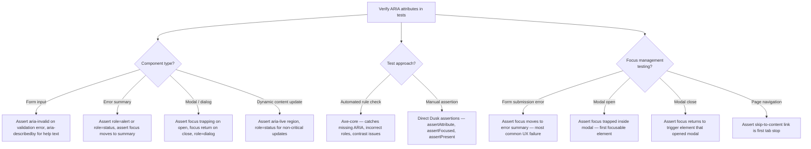

# Decision Trees

## Domain: Testing & Reliability Engineering
## Subdomain: Accessibility Regression Testing
## Knowledge Unit: Accessibility Regression Testing

---

### Tree 1: Tool Selection — Axe-core vs Pa11y vs Lighthouse CI

```mermaid
flowchart TD
    A[Choose accessibility testing tool] --> B{Integration point?}
    B -->|Inside Dusk/Playwright tests — per-PR regression| C[Axe-core — injected via browser script()]
    B -->|Scheduled scan — nightly comprehensive| D[Pa11y — CLI tool, scans URLs]
    B -->|Performance + accessibility combined| E[Lighthouse CI — performance budget + a11y score]
    A --> F{CI placement?}
    F -->|Blocking — must pass for PR merge| G[Axe-core in Dusk tests — focused, fast, per-page]
    F -->|Non-blocking — advisory| H[Pa11y — comprehensive nightly scan, no blocking]
    A --> I{Setup complexity?}
    I -->|Low — need quick check| J[Axe-core via script injection — simple to integrate]
    I -->|High — need full reporting| K[Pa11y — configurable reports, URL-based scanning]
    A --> L{Existing testing<br>setup?}
    L -->|Already uses Dusk| M[Axe-core via Dusk script() — most natural integration]
    L -->|Already uses Playwright| N[@axe-core/playwright — direct npm package]
    L -->|No browser tests| O[Pa11y — simplest starting point, no test framework needed]
```

**Key decision points:**
- **Per-PR vs scheduled**: Axe-core for per-PR regression gates. Pa11y for comprehensive nightly scans.
- **Integration point**: Axe-core runs inside existing browser tests. Pa11y runs as standalone CLI.
- **Setup complexity**: Axe-core via script injection is simplest. Pa11y has richer reporting but more config.

---

### Tree 2: What to Test — Page Prioritization

```mermaid
flowchart TD
    A[Decide which pages to test] --> B{Page type?}
    B -->|Critical user-facing| C[Test: login, checkout, registration, dashboard — top 5-10 pages]
    B -->|Reusable component| D[Test: modals, date pickers, multi-select, error states — component-level]
    B -->|Error state| E[Test: 404, 500, validation errors — most common a11y regression points]
    A --> F{Test scope per page?}
    F -->|Happy path only| G[Essential but insufficient — misses error state regressions]
    F -->|Happy + error states| H[Comprehensive — submit invalid form, trigger 404, verify ARIA]
    A --> I{CI run type?}
    I -->|Per-PR (blocking)| J[Top 5 pages, happy + error states — 10-15s total overhead]
    I -->|Nightly (comprehensive)| K[All pages + all components, full Pa11y scan]
    A --> L{Baseline established?}
    L -->|Yes — known violations tracked| M[Fail only on NEW violations — baseline in CI artifact]
    L -->|No — first run| N[Run once without blocking, record baseline, then enforce]
```

**Key decision points:**
- **Happy path + error states**: Error states are where accessibility most commonly fails. Always test both.
- **Baseline approach**: For existing projects, record current violations as baseline. Fail on new violations only.
- **Per-PR vs nightly**: Per-PR tests focus on critical pages. Nightly scans cover everything.

---

### Tree 3: ARIA Verification Strategy



**Key decision points:**
- **Component-specific ARIA**: Different components need different ARIA assertions. Match assertions to component type.
- **Automated + manual**: Axe-core catches general ARIA issues. Manual assertions verify specific UX behaviors (focus management).
- **Focus management priority**: Form errors → modal open/close → skip-to-content links. Fix in priority order.

---

### Tree 4: CI Integration — Blocking vs Advisory

```mermaid
flowchart TD
    A[Integrate a11y checks into CI] --> B{Check type?}
    B -->|Violation count check| C[Blocking — fail CI if violations increase]
    B -->|Score threshold| D[Advisory — report score, don't block PR]
    A --> E{Baseline vs<br>zero-tolerance?}
    E -->|Baseline (existing violations)| F[CI passes if violations ≤ baseline — non-blocking for known issues]
    E -->|Zero-tolerance (greenfield)| G[CI fails on any violation — blocking]
    A --> H{Incomplete results<br>handling?}
    H -->|Log to CI artifact| I[Schedule monthly review — assign team member]
    H -->|Ignore| J[Risk — potential issues never reviewed]
    A --> K{Notification on<br>failure?}
    K -->|Yes — Slack/email| L[Team notified when violations exceed baseline — actionable]
    K -->|No — only CI failure| M[Violations may go unnoticed if CI failure is not monitored]
    A --> N{axe-core version<br>pinning?}
    N -->|Yes — pinned version| O[Stable — rule changes don't cause unexpected failures]
    N -->|No — auto-updated| P[Unstable — rule changes break CI, team distrusts a11y checks]
```

**Key decision points:**
- **Baseline vs zero-tolerance**: Baseline enables progressive improvement. Zero-tolerance only works for greenfield projects.
- **Incomplete results**: Always log and schedule review. "Incomplete" means requires human judgment.
- **Version pinning**: Pin axe-core version. Auto-updates cause unexpected failures from new rules.
