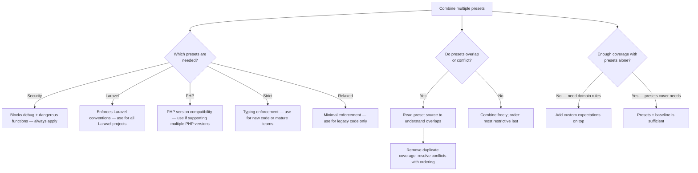
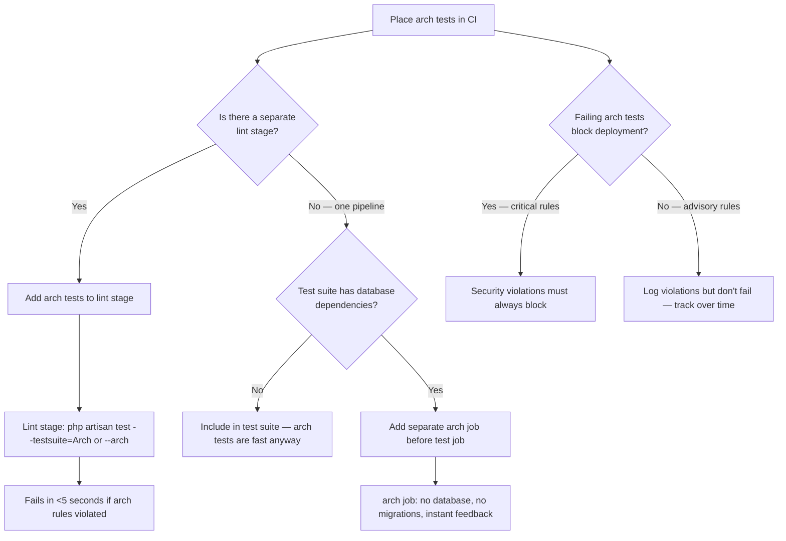

# Decision Trees

## Domain: Testing & Reliability Engineering
## Subdomain: Architecture Testing
## Knowledge Unit: Architecture Presets

---

### Tree 1: Which Presets to Apply and Where

```mermaid
flowchart TD
    A[Choose architecture presets] --> B{New project or<br>existing codebase?}
    B -->|New project| C[Start with security + laravel presets]
    B -->|Existing codebase| D{How many violations<br>expected?}
    D -->|Few — clean codebase| E[Apply security + laravel + custom rules]
    D -->|Many — legacy code| F{Can we target new<br>directories only?}
    F -->|Yes| G[security on all code; strict on new modules only]
    F -->|No — mixed| H[relaxed on legacy; security on all; strict on new via targeting()]
    A --> I{Need strict typing<br>enforcement?}
    I -->|Yes, team is ready| J[Add strict preset]
    I -->|No, too early| K[Add strict later when team matures]
    C --> L[CI: arch tests in lint stage, fail fast]
    E --> L
    G --> M[Generate baseline for existing violations; review quarterly]
    H --> M
```

**Key decision points:**
- **New vs existing**: New projects start with `security + laravel`. Existing projects use `targeting()` for progressive adoption.
- **Strict preset**: Add only when the team is ready for typing enforcement. Don't apply to legacy codebases.
- **Baseline**: Existing codebases need a baseline file to suppress known violations while preventing new ones.

---

### Tree 2: Preset Combination Strategy



**Key decision points:**
- **Always include security**: The security preset is universally valuable — blocks `dd`, `dump`, `eval`, `exec` in production code.
- **Know your presets**: Read the source in `vendor/pestphp/pest/src/ArchPresets/` before combining.
- **Custom rules**: Presets are the foundation. Add domain-specific expectations for team conventions.

---

### Tree 3: Progressive Adoption on Legacy Projects

```mermaid
flowchart TD
    A[Adopt arch presets on legacy project] --> B[Run security preset first on full codebase]
    B --> C{How many violations?}
    C -->|0-10| D[Excellent — apply security + laravel to all code]
    C -->|10-100| E[Acceptable — add ignoring() list for known exceptions]
    C -->|100+| F[Too many — must use phased approach]
    F --> G[Phase 1: security preset with generous ignoring() list]
    G --> H[Phase 2: narrow ignoring() list — fix easy violations]
    H --> I[Phase 3: add laravel preset to new code only via targeting()]
    I --> J[Phase 4: migrate legacy directories gradually]
    J --> K[Phase 5: add strict preset with targeting() for new modules]
    A --> L{Strict preset<br>intended?}
    L -->|Yes| M[Only apply to app/Modules or app/Services — never blanket]
    L -->|No| N[Stop after security + laravel presets]
```

**Key decision points:**
- **Phased approach**: Legacy projects adopt presets in phases over weeks/months, not days.
- **`targeting()`**: Key tool for progressive adoption — apply strict rules to new code, not existing code.
- **`ignoring()`**: Use for legitimate exceptions. Review quarterly to prevent ignoring list bloat.

---

### Tree 4: CI Placement — Lint Stage vs Test Stage



**Key decision points:**
- **Lint stage preferred**: Arch tests have no database dependency. Run them before any test infrastructure setup.
- **Blocking vs advisory**: Security preset violations should block CI. Stylistic/typing violations could be advisory initially.
- **Speed advantage**: Arch tests complete in seconds. Placing them early provides near-instant feedback.
