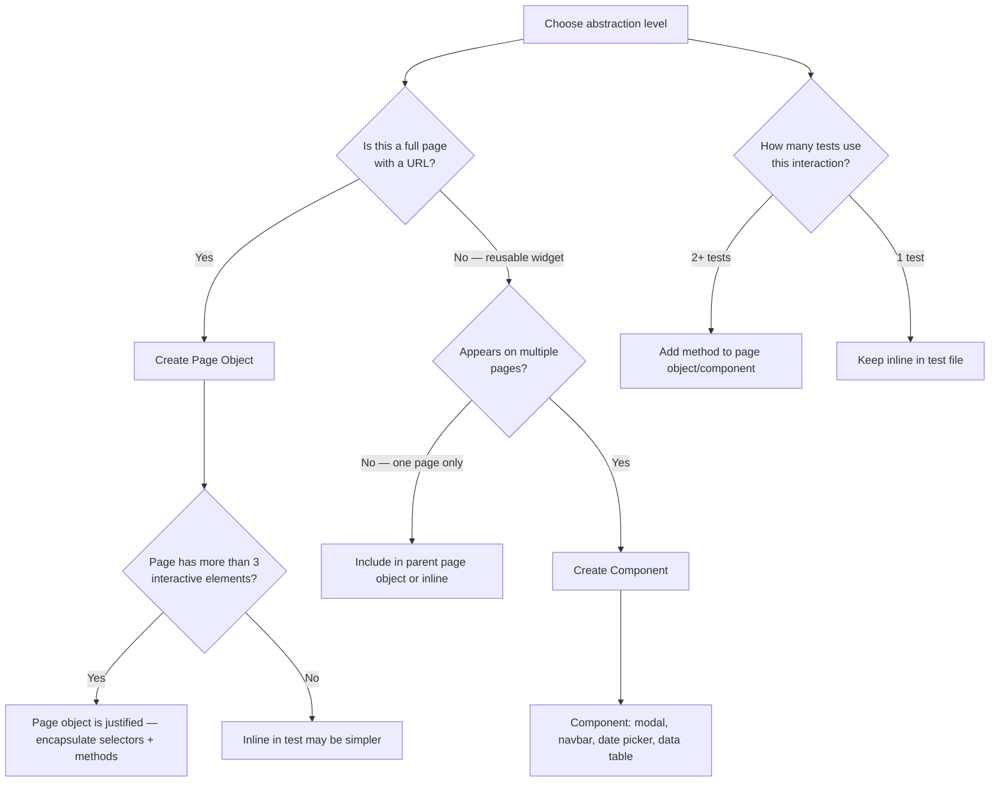

# Decision Trees

## Domain: Testing & Reliability Engineering
## Subdomain: Browser & E2E Testing
## Knowledge Unit: Dusk Selectors, Page Objects, Components

---

### Tree 1: Which Selector Strategy to Use

```mermaid
flowchart TD
    A[Choose element selector] --> B{Can you add a @dusk<br>attribute to the element?}
    B -->|Yes — own template| C[Use @dusk="name" — most stable option]
    B -->|No — third-party HTML| D{Is there a stable<br>CSS selector?}
    D -->|Yes| E[Use CSS selector as fallback]
    D -->|No| F[Use XPath — last resort, most brittle]
    C --> G[Avoid CSS classes — they change with styling]
    E --> H[Prefer IDs or data-* attributes over classes]
    F --> I[XPath breaks on any DOM structure change]
    A --> J{Is this element accessed<br>from multiple tests?}
    J -->|Yes| K[Add element to page object or component]
    J -->|No — one test| L[Use @dusk directly in test — acceptable]
```

**Key decision points:**
- **`@dusk` vs CSS vs XPath**: Always prefer `@dusk`. CSS for third-party HTML. XPath only as last resort.
- **Own vs third-party HTML**: Own templates always get `@dusk` attributes. Third-party widgets use CSS.
- **Reuse**: Elements accessed from multiple tests belong in page objects/components.

---

### Tree 2: Page Object vs Component vs Inline — Which Abstraction



**Key decision points:**
- **Page vs component**: Pages have URLs. Components are reusable widgets without their own URL.
- **Abstraction threshold**: >3 elements or >1 test using it → create abstraction.
- **Over-engineering**: Single-use interactions stay in the test file.

---

### Tree 3: When to Use `within()` for Scoped Assertions

```mermaid
flowchart TD
    A[Decide on scoped assertion] --> B{Is the expected text<br>unique on the page?}
    B -->|Yes — page title, unique heading| C[Top-level assertSee is fine]
    B -->|No — could appear in sidebar, nav, footer| D[Use within() to scope the assertion]
    D --> E[within('@section-selector', fn ($scope) => $scope->assertSee('text'))]
    A --> F{Testing a component<br>on a page?}
    F -->|Yes| G[Use within(new ComponentClass) for scoped component testing]
    F -->|No| H[within(@section) is sufficient]
    A --> I{Need to wait for async<br>component?}
    I -->|Yes| J[Use whenAvailable instead of within — combines wait + scope]
    I -->|No| K[Use within — simpler for synchronous elements]
```

**Key decision points:**
- **Uniqueness**: If text is guaranteed unique, top-level assertion is fine. Otherwise, scope.
- **Component vs section**: Use `within(new Component)` for reusable components. Use `within('@selector')` for one-off sections.
- **`whenAvailable()` vs `within()`**: `whenAvailable()` for async elements. `within()` for already-rendered elements.

---

### Tree 4: @dusk Attribute Naming Convention

```mermaid
flowchart TD
    A[Name @dusk attributes] --> B{What type of element<br>is it?}
    B -->|Button or form action| C[Use verb-noun: @submit-login, @delete-user, @confirm-modal]
    B -->|Input field| D[Use field-name: @email-input, @search-field, @password-input]
    B -->|Container/section| E[Use section-name: @sidebar, @results-table, @header-nav]
    B -->|Link| F[Use destination: @profile-link, @settings-link, @logout-link]
    A --> G{Is this element<br>dynamic (list item)?}
    G -->|Yes — repetitive| H[Use index: @user-row-3, or use within() on parent container]
    G -->|No — static| I[Simple descriptive name is fine]
    A --> J{Consistent naming<br>across project?}
    J -->|Yes| K[Good — tests are predictable and readable]
    J -->|No| L[Adopt project-wide convention for @dusk attribute naming]
```

**Key decision points:**
- **Element type**: Buttons = verb-noun. Inputs = field-name. Sections = section-name. Links = destination.
- **Dynamic elements**: Use parent container + `within()` scoping rather than dynamic `@dusk` names.
- **Consistency**: Project-wide naming convention makes tests predictable and readable for all team members.
