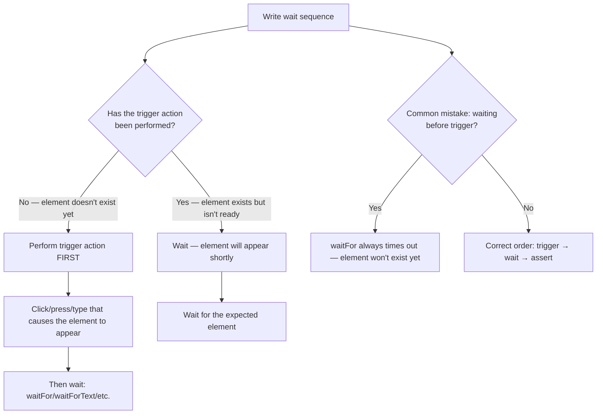

# Decision Trees

## Domain: Testing & Reliability Engineering
## Subdomain: Browser & E2E Testing
## Knowledge Unit: Dusk Waiting Strategies

---

### Tree 1: Which Wait Method to Use

```mermaid
flowchart TD
    A[Choose wait method] --> B{What are you waiting<br>for?}
    B -->|Element to appear in DOM| C[waitFor($selector)]
    B -->|Text to appear on page| D[waitForText($text)]
    B -->|URL to change| E[waitForLocation($path)]
    B -->|Element to disappear| F[waitUntilMissing($selector)]
    B -->|Async element + interaction| G[whenAvailable($selector, $callback)]
    B -->|Custom JS condition| H[waitUntil($jsExpression)]
    A --> I{Is a fixed delay<br>absolutely required?}
    I -->|Never — always prefer adaptive waits| J[Do not use pause()]
    J --> K[Adaptive waits poll every 250ms and return immediately when condition met]
```

**Key decision points:**
- **Element vs text vs URL**: Match the wait method to the expected change — element for DOM, text for content, URL for navigation.
- **Never `pause()`**: Fixed delays are always worse than adaptive waits. Too short → flaky. Too long → slow.
- **`whenAvailable()`**: Combine wait + scope for async modals and dialogs.

---

### Tree 2: Trigger Action vs Wait — Correct Ordering



**Key decision points:**
- **Order matters**: Trigger action must happen BEFORE the wait. Waiting first always times out.
- **Mistake detection**: If `waitFor()` consistently times out, check whether the trigger action happens before it.

---

### Tree 3: Choosing the Right Timeout

```mermaid
flowchart TD
    A[Set wait timeout] --> B{What environment is<br>the test running in?}
    B -->|Local development| C[5 second default]
    B -->|CI — slow runner| D[10-15 seconds for known slow operations]
    A --> E{What operation are<br>you waiting for?}
    E -->|Standard click/navigation| F[5 seconds — sufficient for 99% of cases]
    E -->|File upload| G[10-15 seconds — upload involves JS + server processing]
    E -->|Report generation| H[15-30 seconds — complex backend processing]
    E -->|Loading indicator| I[waitUntilMissing with 10 second timeout]
    A --> J{Global timeout currently<br>set high "for safety"?}
    J -->|Yes — 30 seconds| K[Reduce to 5 seconds; increase per-wait for specific cases]
    J -->|No — already 5 seconds| L[Good — failing tests fail fast]
```

**Key decision points:**
- **Environment**: CI is slower — increase per-wait timeout, not global.
- **Operation type**: File uploads and report generation need longer waits than standard navigation.
- **Global timeout**: Keep at 5 seconds. Per-wait overrides for slow operations. Don't inflate globally.

---

### Tree 4: Debugging a Flaky Dusk Wait

```mermaid
flowchart TD
    A[Debug flaky Dusk test] --> B{Does the test use<br>pause()?}
    B -->|Yes| C[Replace pause() with appropriate waitFor variant — likely fix]
    B -->|No| D{Is the trigger action<br>before the wait?}
    D -->|No — wait before trigger| E[Reorder: trigger → wait → assert]
    D -->|Yes| F{Is the selector<br>correct?}
    F -->|Wrong selector| G[Fix selector — element exists but not matched]
    F -->|Correct| H{Is the wait timeout<br>long enough for CI?}
    H -->|No — CI slower| I[Increase per-wait timeout for CI]
    H -->|Yes| J{Does the element appear<br>at all?}
    J -->|No — bug in app code| K[Fix the application — element isn't rendered]
    J -->|Yes — timing issue| L[Use a more specific wait: waitForText, waitForLocation, or waitUntilMissing]
```

**Key decision points:**
- **`pause()` is the #1 cause**: Replace with adaptive waits first.
- **Trigger order**: Second most common cause — putting wait before the trigger.
- **CI-specific timing**: If it passes locally but fails in CI, increase per-wait timeout.
- **Missing element**: If the element never appears, it's a bug in the application, not the test.
