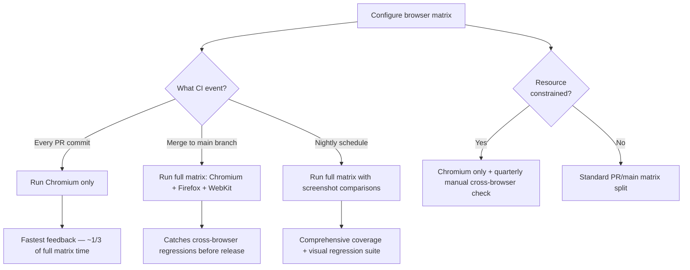
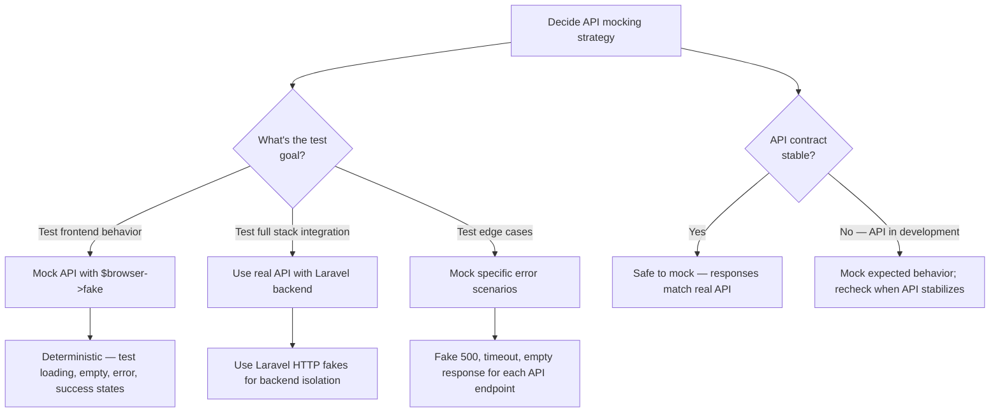
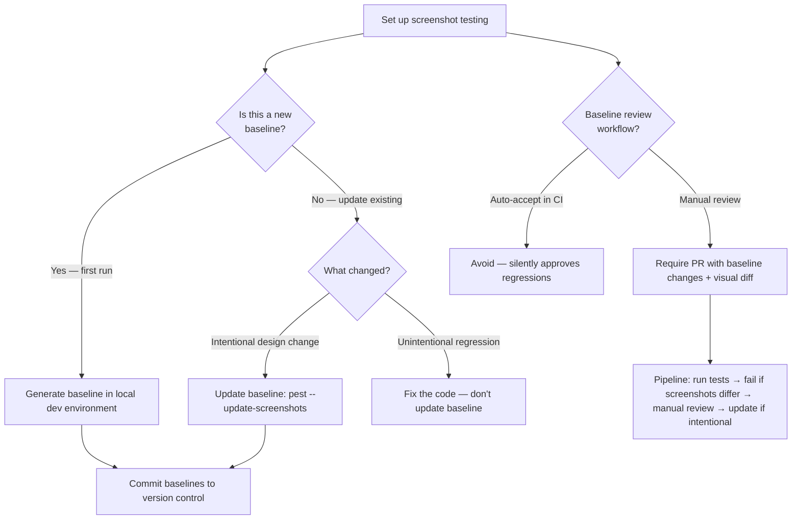

# Decision Trees

## Domain: Testing & Reliability Engineering
## Subdomain: Browser & E2E Testing
## Knowledge Unit: Pest 4 Browser Testing

---

### Tree 1: Pest 4 Browser vs Dusk — Which to Use

```mermaid
flowchart TD
    A[Choose E2E testing approach] --> B{Is this a new Laravel<br>project (2026+)?}
    B -->|Yes| C[Use Pest 4 Browser Testing — recommended]
    B -->|No — existing project| D{Does it already have<br>a Dusk test suite?}
    D -->|Yes, large and stable| E[Stay with Dusk — migration cost not justified]
    D -->|Yes, small suite or migrating| F[Use pest:dusk-migrate and review manually]
    D -->|No existing E2E tests| G[Use Pest 4 Browser Testing]
    C --> H{CI supports<br>Node.js?}
    G --> H
    H -->|Yes| I[Proceed with Playwright setup]
    H -->|No| J[Use Dusk — PHP-only dependency]
    A --> K{Need cross-browser<br>testing?}
    K -->|Yes| L[Pest 4 — Chromium, Firefox, WebKit out of the box]
    K -->|No| M[Either works; Pest 4 has auto-waiting advantage]
```

**Key decision points:**
- **New vs existing project**: New projects default to Pest 4 browser testing. Large existing Dusk suites should evaluate migration cost.
- **CI compatibility**: Playwright requires Node.js in CI. If unavailable, use Dusk.
- **Cross-browser**: Pest 4 supports Chromium, Firefox, and WebKit natively.

---

### Tree 2: Browser Matrix Strategy — How Many Browsers to Test



**Key decision points:**
- **PR vs main**: Chromium on PRs for speed. Full matrix on main for safety.
- **Nightly suite**: Add visual regression and screenshot comparison to nightly runs.
- **Resource constraints**: If CI minutes are limited, Chromium-only is acceptable with periodic manual cross-browser checks.

---

### Tree 3: API Mocking in Browser Tests — When and How



**Key decision points:**
- **Frontend vs full stack**: Mock APIs for isolated frontend tests. Use real API for full stack integration.
- **Edge case coverage**: Mocking enables testing error/empty states that are hard to reproduce with real API.
- **Contract stability**: Mocking is safe when the API contract is stable. Revisit mocks when the API changes.

---

### Tree 4: Screenshot Baseline Management



**Key decision points:**
- **New vs updated baselines**: Generate baselines locally. Update only for intentional changes.
- **Review process**: Never auto-accept baselines in CI. Require manual PR review with visual diff.
- **Environment consistency**: Run screenshot tests in consistent environment (same OS, browser version) to avoid environment-based differences.
