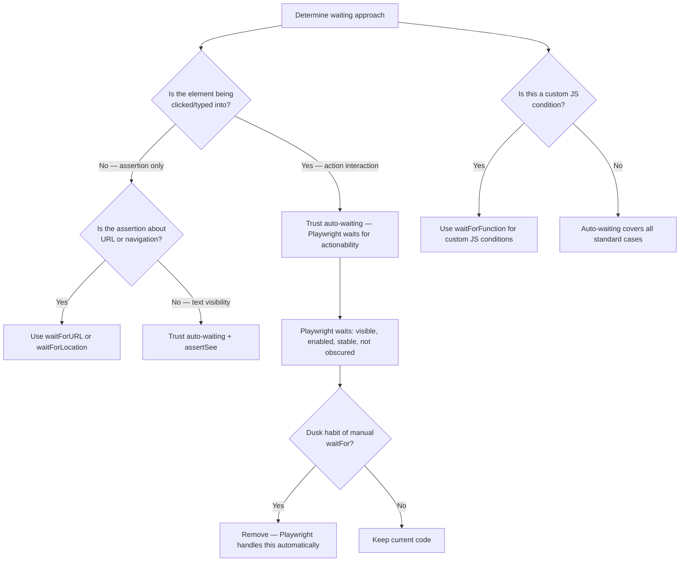
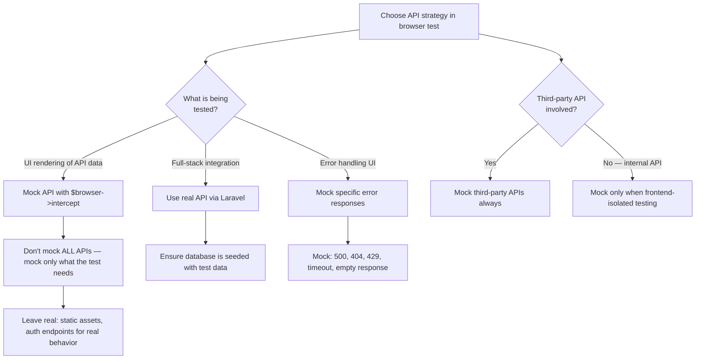
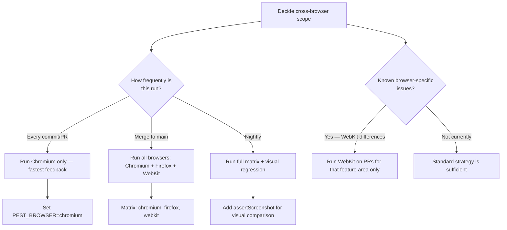
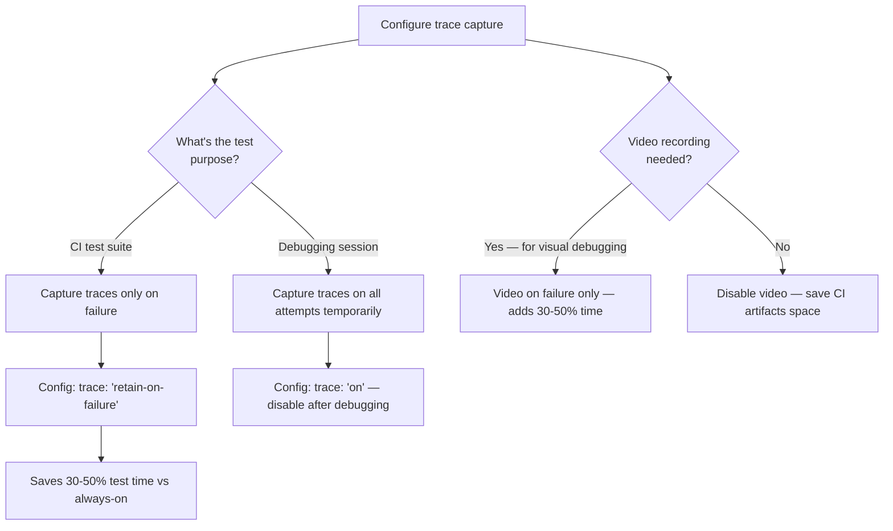

# Decision Trees

## Domain: Testing & Reliability Engineering
## Subdomain: Browser & E2E Testing
## Knowledge Unit: Pest Playwright Browser Testing

---

### Tree 1: Auto-Waiting vs Manual Waits — When to Trust Playwright

**Key decision points:**
- **Actions vs assertions**: Playwright auto-waits for actionability on clicks/types. Assertions also auto-wait for element visibility.
- **Dusk migration habit**: If coming from Dusk, remove `waitFor()` calls — Playwright auto-waits by default.
- **Custom conditions**: Only use `waitForFunction()` for JS-specific conditions not covered by auto-waiting.

---

### Tree 2: Network Interception — Full Mock vs Real API

**Key decision points:**
- **UI vs integration**: Mock APIs for frontend testing. Use real APIs for full-stack tests.
- **Error simulation**: Mocking is necessary for error paths that are hard to reproduce with real APIs.
- **Third-party vs internal**: Always mock third-party APIs. Internal APIs can be real or mocked depending on test scope.

---

### Tree 3: Cross-Browser Testing — PR vs Main Branch Strategy

**Key decision points:**
- **Frequency**: Every commit = Chromium only. Merge to main = full matrix. Nightly = full matrix + screenshots.
- **Known issues**: If specific browser has known differences, add that browser to targeted PR tests.
- **CI cost**: Full matrix is ~3x CI time. Only run on merge to main unless cross-browser issues are frequent.

---

### Tree 4: Trace Capture — On Failure vs Always

**Key decision points:**
- **CI vs debugging**: CI uses `retain-on-failure` for performance. Debugging sessions use `on` temporarily.
- **Video recording**: Adds significant overhead. Enable only when visual playback is needed for debugging.
- **Artifact storage**: Traces and videos consume CI artifact space. Set retention policies.
