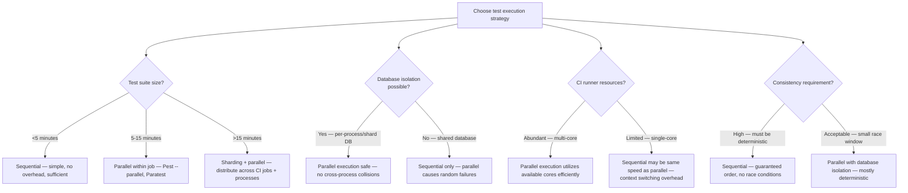
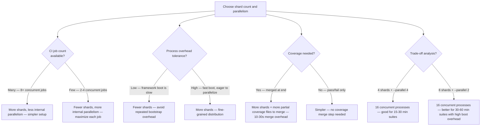
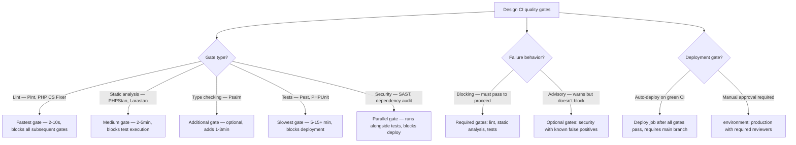
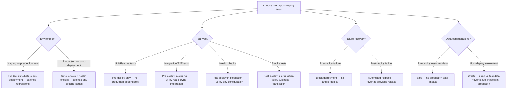

# Decision Trees

## Domain: Testing & Reliability Engineering
## Subdomain: CI/CD Pipeline Integration
## Knowledge Unit: CI Test Execution Strategies

---

### Tree 1: Sequential vs Parallel Execution

**Key decision points:**
- **Suite size drives strategy**: <5 min → sequential. 5-15 min → parallel. >15 min → sharding + parallel.
- **Database isolation**: Mandatory for parallel execution. Without it, tests collide on shared tables.
- **Determinism**: Sequential tests are most deterministic. Parallel tests need careful isolation.

---

### Tree 2: Shard Count vs Internal Parallelism

**Key decision points:**
- **Many CI jobs → more shards**: Distribute across jobs, minimize internal complexity.
- **Few CI jobs → more internal parallelism**: Maximize each job's resource utilization.
- **Combine both**: Two-level parallelism (sharding × process-level) maximizes throughput.

---

### Tree 3: CI Stage Design — Quality Gates

**Key decision points:**
- **Gate order**: Fastest gates first (lint → static analysis → tests → deploy). Fail fast.
- **Blocking vs advisory**: Lint, analysis, tests are blocking. Some security checks can be advisory.
- **Deployment**: Requires all blocking gates to pass. Main branch only. Optional manual approval.

---

### Tree 4: Pre-Deploy vs Post-Deploy Testing

**Key decision points:**
- **Pre-deploy**: Full test suite in staging/CI. Catches code regressions and integration issues.
- **Post-deploy**: Smoke tests and health checks in production. Catches environment-specific issues.
- **Failure recovery**: Pre-deploy → block deployment. Post-deploy → automated rollback.
