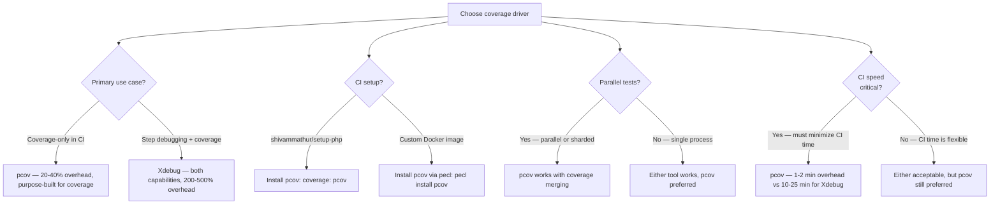
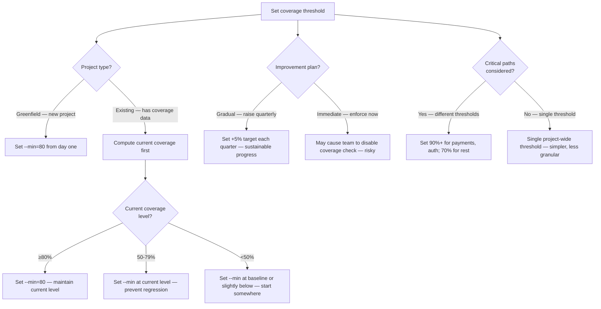
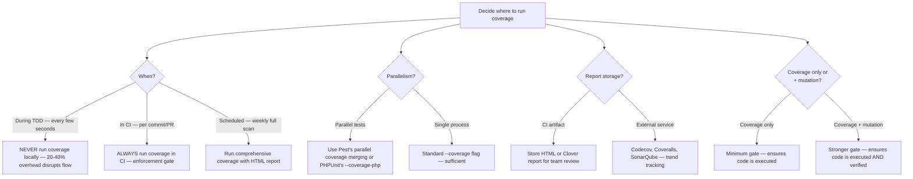

# Decision Trees

## Domain: Testing & Reliability Engineering
## Subdomain: CI/CD Pipeline Integration
## Knowledge Unit: Coverage Reporting & Enforcement

---

### Tree 1: Coverage Tool Selection — pcov vs Xdebug



**Key decision points:**
- **Coverage-only → pcov**: pcov is purpose-built for coverage with minimal overhead.
- **Debugging needed → Xdebug**: Xdebug supports both step debugging and coverage, but coverage is much slower.
- **CI speed**: pcov adds 1-2 minutes vs Xdebug's 10-25 minutes to a 5-minute test suite.

---

### Tree 2: Threshold Strategy — Baseline vs Target



**Key decision points:**
- **Greenfield → 80%**: New projects can enforce 80% from the start.
- **Existing → baseline**: Compute current coverage and use it as baseline. Raise gradually.
- **Gradual improvement**: Raise by 5% per quarter. Immediate enforcement causes teams to disable the check.

---

### Tree 3: CI Placement — Local vs CI Coverage



**Key decision points:**
- **Local**: Never run coverage during TDD. The 20-40% overhead slows the development loop.
- **CI**: Always run coverage in CI. Enforcement gate prevents regression.
- **Parallel merging**: Use Pest's built-in coverage merging or PHPUnit's coverage cache for parallel tests.

---

### Tree 4: Report Format Selection

```mermaid
flowchart TD
    A[Choose coverage report format] --> B{Consumer?}
    B -->|Team review — visual browsing| C[HTML report — browse by file, see uncovered lines]
    B -->|CI platform integration| D[Clover XML — SonarQube, GitLab, Jenkins]
    B -->|Terminal — quick check| E[Text format — summary percentages per file]
    B -->|Trend tracking| F[Send to Codecov, Coveralls, or similar service]
    A --> G{Storage?}
    G -->|CI artifact| H[HTML or Clover — configurable retention period]
    G -->|Public access (open source)| I[Codecov badge — visible, but restrict if proprietary]
    A --> J{Multiple formats<br>needed?}
    J -->|Yes| K[Generate multiple formats: --coverage-html + --coverage-clover]
    J -->|No| L[Single format based on consumer requirements]
    A --> M{Compliance?}
    M -->|Yes — audit trail required| N[HTML + Clover archived with timestamps]
    M -->|No — internal improvement| O[HTML artifact sufficient — team-driven review]
```

**Key decision points:**
- **HTML for team review**: Most accessible format. Browse by file, see uncovered lines.
- **Clover for CI platforms**: Required by SonarQube, GitLab, Jenkins integrations.
- **Public vs private**: Open-source projects can use Codecov badges. Private projects should restrict artifact access.
