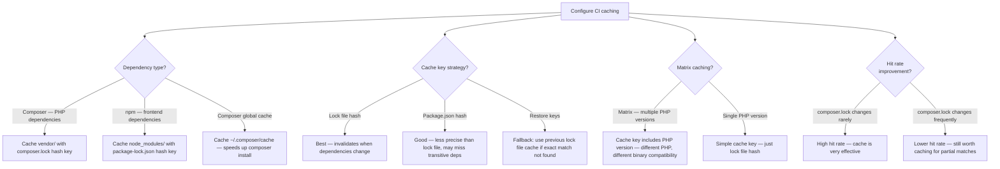
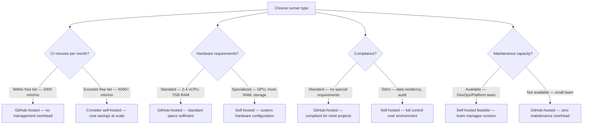
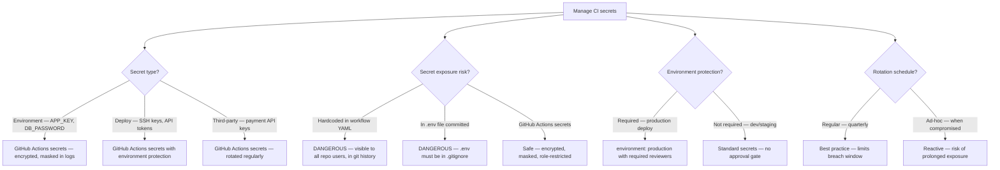

# Decision Trees

## Domain: Testing & Reliability Engineering
## Subdomain: CI/CD Pipeline Integration
## Knowledge Unit: GitHub Actions CI/CD for Laravel

---

### Tree 1: CI Pipeline Stage Order

```mermaid
flowchart TD
    A[Design CI pipeline stages] --> B{Fast feedback priority?}
    B -->|Yes — fail fast| C[Lint (2-10s) → Static analysis (2-5min) → Test (5-15min) → Deploy]
    B -->|No — simplicity| D[Single job: lint → analysis → test → deploy (sequential)]
    A --> E{Sequential or<br>parallel?}
    E -->|Sequential with dependencies| F[Lint → needs:lint → Static analysis → needs:static-analysis → Test → needs:test → Deploy]
    E -->|Parallel independent| G[Lint and Static analysis run in parallel → Test needs both → Deploy needs Test]
    A --> H{Deployment stage?}
    H -->|Yes — auto-deploy from main| I[Add deploy job: needs: test, environment: production, if: github.ref == 'refs/heads/main']
    H -->|No — manual deploy| J[Pipeline ends after test stage]
    A --> K{Artifact upload?}
    K -->|Yes — coverage, screenshots| L[Upload after test stage — retention: 7 days]
    K -->|No| M[Faster pipeline — no artifact upload time]
```

**Key decision points:**
- **Fastest feedback**: Sequential gates (lint fails in seconds, not minutes).
- **Dependency chain**: Lint → Static analysis → Test → Deploy. Each stage blocks the next.
- **Deployment**: Only from main branch after successful test stage. Use `environment: production` with required reviewers.

---

### Tree 2: Caching Strategy



**Key decision points:**
- **Composer cache**: Highest ROI for Laravel CI. Reduces dependency install from 30-60s to 5-10s.
- **Cache key**: Use `composer.lock` hash for precision. Include PHP version in matrix caching.
- **npm/frontend**: Cache separately if the project builds frontend assets.

---

### Tree 3: GitHub-Hosted vs Self-Hosted Runners



**Key decision points:**
- **GitHub-hosted for most teams**: Zero maintenance, within free tier for small-medium projects.
- **Self-hosted for scale or compliance**: Large test suites, custom hardware, or strict data residency.
- **Maintenance**: Self-hosted runners require ongoing management (updates, security patches).

---

### Tree 4: Secret Management



**Key decision points:**
- **Never hardcode secrets**: Use GitHub Actions secrets for all sensitive values.
- **Environment protection**: Production deploy secrets should require approval.
- **Rotation**: Regular secret rotation limits the impact of any credential leak.
