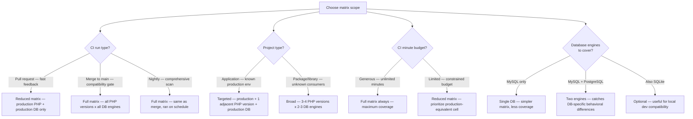
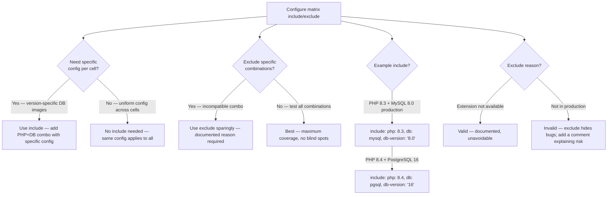

# Decision Trees

## Domain: Testing & Reliability Engineering
## Subdomain: CI/CD Pipeline Integration
## Knowledge Unit: Matrix Testing (PHP x Database)

---

### Tree 1: Matrix Scope — Full vs Reduced



**Key decision points:**
- **PR vs merge**: Reduced matrix on PRs (fast feedback). Full matrix on merge (comprehensive gate).
- **Application vs package**: Applications target known production environments. Packages need broader coverage.
- **Database engines**: MySQL + PostgreSQL catch behavioral differences not found with SQLite alone.

---

### Tree 2: PHP Version Selection

```mermaid
flowchart TD
    A[Choose PHP versions for matrix] --> B{Current production<br>PHP version?}
    B -->|PHP 8.2| C[Include: 8.2 (production), 8.3 (next), optionally 8.4 (future)]
    B -->|PHP 8.3| D[Include: 8.3 (production), 8.4 (next), optionally 8.2 (LTS)]
    B -->|PHP 8.4| E[Include: 8.4 (production), optionally 8.3 (previous)]
    A --> F{Deprecation tracking?}
    F -->|Yes — proactive| G[Always include one version ahead of production]
    F -->|No — reactive| H[Production version only — risk of surprise during upgrade]
    A --> I{Upgrade frequency?}
    I -->|Frequent — stay current| J[2-3 versions — easy to maintain, small diffs]
    I -->|Rare — stay on LTS| K[1-2 versions — focus on production compatibility]
    A --> L{EOL versions?}
    L -->|Include for backward compat| M[Package/library — broadest support]
    L -->|Don't include EOL| N[Application — only actively supported PHP versions]
```

**Key decision points:**
- **Production + 1 ahead**: Minimum for deprecation tracking. Catches warnings before the upgrade.
- **Proactive deprecation tracking**: Include the next PHP version. Surface deprecations one PR at a time.
- **EOL versions**: Packages should support EOL versions. Applications should only support actively supported versions.

---

### Tree 3: Database Engine Selection

```mermaid
flowchart TD
    A[Choose database engines] --> B{Production database?}
    B -->|MySQL| C[Mandatory: MySQL matching production version]
    B -->|PostgreSQL| D[Mandatory: PostgreSQL matching production version]
    B -->|SQLite only (rare)| E[Use SQLite — but verify if app has production DB requirements]
    A --> F{Additional engines<br>for coverage?}
    F -->|Yes — high compatibility needs| G[Add PostgreSQL if MySQL is production, or vice versa]
    F -->|No — production only| H[Production engine only — simpler matrix]
    A --> I{Version selection?}
    I -->|Pinned version| J[image: mysql:8.0 — stable, matches production]
    I -->|Latest tag| K[AVOID — latest breaks CI on new DB releases]
    A --> L{Service container<br>or external DB?}
    L -->|Service container| M[Preferred — isolated, fresh per job, version-pinned]
    L -->|External DB| N[Avoid — shared state, flaky, non-reproducible]
```

**Key decision points:**
- **Production engine is mandatory**: Always include the exact production database version.
- **Additional engine for high-compatibility**: Add the other engine if the app might migrate or support both.
- **Pin versions**: Never use `latest` tags. Pin to exact versions matching production.

---

### Tree 4: Matrix Include/Exclude Logic



**Key decision points:**
- **Include for specific config**: Use `include` to add version-specific database images or extension configs.
- **Exclude sparingly**: Each exclude creates a blind spot. Document reasons and risks.
- **Test all combinations**: Without excludes, the matrix provides maximum compatibility coverage.
