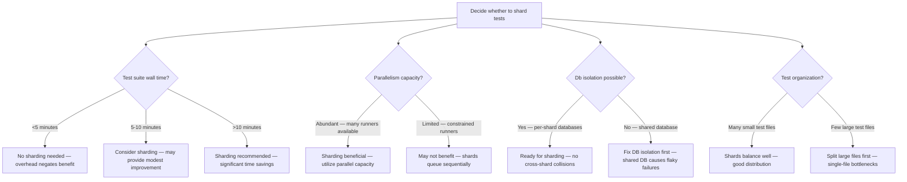
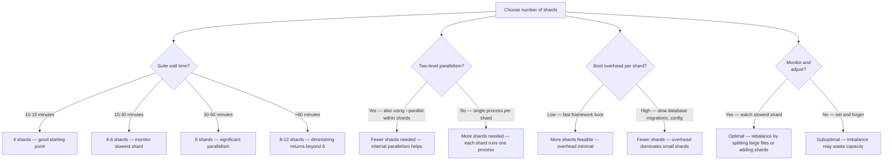
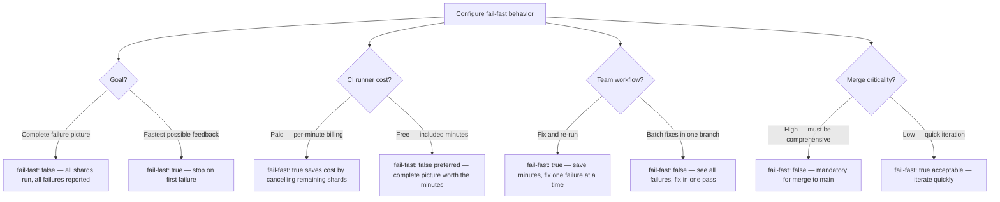

# Decision Trees

## Domain: Testing & Reliability Engineering
## Subdomain: CI/CD Pipeline Integration
## Knowledge Unit: Parallel Test Sharding in CI

---

### Tree 1: Sharding vs No Sharding



**Key decision points:**
- **Threshold**: Shard when suite >10 minutes. Under 5 minutes, overhead negates benefit.
- **Database isolation**: Mandatory prerequisite. Shared databases cause parallel collision failures.
- **Test file size**: Large files (>2 min runtime) must be split before effective sharding.

---

### Tree 2: Shard Count Selection



**Key decision points:**
- **Start with 4**: 10-15 minute suites → 4 shards. Larger suites → 6-8 shards.
- **Diminishing returns**: Beyond 8 shards, framework boot overhead reduces marginal benefit.
- **Two-level parallelism**: Combining sharding (CI jobs) with `--parallel` (processes) reduces needed shard count.

---

### Tree 3: Database Isolation Strategy

```mermaid
flowchart TD
    A[Configure database per shard] --> B{Driver?}
    B -->|MySQL/PostgreSQL| C[Parameterize DB_DATABASE per shard]
    B -->|SQLite in-memory| D[Isolation automatic — each process has own memory]
    A --> E{Parameterization approach?}
    E -->|GitHub Actions matrix| F[DB_DATABASE: testing_${{ matrix.shard }} — clean, simple]
    E -->|Manual script| G[Create databases dynamically in CI setup step]
    A --> H{Collision risk?}
    H -->|Multiple shards on same table| I[High — race conditions, inconsistent reads, duplicate records]
    H -->|Each shard has isolated DB| J[Nil — no cross-shard data access]
    A --> K{Coverage consideration?}
    K -->|Coverage collected| L[Each shard generates partial coverage file — upload as artifact]
    K -->|No coverage needed| M[Simple sharding — run tests, report pass/fail]
```

**Key decision points:**
- **MySQL/PostgreSQL**: Parameterize DB_DATABASE per shard. `testing_1`, `testing_2`, etc.
- **SQLite**: Isolation is automatic with in-memory databases. Each process has its own memory space.
- **Coverage**: Each shard generates partial coverage. Merge in a final job for accurate reporting.

---

### Tree 4: Fail-Fast Setting



**Key decision points:**
- **Complete picture**: `fail-fast: false` — see all failures in one run. Fix in one pass.
- **Cost saving**: `fail-fast: true` — cancel remaining shards on first failure. Saves CI minutes.
- **Merge to main**: Always use `fail-fast: false`. Merges must have complete failure information.
