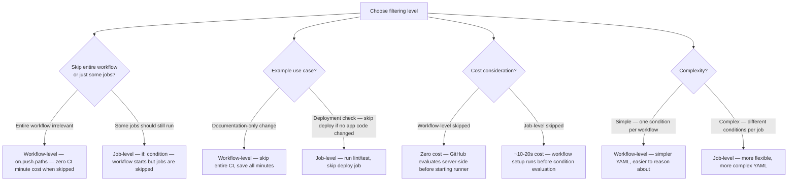
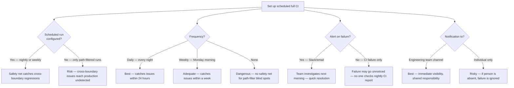

# Decision Trees

## Domain: Testing & Reliability Engineering
## Subdomain: CI/CD Pipeline Integration
## Knowledge Unit: Path-Based CI Triggering

---

### Tree 1: Path Filter vs No Path Filter

```mermaid
flowchart TD
    A[Decide whether to use path filters] --> B{Project size?}
    B -->|Small — CI completes in <5 minutes| C[No path filter needed — optimization has no benefit]
    B -->|Large — CI takes 15+ minutes| D[Use path filters — significant CI time savings]
    A --> E{Codebase structure?}
    E -->|Monorepo — multiple apps/packages| F[Path filters essential — without them, every change runs full suite]
    E -->|Single app — focused codebase| G[Optional — path filters still help with doc/config changes]
    A --> H{Merge branch?}
    H -->|Development branch (PR)| I[Use path filters — fast feedback for focused changes]
    H -->|Main branch (merge)| J[NEVER use path filters on merge to main — always run full CI]
    A --> K{Path filter scope?}
    K -->|Broad — all code directories| L[Safe — may run extra CI but won't miss important changes]
    K -->|Narrow — specific subdirectories| M[Risky — new directories or files may skip CI]
```

**Key decision points:**
- **Project size**: Small projects (<5 min CI) don't need path filters. Large projects benefit significantly.
- **Branch type**: Path filters on PRs for fast feedback. Never on merge to main.
- **Filter scope**: Start broad and narrow down. Better to run extra CI than miss important changes.

---

### Tree 2: Workflow-Level vs Job-Level Filtering



**Key decision points:**
- **Workflow-level for coarse filtering**: Skipping entire workflows saves all CI minutes.
- **Job-level for fine-grained control**: Use when some jobs should still run (e.g., lint always, deploy conditionally).
- **Cost**: Workflow-level skipped = zero cost. Job-level skipped = pays workflow setup cost.

---

### Tree 3: Path Inclusion vs Path-Ignore Strategy

```mermaid
flowchart TD
    A[Choose path matching strategy] --> B{Codebase maturity?}
    B -->|Stable — known directory structure| C[Use paths (explicit inclusion) — maintain accurate list]
    B -->|Growing — new directories added| D[Use paths-ignore (exclusion) — catches new code automatically]
    A --> E{Goal?}
    E -->|Only run CI for specific code| F[paths — explicit, maintains strict boundaries]
    E -->|Skip CI for non-code files| G[paths-ignore — documentation, config, non-code changes]
    A --> H{Risk tolerance?}
    H -->|Low — must not miss changes| I[paths-ignore — safer: CI runs for any code not explicitly ignored]
    H -->|Can accept occasional misses| J[paths — riskier: must update when new directories are added]
    A --> K{Maintenance overhead?}
    K -->|High — can't update filters often| L[paths-ignore — lower maintenance, broad coverage]
    K -->|Low — regular filter updates]| M[paths — explicit, auditable, requires quarterly review]
```

**Key decision points:**
- **paths (explicit inclusion)**: More control, but must update when new directories are added.
- **paths-ignore (exclusion)**: Safer — catches new code automatically. Only ignores well-known non-code files.
- **Maintenance**: paths-ignore requires less maintenance. paths requires quarterly review.

---

### Tree 4: Scheduled Full CI as Safety Net



**Key decision points:**
- **Scheduled run is mandatory**: Path filters need a safety net. Nightly full CI catches cross-boundary issues.
- **Daily is best**: 24-hour feedback loop for cross-boundary regressions.
- **Alert on failure**: Nightly CI failure must notify the team. Otherwise, failures go unnoticed.
