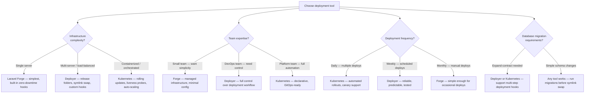
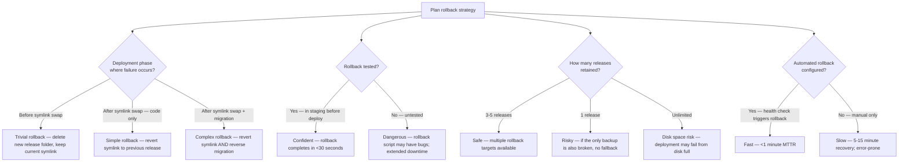

# Decision Trees

## Domain: Testing & Reliability Engineering
## Subdomain: CI/CD Pipeline Integration
## Knowledge Unit: Zero-Downtime Deployment

---

### Tree 1: Deployment Tool Selection — Deployer vs Forge vs Kubernetes



**Key decision points:**
- **Infrastructure drives tooling**: Single server → Forge. Multi-server → Deployer. Containerized → Kubernetes.
- **Team expertise**: Small teams prefer Forge's simplicity. DevOps teams need Deployer's control.
- **Expand-contract support**: Complex database migrations require multi-step deployment hooks.

---

### Tree 2: Migration Timing — Before vs After Symlink Swap

```mermaid
flowchart TD
    A[Choose when to run migrations] --> B{Migration type?}
    B -->|Additive — new column, new table| C[Run BEFORE symlink swap]
    B -->|Destructive — drop column, drop table| D[Run AFTER symlink swap (separate deploy)]
    B -->|Data migration — backfill, transform| E[Run BEFORE or AFTER depending on read/write pattern]
    A --> F{Expand-contract<br>phase?}
    F -->|Phase 1 — add new schema| G[Before swap — old code ignores new columns]
    F -->|Phase 2 — remove old schema| H[After swap (next deploy) — old code no longer runs]
    A --> I{Rollback plan?}
    I -->|Migration before swap| J[Rollback requires careful migration reversal — test thoroughly]
    I -->|Migration after swap| K[Rollback is simpler — symlink revert without schema revert]
    A --> L{Deployment atomicity?}
    L -->|Need atomic — all or nothing| M[Run migrations before swap — migration failure blocks deploy]
    L -->|Tolerate partial — phased rollout| N[Run migrations after swap — instances update gradually]
```

**Key decision points:**
- **Additive before, destructive after**: Add new schema before symlink swap. Remove old schema in a separate deploy.
- **Expand-contract**: Two-phase schema changes. Phase 1 adds (before swap). Phase 2 removes (after old code drains).
- **Rollback simplicity**: Migrations before swap make rollback complex (need migration reversal).

---

### Tree 3: Cache Strategy — Pre-Warm vs Cold Start

```mermaid
flowchart TD
    A[Choose cache strategy] --> B{Which cache?}
    B -->|Laravel config cache| C[Pre-warm BEFORE symlink swap — php artisan config:cache]
    B -->|Route cache| D[Pre-warm BEFORE symlink swap — php artisan route:cache]
    B -->|View cache| E[Pre-warm BEFORE symlink swap — php artisan view:cache]
    B -->|Application / page cache| F[Warm AFTER symlink swap — curl critical pages]
    B -->|OpCache| G[Warm AFTER symlink swap — curl critical pages to compile PHP]
    A --> H{CI placement?}
    H -->|Deployer recipe| I[after('deploy:symlink', 'deploy:warmup') — automated]
    H -->|Manual / Forge| J[Add warm-up script to deployment hooks]
    A --> K{Warm-up required?}
    K -->|Yes — production traffic| L[Mandatory — first users experience 2-5s cold start without warm-up]
    K -->|No — staging / dev| M[Optional — acceptable slowness in non-production]
    A --> N{Multi-server?}
    N -->|Yes — load-balanced| O[Warm each instance individually after deploy]
    N -->|No — single server| P[Warm once after symlink swap]
```

**Key decision points:**
- **Pre-swap vs post-swap**: Config/route/view caches built before swap. Page/OpCache warmed after swap.
- **Mandatory for production**: Without warm-up, first users experience 2-5 second cold-start page loads.
- **Multi-server**: Each instance must be warmed individually. Script the warm-up per-instance.

---

### Tree 4: Rollback Strategy — When and How



**Key decision points:**
- **Phase determines complexity**: Pre-swap failures are trivial. Post-swap + migration failures are complex.
- **Test rollback**: Always test rollback in staging before production. Untested rollback = hope-based deployment.
- **Release retention**: Keep 3-5 releases. Too few = no fallback. Too many = disk exhaustion.
