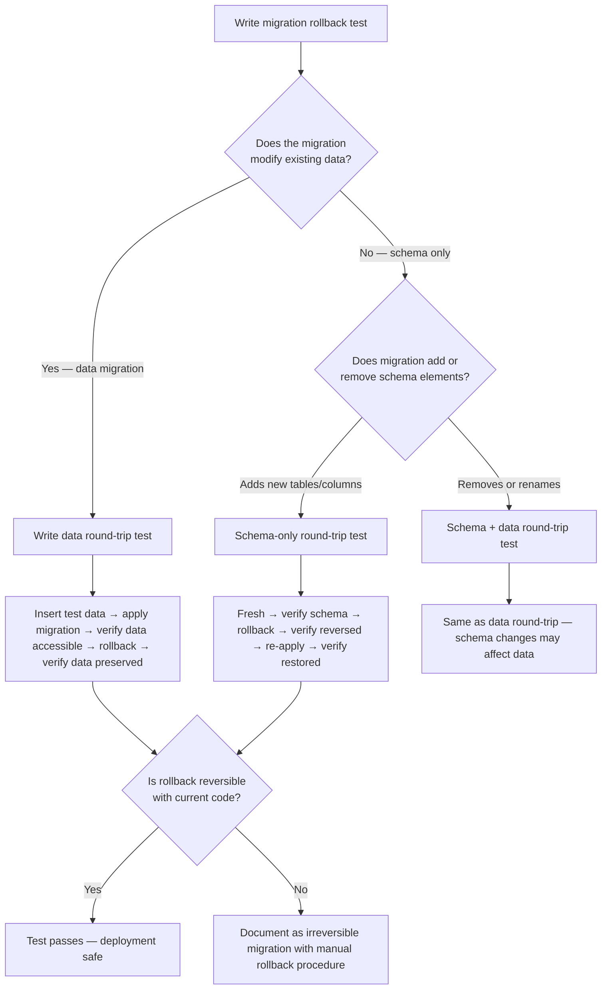

# Decision Trees

## Domain: Testing & Reliability Engineering
## Subdomain: Database Testing
## Knowledge Unit: Migration Rollback Testing

---

### Tree 1: How to Test a New Migration's Rollback



**Key decision points:**
- **Data vs schema only migration**: Data transformations require round-trip data preservation tests. Pure additive schema changes need only schema verification.
- **Reversible vs irreversible**: If a migration cannot have a functional `down()`, document it explicitly and create a manual rollback procedure rather than leaving rollback untested.

---

### Tree 2: `migrate:rollback` vs `migrate:fresh` vs `migrate:reset`

```mermaid
flowchart TD
    A[Choose migration command for test] --> B{What are you<br>testing?}
    B -->|Normal test setup| C[migrate:fresh]
    B -->|Rollback functionality| D[migrate:rollback]
    B -->|Complete reset of all migrations| E[migrate:reset — development only]
    C --> F[Drops all tables + re-runs all migrations. Does NOT test down().]
    D --> G[Reverses last batch. Tests down(). Mirrors production rollback.]
    E --> H[Reverses all migrations. Useful for development cleanup.]
    B -->|CI round-trip| I[Use migrate:fresh + migrate:rollback + migrate sequence]
```

**Key decision points:**
- **What to test**: `migrate:fresh` for setup (fast, clean). `migrate:rollback` for verifying `down()` methods. Never use `migrate:fresh` as a substitute for testing rollback.
- **Batch vs individual**: Always test full batch rollback — production rollback reverts by batch, not individual migrations.

---

### Tree 3: How to Sequence Migration Tests in CI

```mermaid
flowchart TD
    A[Add migration tests to CI] --> B{Parallel test suite<br>configured?}
    B -->|Yes| C[Create dedicated sequential CI job]
    B -->|No| D[Add migration tests to existing sequential suite]
    C --> E[Job uses: needs: [main-test-suite]]
    E --> F[Run: php artisan migrate:fresh && vendor/bin/phpunit --filter=Migrat --no-parallel]
    D --> G[Prepend: php artisan migrate:fresh → run migration tests → run other tests]
    F --> H{Migration tests<br>pass?}
    H -->|Yes| I[Proceed to deployment]
    H -->|No| J[Block pipeline — rollback methods broken]
    D --> H
```

**Key decision points:**
- **Parallel vs sequential**: Migration tests MUST run sequentially. If the main suite runs in parallel, create a separate job. Never use `--parallel` for migration tests.
- **Job ordering**: Migration tests should run after the main test suite to avoid delaying feedback on non-migration test failures.

---

### Tree 4: Data Preservation in `down()` — How to Handle

```mermaid
flowchart TD
    A[Implement down() method] --> B{What does up()<br>do to the schema?}
    B -->|Adds new column| C[down() drops the column — no data risk]
    B -->|Removes a column| D[down() recreates the column — data was already removed]
    B -->|Renames a column| E[down() renames back — data preserved]
    B -->|Transforms data| F{Can original data<br>be reconstructed?}
    F -->|Yes| G[Save original values in temp column; down() restores them]
    F -->|No| H[Document as irreversible; have manual procedure]
    B -->|Adds new table| I[down() drops table — back up data if needed]
    B -->|Drops a table| J[down() recreates table — data is lost; consider reversible approach]
    C --> K[Test: verify column gone after rollback]
    D --> L[Test: verify column exists after rollback]
    E --> M[Test: verify column renamed back with data intact]
    G --> N[Test: verify original data values restored after rollback]
```

**Key decision points:**
- **Schema changes that don't affect data** (add/drop columns): Straightforward `down()` — reverse the schema operation.
- **Data transformations**: Prefer saving original values (temp column, separate table) so `down()` can fully restore.
- **Irreversible operations**: Accept the limitation, document thoroughly, and have a manual emergency procedure.
