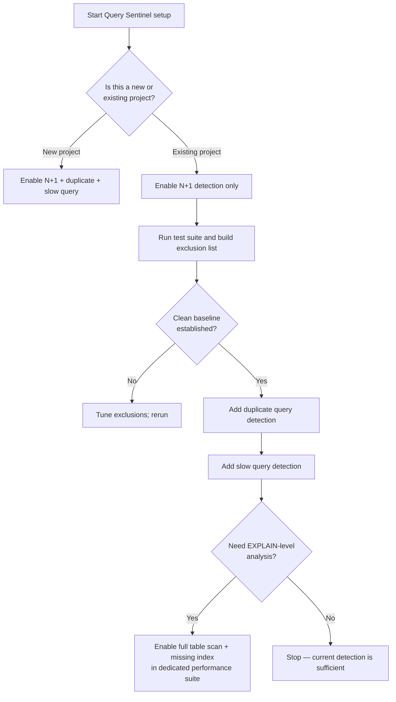
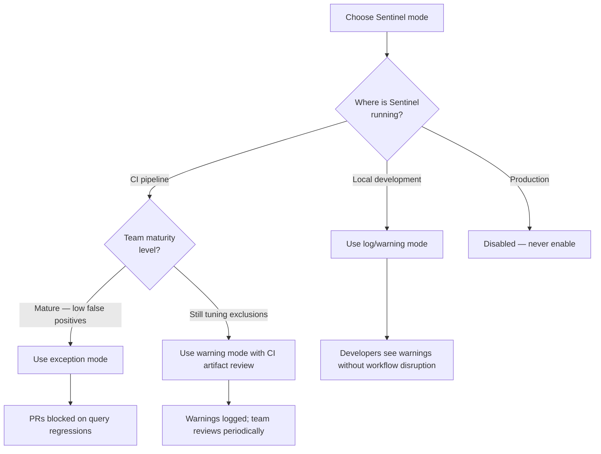
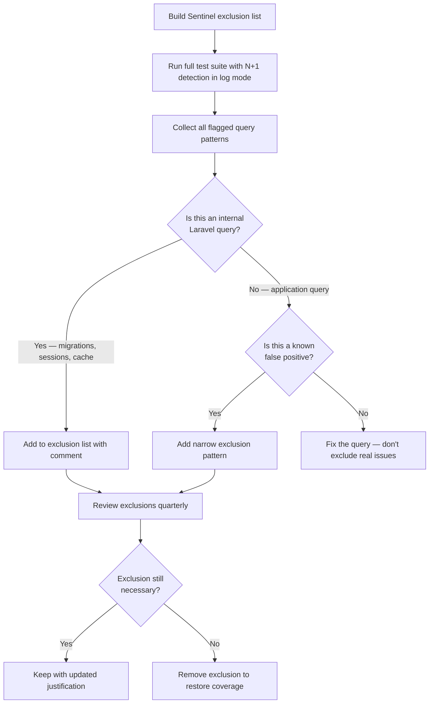
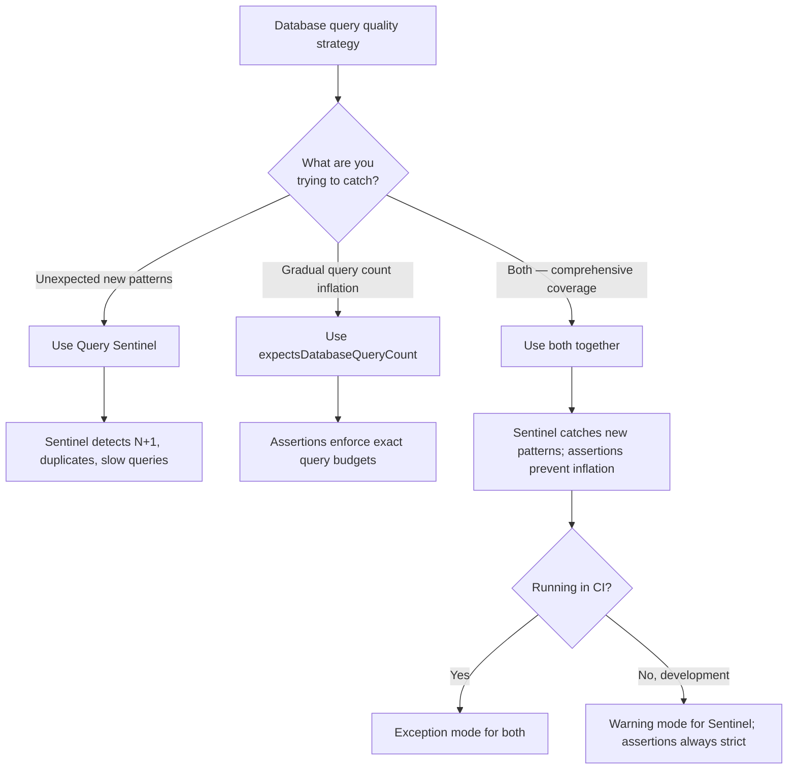

# Decision Trees

## Domain: Testing & Reliability Engineering
## Subdomain: Database Testing
## Knowledge Unit: Query Sentinel

---

### Tree 1: Which Detection Types to Enable

**Key decision points:**
- **Existing vs new project**: Existing projects need incremental enablement to avoid false-positive overload. New projects have less legacy code and can start with broader detection.
- **EXPLAIN-level detection**: Full table scan and missing index detection add 1-10ms per SELECT query. Reserve for dedicated performance test suites.
- **Baseline first**: Without a clean baseline, every detection type generates noise that undermines trust in Sentinel.

---

### Tree 2: Warning vs Exception Mode

**Key decision points:**
- **Development vs CI**: Warnings preserve developer velocity in local dev. Exceptions enforce standards in CI.
- **Team maturity**: Teams with well-tuned exclusion lists can use exception mode everywhere. Teams still tuning should use warning mode even in CI, reviewing logs periodically.

---

### Tree 3: How to Build the Exclusion List

**Key decision points:**
- **Internal vs application query**: Internal Laravel queries are safe to exclude. Application queries flagged by Sentinel should be fixed, not excluded.
- **Narrow vs broad exclusions**: Use specific patterns (e.g., `migrations_*`) not generic ones (`%`). Review quarterly to prevent exclusion list bloat.

---

### Tree 4: Sentinel vs `expectsDatabaseQueryCount()` — Which to Use

**Key decision points:**
- **Pattern detection vs budget enforcement**: Sentinel catches what you didn't know about. Query count assertions enforce what you know. They complement, not replace.
- **CI vs development**: Both should be active in CI. In development, assertions remain strict but Sentinel can be in warning mode.
