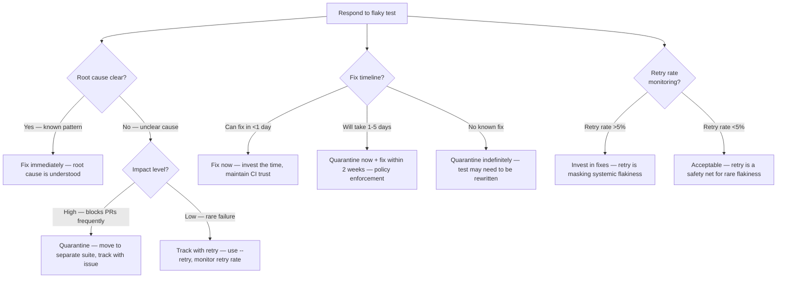
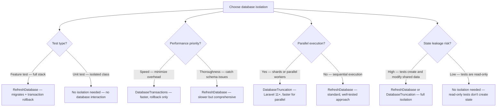
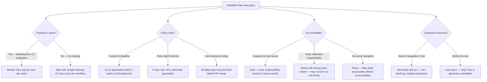

# Decision Trees

## Domain: Testing & Reliability Engineering
## Subdomain: Flaky Test Prevention
## Knowledge Unit: Flaky Test Prevention Strategies

---

### Tree 1: Flakiness Source Identification

```mermaid
flowchart TD
    A[Identify flakiness source] --> B{Failure pattern?}
    B -->|Passes locally, fails in CI| C{Timing related?}
    C -->|Yes — Dusk test, async assertion| D[Timing-dependent — replace pause() with waitFor()]
    C -->|No — database test, specific to CI env| E[Environment-dependent — check DB config, service containers]
    B -->|Passes in CI, fails locally| F[Local environment issue — check PHP version, DB engine, extensions]
    B -->|Fails intermittently everywhere| G{Root cause?}
    G -->|Time-based — fails at midnight/boundary| H[Time-dependent — add $this->freezeTime()]
    G -->|Order-based — fails in full suite, passes alone| I[State leakage — add RefreshDatabase]
    G -->|Network-based — fails when API is slow| J[Network-dependent — add Http::fake()]
    G -->|Data-based — fails on specific Faker output| K[Random data — use explicit values for asserted fields]
    A --> L{Frequency?}
    L -->|<5% of runs| M[Fix or track — monitor for worsening]
    L -->|5-25% of runs| N[Fix immediately — significant CI trust erosion]
    L -->|>25% of runs| O[Quarantine now — test is unreliable, protect CI trust]
```

**Key decision points:**
- **Timing → Dusk**: Replace `pause()` with `waitFor()`, `waitForText()`.
- **Time → freeze**: Add `$this->freezeTime()` for any time-sensitive assertion.
- **State leakage → RefreshDatabase**: Add database isolation trait for order-dependent failures.
- **Network → Http::fake()**: Fake all external HTTP interactions.

---

### Tree 2: Fix vs Quarantine vs Retry



**Key decision points:**
- **Fix immediately**: If root cause is clear. Time freezing, Http::fake, RefreshDatabase are quick fixes.
- **Quarantine**: Move to separate non-blocking suite when cause is unclear or fix takes time.
- **Retry**: Safety net for rare flakiness (<5%). Monitor retry rate to detect worsening.

---

### Tree 3: Database Isolation Strategy



**Key decision points:**
- **RefreshDatabase**: Standard choice. Thorough (migrates + transactions). Slightly slower.
- **DatabaseTransactions**: Faster (no migration per suite). May miss schema issues.
- **DatabaseTruncation**: Laravel 11+. Faster for parallel execution than RefreshDatabase.

---

### Tree 4: Flaky Test Policy — Process and Culture



**Key decision points:**
- **Tracking**: Must have visibility into flaky test frequency. Without tracking, flakiness is invisible.
- **Fix deadline**: 2 weeks is recommended. Longer = accumulating flake debt.
- **Accountability**: Assigned ownership is most effective. Collective ownership works in disciplined teams.
