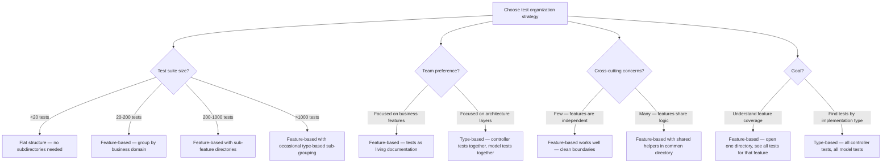

# Decision Trees

## Domain: Testing & Reliability Engineering
## Subdomain: Flaky Test Prevention
## Knowledge Unit: Test Organization Patterns

---

### Tree 1: Feature-Based vs Type-Based Organization



**Key decision points:**
- **Feature-based is the standard**: Groups tests by business capability. Tests as living documentation.
- **Type-based for large codebases**: >1000 tests may benefit from architectural layer grouping within features.
- **Flat for small suites**: <20 tests, no subdirectories needed.

---

### Tree 2: File Size — When to Split

```mermaid
flowchart TD
    A[Decide whether to split a test file] --> B{File line count?}
    B -->|<150 lines| C[Keep as one file — manageable, easy to navigate]
    B -->|150-300 lines| D[Consider splitting — monitor for growth]
    B -->|300-500 lines| E[Split recommended — approaching unmanageable]
    B -->|>500 lines| F[MUST split — file is too large]
    A --> G{Sub-features identified?}
    G -->|Yes — logical sub-groups exist| H[Split by sub-feature — one file per sub-feature]
    G -->|No — all tests are closely related| I[Consider describe() blocks or parameterized tests first]
    A --> J{Consequence of<br>not splitting?}
    J -->|Hard to navigate| K[Developers waste time scrolling; merge conflicts increase]
    J -->|Hard to review in PR| L[PRs with large test files discourage thorough review]
    J -->|Hard to parallelize| M[Large files imbalance sharding — one slow file blocks all shards]
```

**Key decision points:**
- **300-line soft limit**: Start considering split at 300 lines. Mandatory split at 500 lines.
- **Split by sub-feature**: Look for natural sub-groups within the file. Each sub-feature gets its own file.
- **Parallelization**: Large files create shard imbalances. Splitting improves distribution.

---

### Tree 3: Arrange Pattern — Inline vs Extracted

```mermaid
flowchart TD
    A[Choose Arrange approach] --> B{Setup complexity?}
    B -->|Simple — 1-3 lines| C[Inline — keep everything visible in the test]
    B -->|Moderate — 3-5 lines| D[Inline or extracted — depends on reusability]
    B -->|Complex — 5+ lines| E[Extract to declarative factory method]
    A --> F{Reusability?}
    F -->|Used in 1-2 tests| G[Inline — extraction adds overhead for rare use]
    F -->|Used in 3+ tests| H[Extract — shared method reduces duplication]
    A --> I{Readability impact?}
    I -->|Method name clarifies intent| J[Extracted method — createAdminUser() is clearer than 5 lines of setup]
    I -->|Method obscures what's created| K[Inline — keep setup visible to avoid hidden dependencies]
    A --> L{Extraction location?}
    L -->|Same test file| M[Private method — simple, co-located with tests]
    L -->|Shared across test files| N[Trait or helper class — reusable, organized by domain]
```

**Key decision points:**
- **Inline for simple, rare setups**: 1-3 lines, used once or twice. Keep visible.
- **Extract for complex, shared setups**: 5+ lines, used in 3+ tests. Extract to descriptive method.
- **Extraction location**: Same file for private helpers. Domain-specific traits for shared helpers.

---

### Tree 4: Naming Convention — Method Name Format

```mermaid
flowchart TD
    A[Choose test naming convention] --> B{Testing framework?}
    B -->|Pest| C[test('describes expected behavior in plain English') — best readability]
    B -->|PHPUnit| D[camelCase or snake_case — standard PHPUnit conventions]
    A --> E{Readability goal?}
    E -->|Natural language — reads as spec| F[Pest test() with descriptive string — best for living documentation]
    E -->|Method name is identifier| G[camelCase test method names — brief, searchable]
    A --> H{Verbosity tolerance?}
    H -->|Long names OK| I[Descriptive: test('rejects invoice with past due date when user has no admin role')]
    H -->|Keep names short| J[Concise: testInvoiceRejectionForNonAdmin()]
    A --> K{CI failure reporting?}
    K -->|Want clear failure messages| L[Pest test() — failure message includes the description string]
    K -->|Prefer concise failure output| M[camelCase method names — shorter failure report]
```

**Key decision points:**
- **Pest test() strings**: Most descriptive. Failure messages are self-documenting. Preferred for readability.
- **camelCase methods**: More concise. Better for developers who prefer method-name navigation.
- **Consistency is key**: Whatever convention is chosen, enforce it across the entire test suite.
