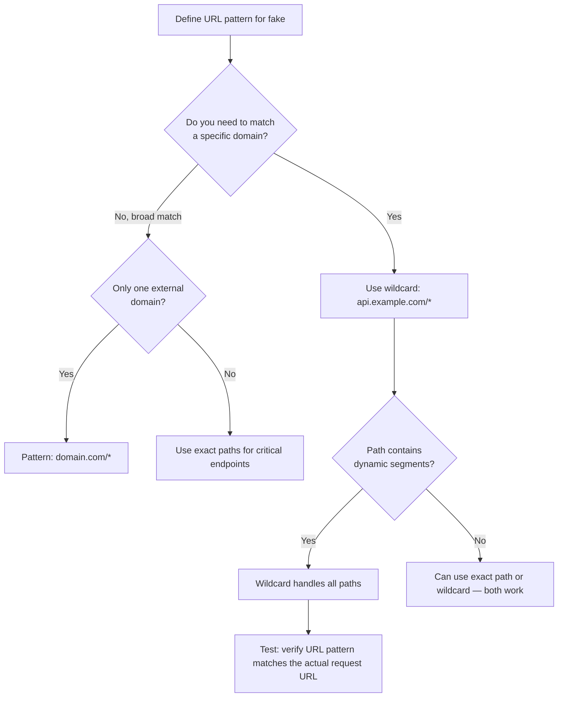
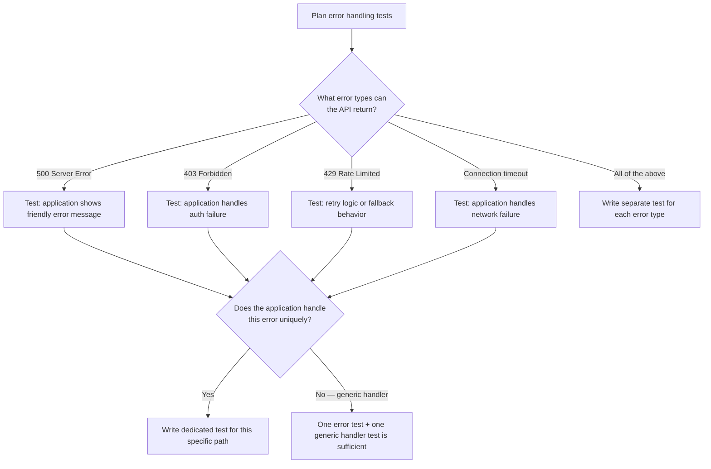

# Decision Trees

## Domain: Testing & Reliability Engineering
## Subdomain: Mocking, Fakes & Test Doubles
## Knowledge Unit: HTTP Client Faking

---

### Tree 1: Which Faking Strategy to Use

```mermaid
flowchart TD
    A[Start HTTP faking] --> B{How many HTTP calls<br>does the code make?}
    B -->|Single request| C{Need to verify<br>request content?}
    B -->|Multiple sequential calls| D[Use Http::sequence]
    C -->|Yes| E[Http::fake with URL pattern + Http::assertSent]
    C -->|No| F[Http::fake with URL pattern only]
    D --> G[Http::sequence with multiple push() calls]
    G --> H[Assert with assertSentInOrder or assertSentCount]
    A --> I{Need to prevent<br>unexpected requests?}
    I -->|Yes| J[Add catch-all: '*' => Http::response(null, 500)]
    I -->|No| K[Risk: stray calls go to real network]
```

**Key decision points:**
- **Single vs multiple calls**: Single request → `Http::fake()` with URL patterns. Multiple sequential (polling, retries) → `Http::sequence()`.
- **Request verification**: Use `assertSent()` when request payload correctness is critical. Skip when only response handling is being tested.
- **Catch-all safety**: Always include a catch-all pattern returning 500 to fail fast on unexpected URLs.

---

### Tree 2: How to Structure URL Patterns



**Key decision points:**
- **Exact vs wildcard**: Wildcards (`domain.com/*`) are preferred — exact URLs fail due to trailing slashes or query parameters.
- **Broad vs narrow patterns**: Match at the domain level for most cases. Use narrower patterns when different paths need different responses.

---

### Tree 3: How Many Error Paths to Test



**Key decision points:**
- **Unique handling vs generic**: Each error code that has unique handling logic needs its own test. If all errors go to the same handler, one error test + a generic test suffices.
- **Connection errors**: Timeout and network failures need separate simulation (exception throwing, not just status codes).

---

### Tree 4: Request Assertion Strategy

```mermaid
flowchart TD
    A[Verify outgoing requests] --> B{What aspect of the<br>request matters?}
    B -->|URL correctness| C[assertSent with URL check]
    B -->|Request body/payload| D[assertSent with body key check]
    B -->|Headers| E[assertSent with header check]
    B -->|Call order| F[assertSentInOrder for sequential calls]
    B -->|Total call count| G[assertSentCount]
    C --> H{Multiple calls to<br>different URLs?}
    H -->|Yes| I[Multiple assertSent calls — one per expected URL]
    H -->|No| J[Single assertSent is sufficient]
    D --> K[Use callback: $request['key'] === 'expected']
    E --> L[Use callback: $request->header('Authorization') === 'Bearer token']
```

**Key decision points:**
- **What to assert**: URL is always important. Body/headers matter when the API contract requires specific data. Call order matters for polling/retry flows.
- **Single vs multiple assertions**: Multiple URL patterns need separate `assertSent()` calls. Use `assertSentInOrder()` when call sequence is important.
