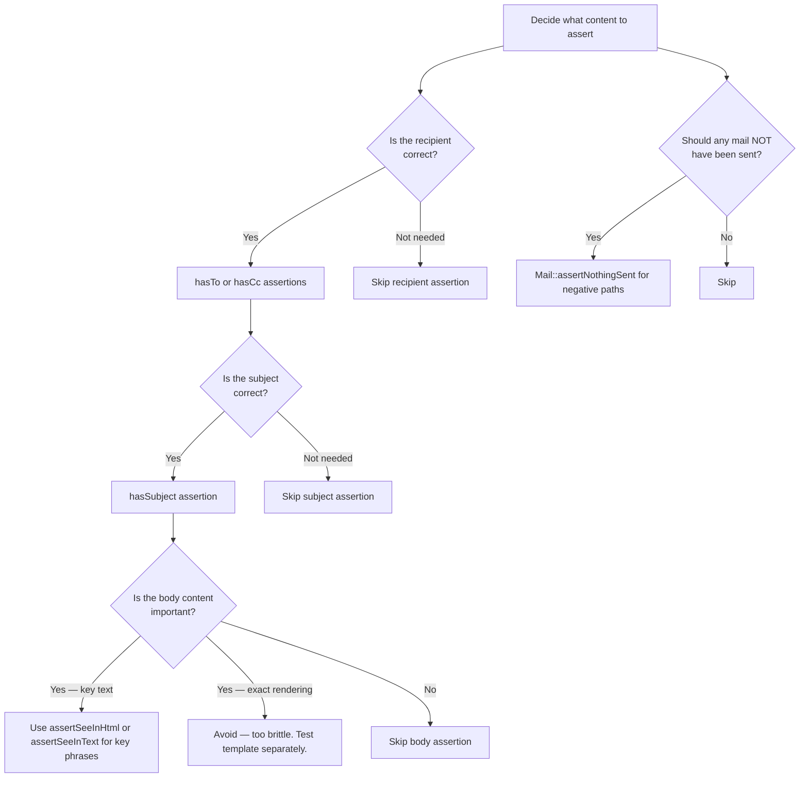

# Decision Trees

## Domain: Testing & Reliability Engineering
## Subdomain: Mocking, Fakes & Test Doubles
## Knowledge Unit: Mail/Notification Testing with Fakes

---

### Tree 1: Mail vs Notification Fake — Which to Use

```mermaid
flowchart TD
    A[Choose mail/notification fake] --> B{What is being<br>sent?}
    B -->|Direct Mailable| C[Use Mail::fake]
    B -->|Notification (multi-channel)| D[Use Notification::fake]
    B -->|Both| E[Use both Mail::fake + Notification::fake]
    C --> F[Assert with Mail::assertSent, Mail::assertSentTo]
    D --> G[Assert with Notification::assertSentTo]
    E --> H[Assert mailable content + notification channel routing]
    D --> I{How many channels<br>does notification use?}
    I -->|One| J[Single assertSentTo is sufficient]
    I -->|Multiple| K[Assert each channel separately: assertSentTo(..., 'mail'), assertSentTo(..., 'database')]
```

**Key decision points:**
- **Mailable vs Notification**: `Mail::fake()` for direct mailables. `Notification::fake()` for multi-channel notifications.
- **Multi-channel assertions**: When a notification uses >1 channel, assert each channel separately — one may fail while others pass.

---

### Tree 2: Synchronous vs Queued Mail — Testing Strategy

```mermaid
flowchart TD
    A[Test mail sending] --> B{Is the mailable<br>queued?}
    B -->|No — synchronous| C[Mail::fake + Mail::assertSent]
    B -->|Yes — ShouldQueue| D{What exactly are you<br>testing?}
    D -->|Mail dispatch| E[Queue::fake + Queue::assertPushed]
    D -->|Mail content| F[Test mailable directly: render + assert content]
    D -->|Both| G[Queue::fake + assertPushed + separate mail content test]
    C --> H[Assert recipient, subject, content inline]
    E --> I[Verify job was queued with correct data]
    F --> J[Call $mailable->render() and assert key text]
    G --> K[Two tests: job dispatch test + mailable rendering test]
```

**Key decision points:**
- **Sync vs async**: Sync mailables test directly with `Mail::fake()` + `assertSent()`. Queued mailables split into dispatch test (`Queue::fake()`) and content test (direct mailable rendering).
- **Content for queued mail**: Don't expect `Mail::assertSent()` to work with queued mailables in the same test — the queue worker hasn't processed it.

---

### Tree 3: What to Assert in Email Content



**Key decision points:**
- **Flexible over exact**: Assert subject, recipient, and key text phrases. Never assert exact HTML output.
- **Negative assertions**: Always verify no mail was sent for actions that shouldn't trigger emails.

---

### Tree 4: Queued Mail + Event + Notification — Combined Testing

```mermaid
flowchart TD
    A[Test complex mail workflow] --> B{What triggers the<br>mail?}
    B -->|Event + queued listener + mail| C[Event::fake + Queue::fake + Mail::fake]
    B -->|Direct dispatch + notification| D[Queue::fake + Notification::fake]
    C --> E[Event::assertDispatched → Queue::assertPushed → test listener handle() separately with Mail::fake]
    D --> F[Queue::assertPushed → Notification::assertSentTo per channel]
    C --> G{All paths covered?}
    G -->|Yes| H[Three tests: dispatch, queue, and listener execution]
    G -->|No| I[Add missing assertions]
```

**Key decision points:**
- **Layered faking**: When mail is triggered by events and queued, fake each layer independently.
- **Separate tests**: Don't test dispatch, queuing, and mail content in a single test — split into focused tests for each concern.
