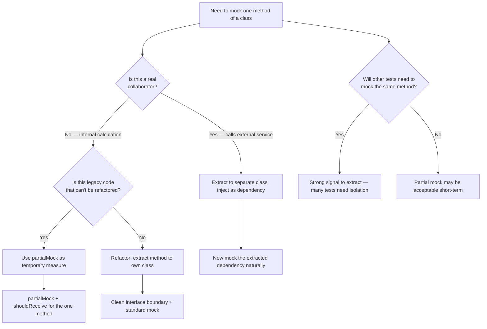

# Decision Trees

## Domain: Testing & Reliability Engineering
## Subdomain: Mocking, Fakes & Test Doubles
## Knowledge Unit: Mockery Integration

---

### Tree 1: Mock vs Fake vs Spy — Which Test Double to Use

```mermaid
flowchart TD
    A[Choose test double type] --> B{Does Laravel provide<br>a native fake?}
    B -->|Yes| C[Use ::fake() — Mail, Event, Queue, Http, Storage, Notification]
    B -->|No — custom interface| D{What behavior is<br>needed?}
    D -->|Pre-configure return values| E[Use $this->mock or Mockery::mock]
    D -->|Verify calls after the fact| F[Use $this->spy or Mockery::spy]
    D -->|Override one method, keep others| G[Use $this->partialMock]
    E --> H[shouldReceive + with + andReturn + once/times]
    F --> I[shouldHaveReceived after code under test]
    G --> J[shouldReceive specific method; real behavior for rest]
    A --> K{Is the dependency an<br>Eloquent model?}
    K -->|Yes| L[NEVER mock — use factory-created records]
    K -->|No| M[Proceed with chosen double]
```

**Key decision points:**
- **Fake vs Mock**: Laravel has built-in fakes for framework services — use them. Mockery is for custom interfaces and third-party SDKs.
- **Mock vs Spy**: Mocks for pre-configured expectations (return values). Spies for post-hoc verification (did a method get called?).
- **Partial mock**: Use sparingly — prefer extracting the mocked method to a separate collaborator.

---

### Tree 2: How Precise Should Mock Expectations Be

```mermaid
flowchart TD
    A[Configure mock expectations] --> B{Call count<br>matters?}
    B -->|Yes — must be called exactly N times| C[Use once(), twice(), times(N)]
    B -->|Yes — must never be called| D[Use never()]
    B -->|No — any count is fine| E[Use zeroOrMoreTimes() or omit count]
    C --> F{Return value<br>needed?}
    D --> F
    E --> F
    F -->|Yes| G[Use andReturn($value) or andReturnUsing($callback)]
    F -->|No — void method| H[Omit return — mock returns null by default]
    G --> I{Arguments matter?}
    H --> I
    I -->|Yes — exact match| J[Use with($exactArg)]
    I -->|Yes — complex condition| K[Use with(Mockery::on(fn ($arg) => ...))]
    I -->|No — any argument| L[Omit with() — accepts any args]
```

**Key decision points:**
- **Call count**: Always specify `once()`, `twice()`, `times(N)`, or `never()`. Without it, zero calls still pass.
- **Return values**: Only set when the mock must return something. Void methods don't need `andReturn`.
- **Argument matching**: Use `with()` for exact, `Mockery::on()` for conditional, omit for any.

---

### Tree 3: Partial Mock vs Dependency Extraction



**Key decision points:**
- **Partial mock = design smell**: If you need to mock one method of a class, that method likely belongs to a separate collaborator.
- **Legacy vs greenfield**: Partial mocks are acceptable for legacy code. New code should design for testability.
- **Test coverage across codebase**: If multiple tests need to mock the same method, extract it immediately.

---

### Tree 4: Sharing Mock Setup — setUp vs Per-Test

```mermaid
flowchart TD
    A[Where to configure mock] --> B{Is the mock setup<br>identical across tests?}
    B -->|Yes — all tests need same mock| C{Is the setup simple<br>(1-2 lines)?}
    C -->|Yes| D[Can use setUp or beforeEach]
    C -->|No — complex setup| E[Still prefer per-test for readability]
    B -->|No — each test differs| F[Configure mock directly in each test method]
    D --> G[Danger: changes affect all tests. Document clearly.]
    F --> H[Best practice — all expectations visible in one place]
    A --> I{Does the mock need<br>different return values?}
    I -->|Yes| J[Avoid setUp — per-test configuration is clearer]
    I -->|No — same return for all| K[setUp is acceptable]
```

**Key decision points:**
- **Per-test setup is preferred**: Keeps mock expectations visible in the same method as the assertions. Shared setup hides important details.
- **Exception**: Truly identical mocks (rare) can go in setUp, but document the shared configuration.
