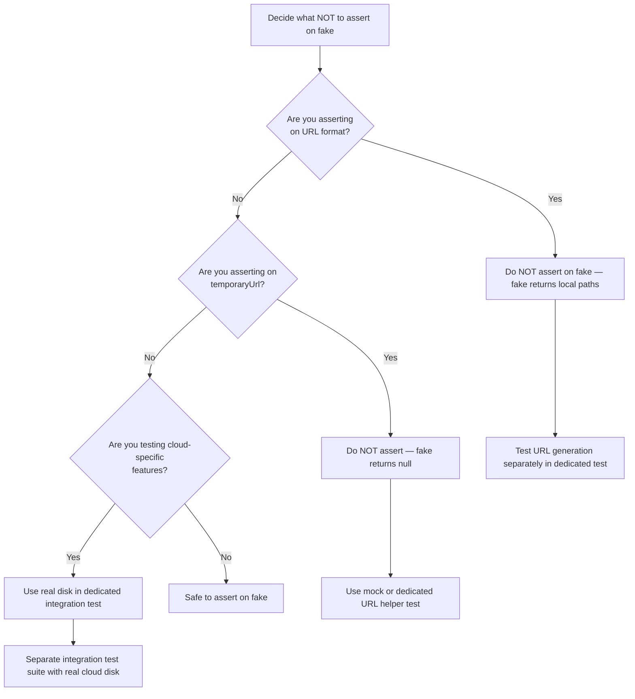
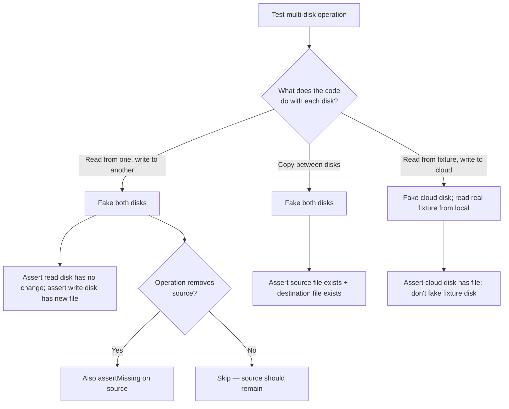

# Decision Trees

## Domain: Testing & Reliability Engineering
## Subdomain: Mocking, Fakes & Test Doubles
## Knowledge Unit: Storage Fake Testing

---

### Tree 1: Which Disks to Fake and How to Assert

```mermaid
flowchart TD
    A[Set up Storage fake] --> B{How many disks does<br>the code interact with?}
    B -->|One| C[Storage::fake('disk-name')]
    B -->|Multiple| D[Storage::fake(['disk1', 'disk2'])]
    C --> E{Which disk does the<br>code use?}
    E -->|Explicit disk| F[Match exact name from config/filesystems.php]
    E -->|Default disk| G[Storage::fake('default-disk') or just Storage::fake()]
    D --> H[Fake all disks the code touches]
    F --> I[Use Storage::disk('disk-name')->assertExists() for assertions]
    G --> J[Use Storage::assertExists() — works for default disk]
    A --> K{Are you asserting<br>on file content?}
    K -->|Yes| L[After assertExists, also call get() + assert content]
    K -->|No — existence only| M[assertExists is sufficient]
```

**Key decision points:**
- **Single vs multiple disks**: When code interacts with multiple disks, fake all of them. An unfaked disk means real I/O.
- **Disk name matching**: Must exactly match the config key. Case-sensitive. Mismatch = fake not applied.
- **Content verification**: `assertExists()` only checks presence. Add `get()` + content assertion when file data matters.

---

### Tree 2: What NOT to Assert on a Faked Disk



**Key decision points:**
- **URL assertions**: Storage fakes return local-style paths, not cloud URLs. Test URL generation separately.
- **temporaryUrl**: Returns null on faked disks. Cannot be tested with fakes.
- **Cloud-specific features**: Versioning, lifecycle policies, replication require real disk integration tests.

---

### Tree 3: File Upload — Complete Test Coverage

```mermaid
flowchart TD
    A[Test file upload] --> B[Storage::fake + UploadedFile::fake]
    B --> C[Perform upload action]
    C --> D{What to verify?}
    D -->|File was stored| E[Storage::disk('X')->assertExists(path)]
    D -->|File has correct content| F[Also get() + assert content]
    D -->|Old file was deleted| G[assertMissing old path]
    D -->|Validation works| H[Upload invalid file + assert validation error]
    D -->|Access control| I[Upload as non-admin + assert forbidden]
    E --> J{File on correct<br>disk?}
    J -->|Yes| K[Assert on that specific disk]
    J -->|No| L[Check code — disk name may mismatch]
    F --> M[AssertStringContains for key content]
    G --> N[AssertMissing — file cleanup verified]
```

**Key decision points:**
- **Multiple concerns to test**: Storage, content, deletion, validation, and access control are separate concerns. Each needs its own assertions.
- **Disk specificity**: Always qualify `assertExists()` with the disk name to avoid asserting on the wrong disk.

---

### Tree 4: Multi-Disk Operations — Full Coverage



**Key decision points:**
- **All touched disks must be faked**: With `Storage::fake(['disk1', 'disk2'])`.
- **Fixture disks**: If a disk is read-only (fixtures), it doesn't need faking — but ensure no writes go to it.
- **Write verification**: Always assert files exist on the destination disk after the operation.
