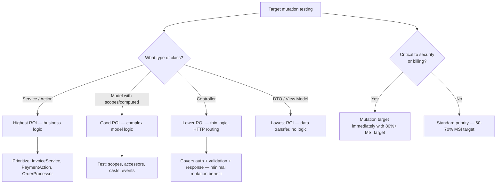
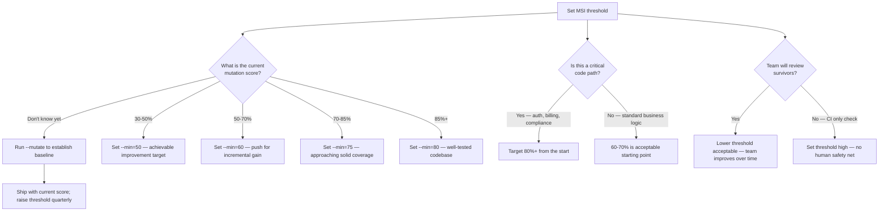
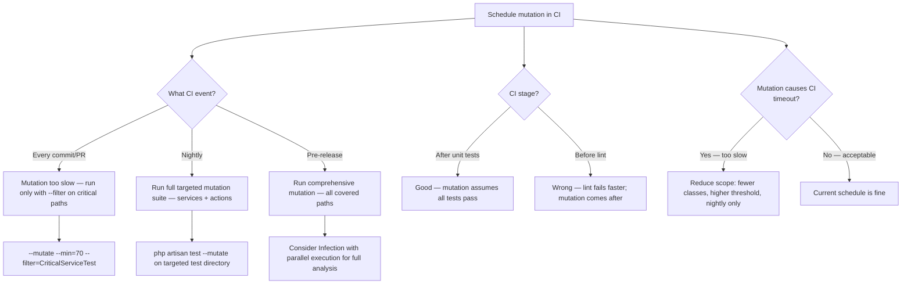

# Decision Trees

## Domain: Testing & Reliability Engineering
## Subdomain: Mutation Testing
## Knowledge Unit: Pest Mutation Testing

---

### Tree 1: Pest Mutation vs Infection — Which to Use

```mermaid
flowchart TD
    A[Choose mutation testing tool] --> B{Are you just starting<br>with mutation testing?}
    B -->|Yes| C[Use Pest mutation — zero config, built-in]
    B -->|No — experienced| D{Need advanced features?}
    D -->|Custom mutators, baseline, differential| E[Use Infection PHP]
    D -->|No — basic mutation is enough| F[Stay with Pest mutation]
    C --> G[covers() + --mutate + --min — all you need]
    E --> H[infection.json, custom mutators, parallel execution]
    F --> I[Same mutators under the hood — quality is identical]
    A --> J{Parallel execution<br>needed?}
    J -->|Yes — large codebase| K[Infection with --threads is faster]
    J -->|No — targeted mutation| L[Pest mutation speed is acceptable]
```

**Key decision points:**
- **Start with Pest mutation**: Zero configuration, built-in, uses same mutators as Infection.
- **Graduate to Infection**: Only when needing custom mutators, baselines, or parallel execution at scale.
- **Mutation quality**: Identical between Pest mutation and Infection — they share mutators.

---

### Tree 2: Which Classes to Target with Mutation



**Key decision points:**
- **Services and actions first**: Highest mutation impact — business logic with real decision trees.
- **Controllers last**: Controllers are thin HTTP routing layers. Mutation here provides low value.
- **Security-critical code**: Always target first. A surviving mutation in auth/billing is a real risk.

---

### Tree 3: Setting MSI Thresholds



**Key decision points:**
- **Baseline first**: Never set a threshold without knowing the current score.
- **Critical vs standard**: Critical paths need 80%+. Standard logic starts at 60%.
- **Human review matters**: If the team reviews survivors, lower thresholds are acceptable.

---

### Tree 4: When to Run Mutation in CI



**Key decision points:**
- **Per-commit**: Too slow for full suite. Use `--filter` for targeted critical paths.
- **Nightly**: Best for comprehensive mutation runs. Review survivors the next day.
- **Pre-release**: Consider Infection with parallel threads for comprehensive analysis before releases.
