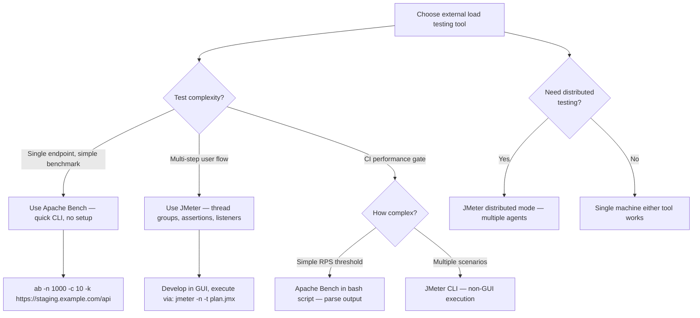
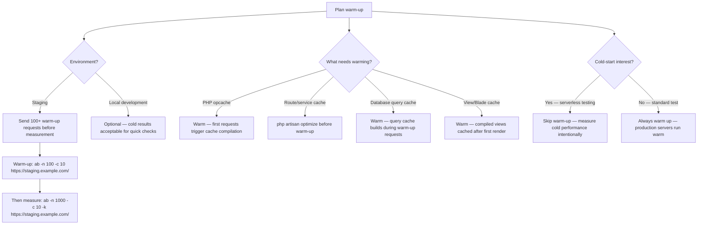
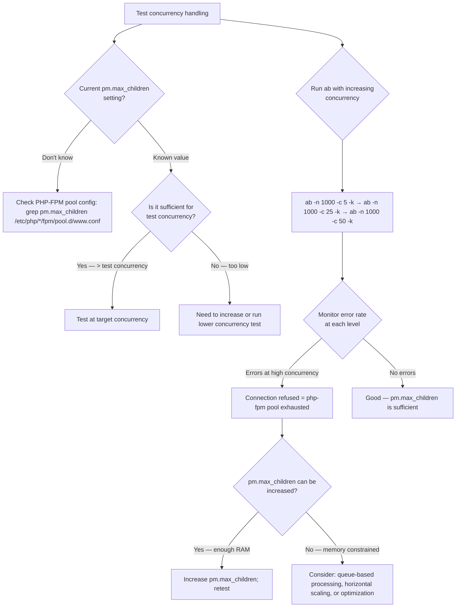

# Decision Trees

## Domain: Testing & Reliability Engineering
## Subdomain: Performance & Load Testing
## Knowledge Unit: Apache Bench and JMeter

---

### Tree 1: Apache Bench vs JMeter — Which to Use



**Key decision points:**
- **Complexity**: `ab` for simple benchmarks (single URL). JMeter for complex flows (login → browse → checkout).
- **CI integration**: `ab` fits in bash scripts with grep/awk parsing. JMeter requires CLI execution setup.
- **Distributed**: `ab` is single-machine only. JMeter supports distributed agents.

---

### Tree 2: What Metrics to Measure and How to Interpret

```mermaid
flowchart TD
    A[Measure and interpret results] --> B{Metric type?}
    B -->|Throughput (RPS)| C[Requests Per Second — capacity indicator]
    B -->|Latency| D{Which percentile?}
    D -->|P50 (median)| E[Typical user experience — most users see this]
    D -->|P95| F[95th percentile — slower users' experience]
    D -->|P99| G[99th percentile — worst-case users — critical metric]
    D -->|Average| H[Avoid — hides tail latency]
    C --> I[Compare RPS against baseline — regression if >20% drop]
    E --> J[Target: <200ms for APIs, <2s for pages]
    F --> K[Target: <500ms at P95]
    G --> L[Target: <2s at P99 — 1% of users should not time out]
    A --> M{Error rate?}
    M -->|>0%| N[Any errors under load indicate a problem — investigate]
    M -->|0%| O[Application handles load correctly]
```

**Key decision points:**
- **Percentiles over averages**: Average hides tail latency. P99 determines worst-case user experience.
- **RPS for capacity**: Track RPS over time. A 20%+ drop indicates a regression.
- **Error rate**: Any errors under load are bugs. Must be 0%.

---

### Tree 3: Warm-Up Strategy



**Key decision points:**
- **Always warm up on staging**: Production servers operate in warm state. Cold metrics are irrelevant for capacity planning.
- **What to warm**: PHP opcache, route cache, query cache, and view cache all need warming.
- **Cold-start tests**: Only relevant for serverless or auto-scaling scenarios where instances are frequently recycled.

---

### Tree 4: Concurrency and PHP-FPM Configuration Testing



**Key decision points:**
- **PHP-FPM bottleneck**: `pm.max_children` is the most common concurrency limit. `ab` reveals exhaustion immediately.
- **Connection refused = pool full**: Error rate spikes at high concurrency indicate PHP-FPM pool exhaustion.
- **Memory budget**: Each PHP-FPM child uses ~20-50MB. `pm.max_children × memory_per_child ≤ available RAM`.
