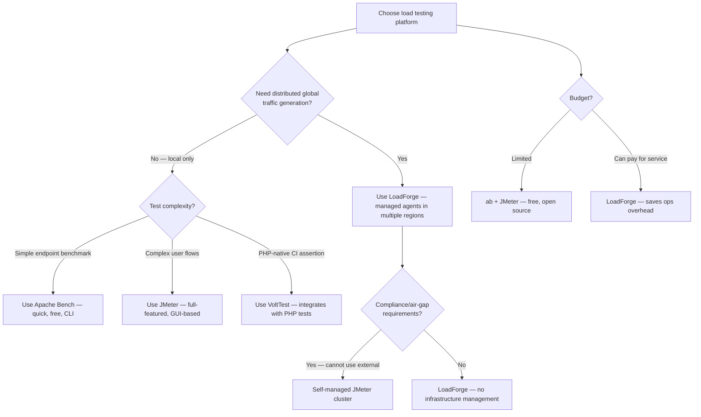
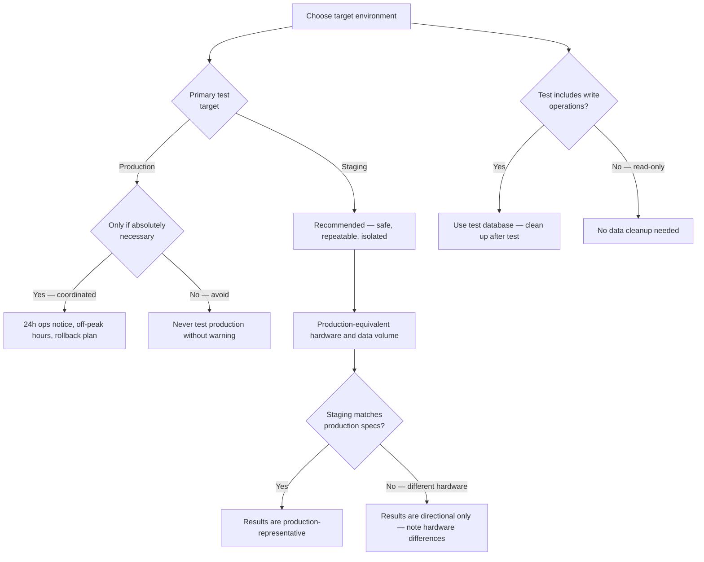
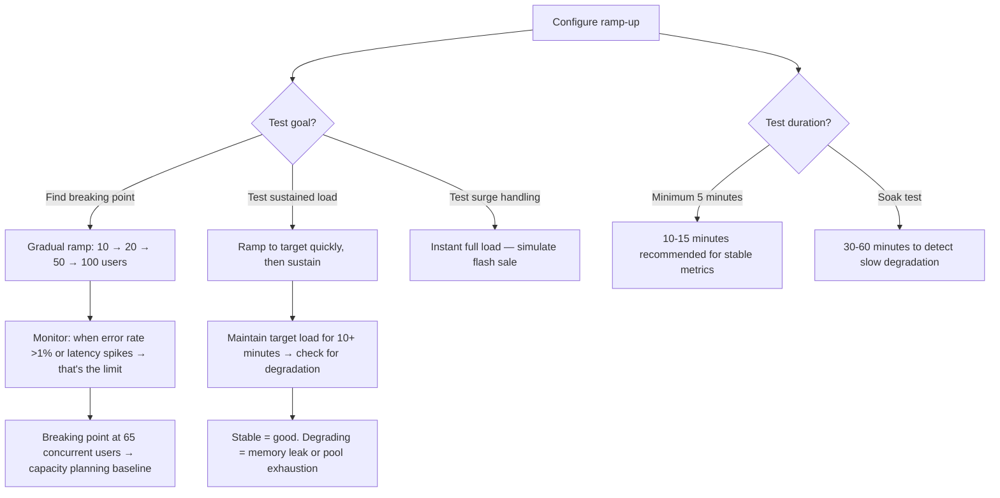
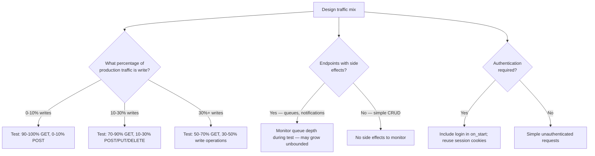

# Decision Trees

## Domain: Testing & Reliability Engineering
## Subdomain: Performance & Load Testing
## Knowledge Unit: LoadForge Cloud Load Testing

---

### Tree 1: LoadForge vs Other Load Testing Tools

**Key decision points:**
- **Distributed vs local**: LoadForge for multi-region tests. Local tools (ab, JMeter, VoltTest) for single-location testing.
- **Compliance**: If external traffic generation is not allowed, use self-managed JMeter.
- **Budget**: LoadForge costs per test run. Free alternatives (ab, JMeter) work for smaller scale.

---

### Tree 2: Staging vs Production — Where to Test

**Key decision points:**
- **Staging by default**: LoadForge tests should target staging. Production testing requires coordination.
- **Hardware parity**: Staging should match production specs for meaningful results.
- **Write operations**: Test data must be cleaned up after write-heavy load tests.

---

### Tree 3: Ramp-Up Strategy — Finding the Breaking Point

**Key decision points:**
- **Breaking point**: Gradual ramp reveals the exact concurrency level where performance degrades.
- **Sustained load**: Maintain target load to detect memory leaks and connection pool exhaustion.
- **Duration**: 10-15 minutes minimum. Longer for soak testing degradation patterns.

---

### Tree 4: Read vs Write Mix — Matching Production Traffic

**Key decision points:**
- **Match production mix**: Write operations have different performance than reads. Weight by production distribution.
- **Side effects**: Queueable jobs triggered by writes may grow unbounded under load. Monitor queue depth.
- **Authentication**: Include login flows in test scripts. Sessions should be reused across requests.
