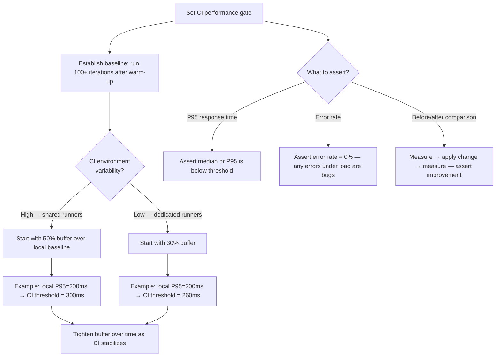
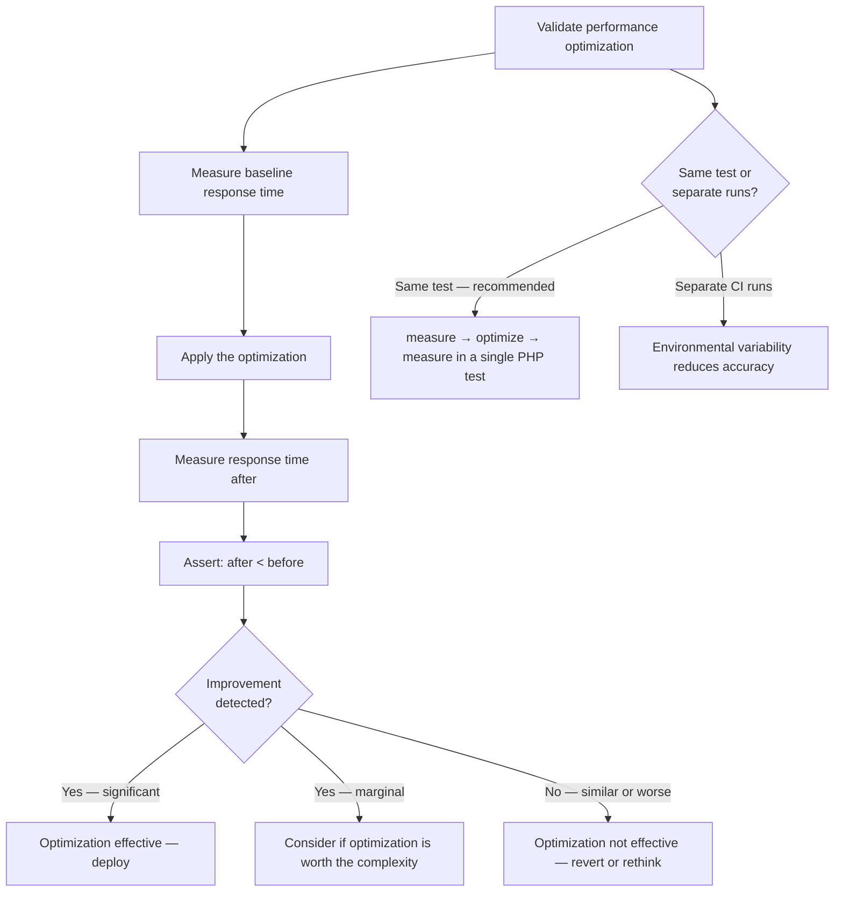

# Decision Trees

## Domain: Testing & Reliability Engineering
## Subdomain: Performance & Load Testing
## Knowledge Unit: VoltTest Laravel Performance Testing

---

### Tree 1: VoltTest vs External Load Testing Tools

```mermaid
flowchart TD
    A[Choose performance testing approach] --> B{What stage of<br>development?}
    B -->|During development / quick feedback| C[Use VoltTest — instant, no deployment needed]
    B -->|Pre-release validation| D[Use external tools — AB, JMeter, LoadForge]
    B -->|CI performance gate| E[Use VoltTest — integrates with PHP test suite]
    C --> F[VoltTest runs inside PHP — microsecond precision, no network overhead]
    D --> G[Tests full HTTP stack: Nginx, PHP-FPM, DB — production-realistic]
    E --> H[php artisan volt:load-test + assertions in CI]
    A --> I{Need absolute vs<br>relative metrics?}
    I -->|Relative comparison (before/after)| J[VoltTest ideal — same-environment comparison]
    I -->|Absolute production prediction| K[External tools — test full HTTP stack]
```

**Key decision points:**
- **Development vs pre-release**: VoltTest for quick dev feedback. External tools for production-like validation.
- **Relative vs absolute**: VoltTest measures improvement, not absolute performance. Compare before/after in the same test.
- **CI gates**: VoltTest integrates naturally with PHP test suites. External tools require separate CI steps.

---

### Tree 2: Concurrency — How Many Users to Simulate

```mermaid
flowchart TD
    A[Choose concurrency level] --> B{What is expected<br>production concurrency?}
    B -->|Low (1-10)| C[Test at: 1, 5, 10 concurrent]
    B -->|Medium (10-50)| D[Test at: 1, 10, 25, 50 concurrent]
    B -->|High (50+)| E[Test at: 1, 25, 50 concurrent — VoltTest limit is ~50]
    C --> F[Fast at all levels? Good — no concurrency bottleneck]
    D --> G[Create latency curve: identify degradation threshold]
    E --> H[If >50 needed, use external tool — AB or LoadForge]
    A --> I{Endpoint type?}
    I -->|API with DB queries| J[Concurrency matters — test at multiple levels]
    I -->|Static / cached page| K[Concurrency less likely to bottleneck]
```

**Key decision points:**
- **Production concurrency**: Match or exceed expected production concurrency levels.
- **VoltTest limit**: ~50 concurrent users due to PHP process overhead. Beyond that, use external tools.
- **Latency curve**: An endpoint fast at concurrency 1 may degrade at concurrency 25. Always test multiple levels.

---

### Tree 3: Configuring a Reliable CI Performance Gate



**Key decision points:**
- **CI buffer**: Start generous (50%), tighten over time. CI variability causes false positives with tight thresholds.
- **What to assert**: P95 response time + 0% error rate is the minimum. Before/after comparison for optimization validation.
- **Warm-up**: Always warm up before measuring. Cold requests skew results.

---

### Tree 4: Before/After Comparison for Performance Optimization



**Key decision points:**
- **Same-test comparison preferred**: Measure before and after in a single test to eliminate environmental variability.
- **Effectiveness threshold**: Significant improvement → deploy. Marginal → question complexity. None → revert.
- **Warm state**: Both measurements should be in warm state to isolate the optimization's effect.
